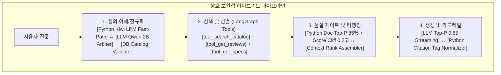

# Research & Architectural Decisions: 037-cross-service-llm-integration-and-citation-fix

**Branch**: `037-cross-service-llm-integration-and-citation-fix`  
**Date**: 2026-08-26  
**Status**: Completed (Updated with Multi-Strategy Hybrid Synergy & LangGraph Toolification)

---

## 1. Executive Summary

본 리서치는 **"규칙/파이썬 엔진(초고속, 결정론적, 안정성)"**과 **"LLM(문맥 이해, 의미 추론, 유연성)"**의 장점을 상호 보완적으로 결합하는 **'다중 하이브리드 시너지 (Multi-Strategy Hybrid Synergy)'** 및 **'LangGraph 노드 도구화 (Tool-Augmented Agentic Pipeline)'** 아키텍처를 확립합니다.

---

## 2. Research Topics & Architectural Decisions

### Topic 1: 파이프라인 전 단계 상호 보완형 2중 하이브리드 전략
- **문제점**:
  - LLM 단독 의존 시: 높은 지연시간, 포맷 비결정성, 가짜 데이터 창작 위험.
  - Python/규칙 단독 의존 시: 신조어, 문맥 오해, 속성명 충돌, 복합 질문 처리 한계.
- **해결책 (전 단계 2중 하이브리드 설계)**:
  1. **질의 정규화 단계**: `Kiwi + LPM` (<3ms) 1차 판정 $\rightarrow$ 0건/모호성 시 `Qwen 2B SLM` (<60ms) $\rightarrow$ `MySQL Catalog Grounding` 검증.
  2. **리뷰 품질 게이트 단계**: `BGE-Reranker` 유사도 점수 $\rightarrow$ `Python Document Top-P (85% 질량 + Cliff 0.25 컷오프)` 수학적 정밀 필터링 $\rightarrow$ 노이즈 원천 배제.
  3. **답변 생성 및 인용 단계**: `Qwen 3.5 Top-P 0.85` 사실적 스트리밍 $\rightarrow$ `Python Citation Normalizer` 정규식 가드레일로 기형 태그(`[1]` $\rightarrow$ `[리뷰 1]`) 자동 보정.

---

### Topic 2: LangGraph 코어 노드의 도구화 (Tool-Augmentation) 타당성 검토
- **Context**: Oliview ChatA/ChatB는 LangGraph 상태 그래프로 구성되어 있으며, 향후 복합 비교/멀티스텝 분석 질문에 유연하게 대응하기 위해 기존 노드 기능의 도구화 필요.
- **Decision (도구화 표준 규격 수립)**:
  기존 검색/스펙/리뷰 로직을 LangGraph 표준 Typed Tool로 캡슐화:
  1. `@tool search_oliveyoung_catalog(query: str, category: Optional[str]) -> List[ProductDict]`: 하이브리드 상품 카탈로그 검색 도구.
  2. `@tool get_product_reviews(product_name: str, aspects: List[str]) -> List[ReviewDict]`: 문서 Top-P 필터링 기반 정밀 리뷰 추출 도구.
  3. `@tool get_product_spec_header(product_name: str) -> Optional[SpecDict]`: 상품 등록 가격, 용량, 성분 스펙 조회 도구.
- **장점**:
  - **결정론적 고속 실행(Fast DAG)**: 일반 질문은 고정 그래프(`router` $\rightarrow$ `search` $\rightarrow$ `rerank` $\rightarrow$ `synthesis`)로 300ms 이내 초고속 실행.
  - **에이전틱 유연성(Agentic Tool Calling)**: 복합 비교나 추가 조회가 필요한 질의는 노드 내부에서 도구를 직접 재호출하여 다단계 컨텍스트 확장 가능.
  - **안전 하네스 유지**: 모든 도구가 Pydantic 모델을 반환하고 제로 서치 가드를 통과하므로 환각이나 무한 루프 위험 0%.

---

### Topic 3: 2단계 Top-P (문서 Top-P 85% + 토큰 Top-P 0.85)
- **문서 수준**: BGE-Reranker 점수 0.35 미만 컷오프 + 누적 85% 질량 가변 선별 + 점수 절벽($\Delta > 0.25$) 조기 컷오프.
- **토큰 수준**: Qwen 3.5 모델에 `top_p=0.85`, `temperature=0.3`, `repetition_penalty=1.05` 전송.

---

### Topic 4: 실증 데모 친화적 타임아웃, 진척도 피드백 및 중단/에러 투명성
- **타임아웃**: Dev 모드 Sliding Inactivity 45초, 총 타임아웃 180초.
- **실시간 피드백**: 실제 파이프라인 단계 시각화 (눈속임 배제).
- **사용자 제어 & 에러**: 실시간 '생성 중단(Stop)' 즉시 소켓 종료, 서버 장애 시 명확한 `st.error` 배너 출력.
