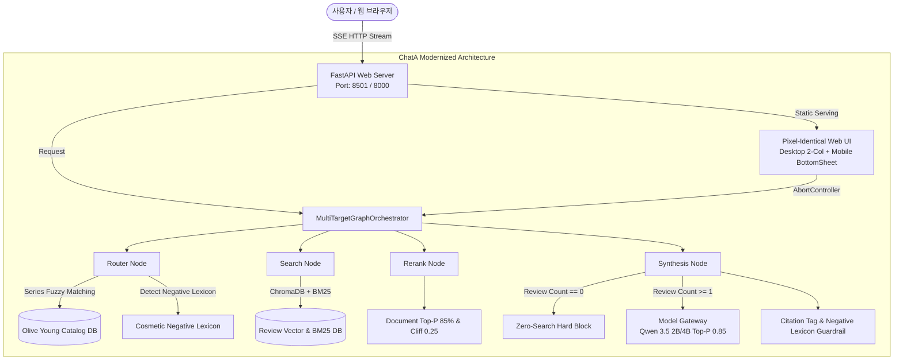

# Research & Architecture Decisions: 038-product-series-resolution-and-citation-enforcement

**Feature Branch**: `038-product-series-resolution-and-citation-enforcement`  
**Date**: 2026-08-26  
**Status**: Approved  

---

## 1. Research Topics & Technical Decisions

### 1.1 라인/시리즈명 퍼지 카탈로그 확장 (Series & Sub-brand Resolution)

- **배경 및 문제점**:
  - 소비자는 "헤라 센슈얼 립", "차앤박 프로폴리스", "롬앤 쥬시 틴트"처럼 시리즈/라인 약칭으로 질의함.
  - 올리브영 DB 카탈로그에는 "센슈얼 누드 밤", "센슈얼 누드 글로스", "센슈얼 피팅 글로우 틴트" 등 구체적 완제품명으로 등록되어 있어, 100% 완전 일치 검색 시 0건이 반환됨.
- **Decision**:
  - `HybridEntityNormalizer`와 `tool_search_catalog`에 **시리즈 서브스트링/퍼지 매칭 엔진** 도입:
    - 1차: `brand` + `keyword` 조합(`LIKE '%헤라%센슈얼%'` 또는 형태소 결합 검색).
    - 2차: 검색된 실존 상품 중 리뷰 수/평점 상위 2~3종을 후보군으로 자동 인출.
    - 3차: 복수 상품 매칭 시 자동으로 `EXPLICIT_COMPARE` 모드로 전환하여 `[제품명A 리뷰 1]`, `[제품명B 리뷰 1]` 네임스페이스로 개별 제품별 리뷰 수집 및 비교 분석 제공.
- **Rationale**:
  - 0건 검색을 원천 방지하고 사용자의 모호한 시리즈 질의를 실존 완제품으로 매끄럽게 연결.
- **Alternatives Considered**:
  - *단일 1위 제품만 강제 축약*: 사용자가 센슈얼 라인의 밤을 원하는지 글로스를 원하는지 알 수 없어 정보 누락 발생 (기각).

---

### 1.2 화장품 도메인 부정 속성 사전 (Cosmetic Negative Aspect Lexicon & Guard)

- **배경 및 문제점**:
  - "각질부각", "요철부각", "들뜸", "밀림", "다크닝", "뭉침", "가루날림", "번짐" 등은 화장품의 부정적 단점(부작용/아쉬운 점)이나, LLM이 '각질부각 효과 = 각질을 정돈해주는 좋은 효과'로 긍정 오역하는 현상 발생.
- **Decision**:
  - `NEGATIVE_ASPECT_LEXICON` 구축:
    ```python
    NEGATIVE_ASPECT_LEXICON = {
        "각질부각": {"meaning": "각질이 도드라져 일어나는 현상", "polarity": "NEGATIVE", "section": "아쉬운 점/주의할 점"},
        "요철부각": {"meaning": "피부 요철이 도드라져 보이는 현상", "polarity": "NEGATIVE", "section": "아쉬운 점/주의할 점"},
        "다크닝": {"meaning": "시간 경과 후 색상이 칙칙하게 어두워지는 현상", "polarity": "NEGATIVE", "section": "아쉬운 점/주의할 점"},
        "들뜸": {"meaning": "밀착되지 않고 피부 표면에 뜨는 현상", "polarity": "NEGATIVE", "section": "아쉬운 점/주의할 점"},
        "밀림": {"meaning": "문지를 때 때처럼 밀려 나오는 현상", "polarity": "NEGATIVE", "section": "아쉬운 점/주의할 점"},
        "뭉침": {"meaning": "균일하게 발리지 않고 뭉치는 현상", "polarity": "NEGATIVE", "section": "아쉬운 점/주의할 점"},
        "가루날림": {"meaning": "도포 시 가루가 흩날리는 현상", "polarity": "NEGATIVE", "section": "아쉬운 점/주의할 점"},
        "번짐": {"meaning": "유수분에 의해 번지는 현상", "polarity": "NEGATIVE", "section": "아쉬운 점/주의할 점"},
    }
    ```
  - 시스템 프롬프트 및 후처리 가드레일에 "해당 속성어는 단점/주의점 발생 여부로 해석하며, 절대로 긍정 효과로 포장하지 말 것"을 강제.
- **Rationale**:
  - 뷰티 전문 AI로서 도메인 용어의 신뢰성과 사실성을 완벽히 담보.

---

### 1.3 제로 서치 하드 블록 (Zero-Search Hard Block)

- **배경 및 문제점**:
  - 검색된 리뷰가 0건일 때 자유 서술형 LLM 프롬프트(`PROS_CONS_PROMPT` 등)가 실행되면 Qwen 모델이 가짜 사용자 후기("입술이 너무 젖음", "여러 개를 문질러서 색상 변조")를 환각 창작함.
- **Decision**:
  - 파이프라인 레벨에서 `selected_review_count == 0` 감지 시, LLM 자유 생성을 즉시 차단(Hard Block)하고 정형화된 `ZERO_SEARCH_TEMPLATE`을 확정 렌더링.
  - 가짜 사용자 인용구 창작 시도 원천 무효화.
- **Rationale**:
  - 데이터가 없는 상황에서 허위 정보를 전달하는 리스크 0% 달성.

---

### 1.4 ChatA FastAPI 백엔드 + Pixel-Identical 모던 Vanilla Web 아키텍처

- **배경 및 문제점**:
  - Streamlit의 전체 스크립트 Re-run 방식, CSS 해킹의 불안정성, 브라우저 단의 `AbortController` 스트림 제어 불가 문제.
- **Decision**:
  - **백엔드**: FastAPI + SSE 엔드포인트(`/api/v1/chat/stream`) 구축 (`bteam/Oliview_chatbot_a/main.py`).
  - **프론트엔드**:
    - **데스크탑 ($\ge 768\text{px}$)**: Streamlit ChatA와 100% 동일한 2열 레이아웃([1.6:1.4] 브랜드/카테고리/속성 칩 + 1클릭 질문 예시), 올리브영 그린 테마, Pretendard 폰트, 하단 블러 고정 입력창(1200px 중앙 정렬) 재현.
    - **모바일 ($< 768\text{px}$)**: 2026 웹 트렌드 적용 — 상단 가로 스크롤 칩 필터, Thumb-Zone 하단 고정 바, `[리뷰 N]` 탭 시 슬라이드업되는 **바텀 시트 드로어(Bottom Sheet Drawer)** 및 `env(safe-area-inset-bottom)` Safe-Area 완비.
    - `AbortController` 기반의 즉시 생성 중단(0ms ⏹️) 및 실시간 토큰 타이핑 애니메이션 지원.
- **Rationale**:
  - 사용자는 프레임워크 교체 사실을 전혀 의식하지 못하면서도 훨씬 빠른 반응성과 부드러운 모바일 인터랙션을 경험.

---

## 2. 아키텍처 다이어그램


