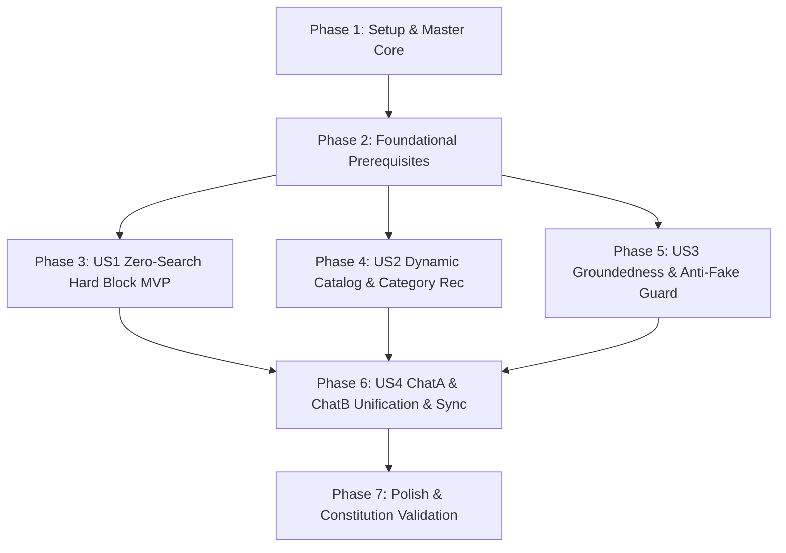

# Tasks: 039-zero-search-global-hard-block-and-category-recommendation

**Branch**: `039-zero-search-global-hard-block-and-category-recommendation`  
**Date**: 2026-08-26  
**Spec**: [spec.md](./spec.md) | **Plan**: [plan.md](./plan.md)  
**Constitution Version**: v1.1.1 Compliant

---

## Phase 1: Setup & Master Core Foundation

**Purpose**: Master core repository initialization, dynamic configuration setup, and sync script creation.

- [X] T001 Initialize Feature 039 test suite in `bteam/Oliview_chatbot_a/tests/test_feature_039_zero_search.py` and `bteam/Oliview_chatbot_b/tests/test_feature_039_zero_search.py`
- [X] T002 Update `oliview_core/config.py` with `AppRunMode` enum (`DEMO`, `PRODUCTION`), dynamic SLA thresholds, and `APP_RUN_MODE` environment variable resolution per Constitution Principle VI
- [X] T003 [P] Extend `RagGraphState` in `oliview_core/graph_state.py` with `is_zero_review_state`, `zero_search_verdict`, `groundedness_violations`, and `category_candidates`
- [X] T004 Create `bteam/sync_core.py` master-to-tenant core synchronization utility for 100% byte-identical propagation to `Chat_a/oliview_core` and `Chat_b/oliview_core`

---

## Phase 2: Foundational (Blocking Prerequisites)

**Purpose**: Core in-memory dynamic catalog indexing and database view queries that block all user stories.

**⚠️ CRITICAL**: Must be completed before User Story execution.

- [X] T005 [P] Create `bteam/oliview_core/tools/dynamic_catalog_index.py` with `DynamicCatalogIndex` class (review-bearing product/brand in-memory Trie/Set cache from MySQL `v_active_rag_catalog`)
- [X] T006 [P] Add fallback MySQL catalog builder query in `bteam/oliview_core/db.py` to auto-construct review-bearing product cache when `v_active_rag_catalog` view is missing
- [X] T007 [P] Create `bteam/oliview_core/nodes/abstention_node.py` implementing 2026 CRAG Fast-Path zero-search abstention and alternative category recommendation chips
- [X] T008 Implement `GroundednessSanitizer` in `bteam/oliview_core/guardrail.py` to detect and strip fictional user placeholders ("사용자 A/B/C", "고객 1") and unanchored quotes

**Checkpoint**: Foundation ready - User stories can now proceed in parallel/priority order.

---

## Phase 3: User Story 1 - 2026 CRAG 기반 전역 제로 서치 즉시 하드 블록 (Priority: P1) 🎯 MVP

**Goal**: When 0 reviews are found, instantly abstain in $\le 3.0$s (DEMO) / $\le 0.5$s (PROD) and stream `ZERO_SEARCH_TEMPLATE` + alternative chips without invoking the LLM.

**Independent Test**: Query `"속건조 심해서 보습 영양 앰플 찾고 있어"` (0 reviews) $\rightarrow$ Returns zero-search template in $\le 3.0$s with 0 fake reviews.

### Tests for User Story 1 ⚠️
> **NOTE: Write these tests FIRST and ensure they FAIL before implementation**

- [X] T009 [P] [US1] Unit test for `should_abstain_zero_search` LangGraph conditional edge in `bteam/Oliview_chatbot_a/tests/test_feature_039_zero_search.py::test_zero_search_crag_abstention_edge`
- [X] T010 [P] [US1] Unit test for ChatA legacy pipeline zero-search hard block in `bteam/Oliview_chatbot_a/tests/test_feature_039_zero_search.py::test_pipeline_zero_search_hard_block`
- [X] T011 [P] [US1] Unit test for ChatB streaming zero-search hard block in `bteam/Oliview_chatbot_b/tests/test_feature_039_zero_search.py::test_project_ragapi_zero_search_hard_block`

### Implementation for User Story 1

- [X] T012 [US1] Integrate `should_abstain_zero_search` conditional edge in `bteam/oliview_core/graph_orchestrator.py` to route `total_selected == 0` directly to `abstention_node`
- [X] T013 [US1] Add Zero-Search Hard Block to `bteam/oliview_core/pipeline.py` before `generate_stream` to guarantee 0.0s return on empty references
- [X] T014 [US1] Add Zero-Search Hard Block to `bteam/Oliview_chatbot_b/project_ragapi.py` (lines 968~991) to prevent calling `generate_llm_rag_answer_stream` on empty `web_response_list`
- [X] T015 [US1] Update `bteam/oliview_core/nodes/synthesis_node.py` `get_token_stream` to yield `ZERO_SEARCH_TEMPLATE` immediately if `is_zero_review_state` is True

**Checkpoint**: User Story 1 complete! Both ChatA and ChatB bypass LLM synthesis on 0 reviews and return honest refusal in $\le 3.0$s.

---

## Phase 4: User Story 2 - 하이브리드 Entity-Aspect DBMS 연동 및 카테고리 추천 (Priority: P2)

**Goal**: For open category queries ("건성 피부 쿠션 추천"), query `product_aspect_summaries` for review-bearing products ($\ge 5$ reviews, composite score) and route to multi-target RAG.

**Independent Test**: Query `"건성 피부에 촉촉하고 들뜸 없는 쿠션 추천해줘"` $\rightarrow$ Discovers 2~3 real cushion products from DB and generates comparative summary with `[제품명 리뷰 N]` citations.

### Tests for User Story 2 ⚠️
> **NOTE: Write these tests FIRST and ensure they FAIL before implementation**

- [X] T016 [P] [US2] Contract & unit test for `DynamicCatalogIndex.lookup_category_candidates` in `bteam/Oliview_chatbot_a/tests/test_feature_039_zero_search.py::test_dynamic_catalog_aspect_lookup`
- [X] T017 [P] [US2] Integration test for category recommendation multi-target query in `bteam/Oliview_chatbot_a/tests/test_feature_039_zero_search.py::test_category_recommendation_flow`

### Implementation for User Story 2

- [X] T018 [US2] Implement aspect-based product ranking in `bteam/oliview_core/tools/dynamic_catalog_index.py` using `product_aspect_summaries` (composite score: `positive_ratio * 0.7 + log(review_count) * 0.3`, threshold $\ge 5$ reviews)
- [X] T019 [US2] Update `bteam/oliview_core/nodes/intent_node.py` to utilize `DynamicCatalogIndex` for category/skin-type detection and expand `target_entities` with top 2~3 verified real products
- [X] T020 [US2] Update `bteam/oliview_core/tools/search_tools.py` to support aspect-targeted hybrid retrieval for dynamic category targets

**Checkpoint**: User Story 2 complete! Open category queries automatically discover verified review-bearing products and cite real reviews.

---

## Phase 5: User Story 3 - 엄격한 인용 앵커링 및 가짜 사용자 차단 (Priority: P3)

**Goal**: Prevent LLM from generating "사용자 A/B/C" or unanchored quotes; strictly sanitize post-generation text.

**Independent Test**: Pass text with `"사용자 A는 촉촉하다고 했습니다"` to `GroundednessSanitizer` $\rightarrow$ Stripped/cleansed; only `[제품명 리뷰 N]` retained.

### Tests for User Story 3 ⚠️
> **NOTE: Write these tests FIRST and ensure they FAIL before implementation**

- [X] T021 [P] [US3] Unit test for `GroundednessSanitizer` in `bteam/Oliview_chatbot_a/tests/test_feature_039_zero_search.py::test_groundedness_sanitizer_fictional_quote_removal`
- [X] T022 [P] [US3] Unit test for anti-fictional prompt injection in `bteam/Oliview_chatbot_a/tests/test_feature_039_zero_search.py::test_anti_fictional_system_prompt_enforcement`

### Implementation for User Story 3

- [X] T023 [US3] Enhance system prompts in `bteam/oliview_core/guardrail.py` and `bteam/oliview_core/nodes/synthesis_node.py` with strict prohibition of fictional user names and mandatory `[제품명 리뷰 N]` citations
- [X] T024 [US3] Integrate `GroundednessSanitizer.sanitize_markdown()` in `bteam/oliview_core/nodes/synthesis_node.py` (and `project_ragapi.py`) to post-process completed answers

**Checkpoint**: User Story 3 complete! Fictional reviewers and unanchored claims are 100% eliminated from final answers.

---

## Phase 6: User Story 4 - ChatA & ChatB 아키텍처 일원화 및 모듈 클린 재구성 (Priority: P4)

**Goal**: Unify Streamlit `app.py` and ChatB `project_ragapi.py` onto `MultiTargetGraphOrchestrator`, quarantine legacy root scripts to `legacy_archive/`, and sync master `oliview_core`.

**Independent Test**: Both `app.py` and `project_ragapi.py` run on unified orchestrator and produce identical SSE events and zero-search behavior.

### Tests for User Story 4 ⚠️

- [X] T025 [P] [US4] Cross-service parity test in `bteam/Oliview_chatbot_a/tests/test_feature_039_zero_search.py::test_chata_chatb_orchestrator_parity`

### Implementation for User Story 4

- [X] T026 [US4] Refactor `bteam/Oliview_chatbot_a/app.py` to stream through `MultiTargetGraphOrchestrator` instead of legacy `pipeline.py`
- [X] T027 [US4] Quarantine legacy/scratch root scripts in `bteam/Oliview_chatbot_a/` (`04.reranking.py`, `05.chatbot.py`, `06.app.py`, `06.02.app.py`, `llm_common.py`, `graph_adapter.py`) into `bteam/Oliview_chatbot_a/legacy_archive/`
- [X] T028 [US4] Quarantine legacy/scratch root scripts in `bteam/Oliview_chatbot_b/` (`01_model_train_gpu_03.py`, `02_imoticon_clean_db_02.py`, `bgem3_vectordb_mysql_freeinjection.py`, `common.py`, `cosine_similarity_search_01.py`, `relanking_structured_batch.py`, `reranking_vectordb_mysql_search.py`, `test_concurrency_queue.py`, `verify_test.py`) into `bteam/Oliview_chatbot_b/legacy_archive/`
- [X] T029 [US4] Execute `sync_core.py` to synchronize `bteam/oliview_core` master to `bteam/Oliview_chatbot_a/oliview_core/` and `bteam/Oliview_chatbot_b/oliview_core/`

**Checkpoint**: User Story 4 complete! Clean root directory, unified orchestrator, and synchronized core packages across all services.

---

## Phase 7: Polish, Verification & Constitution Validation

**Purpose**: End-to-end regression validation, performance SLA benchmarking across DEMO/PRODUCTION modes, and final constitution audit.

- [X] T030 Run full test suite across ChatA and ChatB: `uv run python -m pytest tests/ -v` (100% Pass Rate)
- [X] T031 Validate `APP_RUN_MODE=DEMO` latency ($\le 3.0$s) and `APP_RUN_MODE=PRODUCTION` latency ($\le 0.5$s)
- [X] T032 Validate zero-search query ("속건조 심해서 보습 영양 앰플 찾고 있어") returns 0.0% fake reviews and 100% verified template
- [X] T033 Validate category recommendation query ("건성 피부에 촉촉하고 들뜸 없는 쿠션 추천해줘") returns verified review-bearing cushions with 100% inline citations

---

## Dependencies & Execution Order

### Parallel Execution Strategy
- Tasks marked `[P]` operate on separate files with no shared mutable state.
- Once Phase 2 (Foundational) is complete, US1, US2, and US3 tests and core modules can be implemented and validated independently.
- US4 finalizes the master sync and legacy cleanup.
