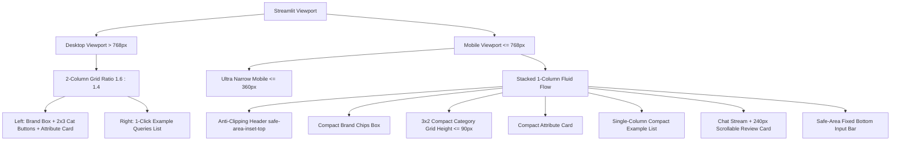

# Data Model & Design Token Specifications

**Feature**: `040-chata-mobile-header-and-layout-optimization`  
**Date**: 2026-08-26  

---

## 1. Responsive Viewport & Breakpoint Hierarchy

---

## 2. CSS Design Tokens & Mobile Override Mapping

| Component | Selector | Desktop (> 768px) Token | Mobile ($\le 768$px) Token |
| :--- | :--- | :--- | :--- |
| **Top Padding** | `.block-container` | `padding-top: 2rem !important;` | `padding-top: max(3.2rem, env(safe-area-inset-top) + 1.5rem) !important;` |
| **Streamlit Header** | `header[data-testid="stHeader"]` | `visibility: hidden; height: 0;` | `visibility: hidden; height: 0; pointer-events: none;` |
| **Category Rows** | `div[data-testid="column"]:nth-of-type(1) div[data-testid="stHorizontalBlock"]` | Standard 3-col flex | `display: flex !important; flex-direction: row !important; gap: 6px !important;` |
| **Category Buttons** | `.stButton > button` | `min-height: 44px; font-size: 14px;` | `min-height: 42px; font-size: 13px; padding: 8px 4px; touch-action: manipulation;` |
| **Brand Chips Box** | `.brand-box` | `gap: 8px; margin-bottom: 16px;` | `gap: 5px; margin-bottom: 10px;` |
| **Attribute Card** | `.attribute-card` | `padding: 12px 14px; margin-top: 14px;` | `padding: 8px 10px; margin-top: 8px;` |
| **Review Accordion**| `.stAccordion [data-testid="stExpanderDetails"]` | Uncapped scroll | `max-height: 240px; overflow-y: auto; -webkit-overflow-scrolling: touch;` |
| **Chat Input** | `[data-testid="stBottom"]` | `background: rgba(255,255,255,0.88)` | `padding-bottom: max(0.75rem, env(safe-area-inset-bottom));` |
