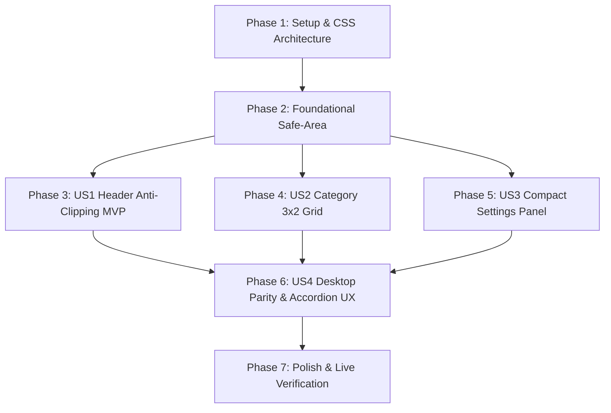

# Tasks: 040-chata-mobile-header-and-layout-optimization

**Branch**: `040-chata-mobile-header-and-layout-optimization`  
**Date**: 2026-08-26  
**Spec**: [spec.md](./spec.md) | **Plan**: [plan.md](./plan.md)  
**Constitution Version**: v1.1.1 Compliant

---

## Phase 1: Setup & CSS Architecture

**Purpose**: Test suite initialization and baseline CSS inspection for ChatA mobile layout optimization.

- [X] T001 Initialize Feature 040 layout test suite in `bteam/Oliview_chatbot_a/tests/test_feature_040_mobile_layout.py`

---

## Phase 2: Foundational (Blocking Prerequisites)

**Purpose**: Core CSS structure and Safe-Area infrastructure blocking all mobile layout stories.

**⚠️ CRITICAL**: Must be completed before User Story implementation.

- [X] T002 [P] Implement top Safe-Area inset and Streamlit header deactivation rules in `bteam/Oliview_chatbot_a/app.py`
- [X] T003 [P] Implement bottom Safe-Area inset and fixed chat input wrapper styling in `bteam/Oliview_chatbot_a/app.py`

**Checkpoint**: Foundation ready - User stories can now proceed.

---

## Phase 3: User Story 1 - 모바일 뷰포트 헤더 가림 현상 근본 해결 (Priority: P1) 🎯 MVP

**Goal**: Eliminate header clipping by removing `stHeader` interference and providing `padding-top: max(3.2rem, env(safe-area-inset-top) + 1.5rem)` on mobile screens.

**Independent Test**: Mobile viewport (375px~430px) at top scroll position reveals 100% of "🌿 Oliview" with 0px truncation.

### Tests for User Story 1 ⚠️
> **NOTE: Write these tests FIRST and ensure they FAIL before implementation**

- [X] T004 [P] [US1] Unit test for mobile header safe-area padding and `stHeader` deactivation rules in `bteam/Oliview_chatbot_a/tests/test_feature_040_mobile_layout.py::test_mobile_header_safe_area`

### Implementation for User Story 1

- [X] T005 [US1] Update `.block-container` with `padding-top: max(3.2rem, env(safe-area-inset-top) + 1.5rem) !important;` under `@media (max-width: 768px)` in `bteam/Oliview_chatbot_a/app.py`
- [X] T006 [US1] Add `header[data-testid="stHeader"]` rule with `visibility: hidden; height: 0; pointer-events: none;` in `bteam/Oliview_chatbot_a/app.py`

**Checkpoint**: User Story 1 complete! Header is 100% visible on mobile with 0px clipping.

---

## Phase 4: User Story 2 - 모바일 카테고리 선택 3x2 컴팩트 그리드 (Priority: P1)

**Goal**: Prevent vertical 6-button stack on mobile by enforcing a 3x2 responsive grid (height $\le 90$px) with 42px touch targets.

**Independent Test**: Mobile viewport displays 6 category buttons in 2 rows of 3 buttons with equal width.

### Tests for User Story 2 ⚠️
> **NOTE: Write these tests FIRST and ensure they FAIL before implementation**

- [X] T007 [P] [US2] Unit test for category button 3x2 grid CSS rules in `bteam/Oliview_chatbot_a/tests/test_feature_040_mobile_layout.py::test_category_grid_rules`

### Implementation for User Story 2

- [X] T008 [US2] Implement CSS `@media (max-width: 768px)` flex/grid override for `div[data-testid="column"]:nth-of-type(1) div[data-testid="stHorizontalBlock"]` in `bteam/Oliview_chatbot_a/app.py`
- [X] T009 [US2] Add touch target `min-height: 42px`, `touch-action: manipulation`, and ellipsis styling to category buttons in `bteam/Oliview_chatbot_a/app.py`

**Checkpoint**: User Story 2 complete! 6 categories render compactly in a 3x2 grid taking $\le 90$px vertical space.

---

## Phase 5: User Story 3 - 모바일 분석 설정 및 질문 예시 컴팩트 최적화 (Priority: P2)

**Goal**: Compress margins, paddings, and font sizes of brand chips, attribute cards, and 1-click example queries on mobile.

**Independent Test**: Onboarding panel consumes 40% less vertical height on mobile viewports.

### Tests for User Story 3 ⚠️
> **NOTE: Write these tests FIRST and ensure they FAIL before implementation**

- [X] T010 [P] [US3] Unit test for brand chips, attribute card, and example button mobile spacing in `bteam/Oliview_chatbot_a/tests/test_feature_040_mobile_layout.py::test_mobile_panel_compactness`

### Implementation for User Story 3

- [X] T011 [US3] Compress margins/padding on `.brand-box`, `.attribute-card`, and 1-click example query buttons under `@media (max-width: 768px)` in `bteam/Oliview_chatbot_a/app.py`

**Checkpoint**: User Story 3 complete! Space-efficient settings and example buttons for mobile.

---

## Phase 6: User Story 4 - 데스크톱 무결성, Safe-Area & 참조 리뷰 아코디언 UX (Priority: P3)

**Goal**: Maintain 100% desktop [1.6, 1.4] 2-column layout integrity, add 240px scrollable review accordion, and apply concise mobile placeholder.

**Independent Test**: Desktop view remains identical; mobile review accordion scrolls with momentum at 240px max-height.

### Tests for User Story 4 ⚠️
> **NOTE: Write these tests FIRST and ensure they FAIL before implementation**

- [X] T012 [P] [US4] Contract test for desktop 2-column [1.6, 1.4] layout integrity and mobile 240px review accordion scroll in `bteam/Oliview_chatbot_a/tests/test_feature_040_mobile_layout.py::test_desktop_integrity_and_accordion`

### Implementation for User Story 4

- [X] T013 [US4] Implement `max-height: 240px` and `-webkit-overflow-scrolling: touch` for `.stAccordion [data-testid="stExpanderDetails"]` in `bteam/Oliview_chatbot_a/app.py`
- [X] T014 [US4] Update `st.chat_input` placeholder to concise mobile format (`"브랜드, 제품, 속성을 입력해주세요"`) in `bteam/Oliview_chatbot_a/app.py`

**Checkpoint**: User Story 4 complete! Seamless desktop/mobile parity and polished accordion UX.

---

## Phase 7: Polish & Live Verification

**Purpose**: Automated test regression run and live browser validation.

- [X] T015 Run full test suite: `uv run python -m pytest tests/test_feature_040_mobile_layout.py tests/test_feature_039_zero_search.py -v` (100% Pass Rate)
- [X] T016 Verify live mobile rendering on `https://ezenitac.duckdns.org/bteam/chata/` across mobile (375px~430px) and desktop (>768px)

---

## Dependencies & Execution Order

### Parallel Execution Strategy
- Tasks marked `[P]` operate on separate tests or independent CSS selectors.
