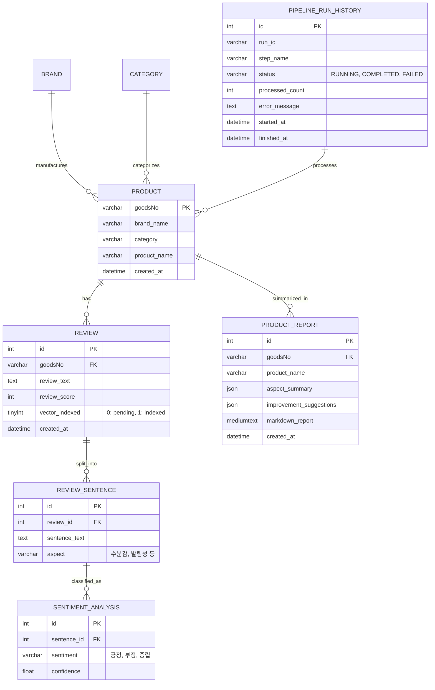

# Data Model & Schema Specifications

**Feature**: `041-bteam-unified-pipeline-restructure`  
**Date**: 2026-08-26  

---

## 1. Entity-Relationship Model (MySQL `cosmetic_db`)

---

## 2. ChromaDB Vector Metadata Contract (`chroma_db_oliview`)

| Field | Type | Description |
| :--- | :--- | :--- |
| **`id`** | `str` | Format: `rev_{review_id}_{chunk_idx}` |
| **`document`** | `str` | Review sentence / full review text |
| **`metadata.product_id`** | `str` | Product `goodsNo` |
| **`metadata.product_name`**| `str` | Product title |
| **`metadata.brand_name`** | `str` | Brand name (차앤박, 헤라, 식물나라 등) |
| **`metadata.category`** | `str` | Category (스킨케어, 클렌징, 선케어 등) |
| **`metadata.aspect`** | `str` | Aspect tag (수분감, 발림성, 자극도 등) |
| **`metadata.sentiment`** | `str` | Sentiment tag (긍정, 부정, 중립) |
| **`metadata.review_score`**| `int` | User rating (1~5) |
| **`metadata.indexed_at`** | `str` | ISO 8601 timestamp |
