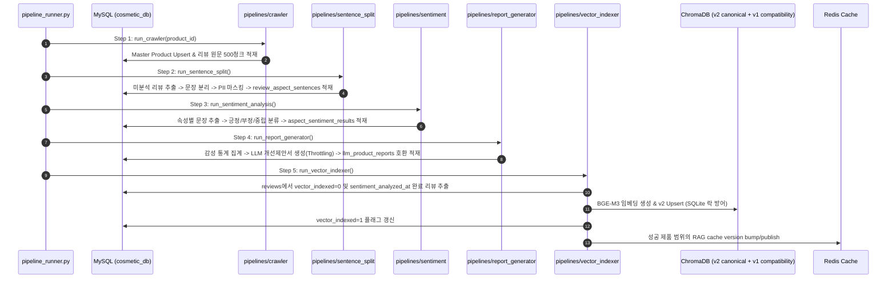

# Research: Oliview B-Team 전주기 데이터 및 서비스 파이프라인 통합 재구성

**Branch**: `041-bteam-unified-pipeline-restructure`  
**Date**: 2026-08-27
**Status**: Completed  

---

## 1. 하위 프로젝트 현황 분석 및 마이그레이션 매핑

### 1.1 현행 디렉토리 및 기능 현황
| 현행 디렉토리 | 주요 기능 및 기술 스택 | 마이그레이션 대상 경로 |
| :--- | :--- | :--- |
| `bteam/oliview_core/` | 공통 RAG/캐시/게이트웨이/설정/로그 모듈 | `bteam/packages/core/oliview_core/`로 비파괴 복제 후 inventory·characterization·checksum 검증 |
| `bteam/Oliview_Project/` (크롤러) | 올리브영 제품/리뷰 크롤링 스크립트 | Green 복제본 `bteam/pipelines/crawler/` |
| `bteam/Oliview_Project/backend` | Flask REST API & 대시보드 백엔드 | Green 복제본 `bteam/services/dashboard_backend/` |
| `bteam/Oliview_Project/frontend` | React 19 + Vite 대시보드 UI | Green 복제본 `bteam/services/dashboard_frontend/` |
| `bteam/Oliview_aspect_sentence_split/` | 리뷰 문장 분리 스크립트 및 KoBERT 가중치 | 스크립트 Green 복제 → `bteam/pipelines/sentence_split/` 가중치 Green 복제 → `bteam/models/sentence_split/` |
| `bteam/Oliview_aspect_sentiment/` | 6대 속성별 감성 분류 모델 및 스크립트 | 스크립트 Green 복제 → `bteam/pipelines/sentiment/` 가중치 Green 복제 → `bteam/models/sentiment/` |
| `bteam/Oliview_LLM/` | 제품별 LLM 개선 제안 보고서 생성 스크립트 | Green 복제 `bteam/pipelines/report_generator/` |
| `bteam/Oliview_chatbot_a/` | Streamlit 대화형 RAG 챗봇 | Green 복제 `bteam/services/chatbot_a/` |
| `bteam/Oliview_chatbot_b/` | FastAPI 하이브리드 RAG 챗봇 | Green 복제 `bteam/services/chatbot_b/` |

---

## 2. 통합 아키텍처 및 파이프라인 오케스트레이션 설계

### 2.1 E2E 데이터 가치 사슬 (End-to-End Pipeline)

### 2.2 통합 범위와 배포 경계

- 통합 대상은 코드 저장소, uv dependency graph, 공통 Core와 데이터 파이프라인 계약이다. 단일 컨테이너가 아니다. 원본은 Green 복제본 검증이 끝날 때까지 이동·rename하지 않는다.
- `pipeline_runner`, Dashboard backend, Dashboard frontend, ChatA, ChatB는 각각 독립 컨테이너로 유지한다. MySQL·Redis·ChromaDB persistence·Model Gateway도 별도 의존 서비스로 격리한다.
- 각 애플리케이션 컨테이너는 독립 healthcheck, restart, resource limit, 구조화 로그, 서비스별 환경 변수·secret allowlist와 rollback 경계를 가진다.

---

## 3. 핵심 엔지니어링 방어 기제

### 3.1 MySQL 청크 트랜잭션 및 DB 락 격리
- 크롤러 및 감성 분석 대량 쓰기 시 `READ COMMITTED` 격리 수준을 적용하고 500건 단위로 `session.commit()`을 수행한다. Deadlock/lock 재시도와 실패 상태를 기록하며, 이것만으로 모든 동시성 문제가 사라진다고 가정하지 않는다.

### 3.2 ChromaDB SQLite 동시성 락 방어
- 현재 legacy `oliview_review_sentences` builder는 `id=str(sentence_id)`를 쓰고 `review_id`를 metadata에 넣지 않으므로 Green이 이를 source citation collection으로 재사용하지 않는다. `vector_indexer`는 `oliview_review_sentences_v2`에 `id=str(aspect_sentence_id)`, `source_review_id`와 `review_id` alias를 함께 기록한다. 승인된 cutover/soak에서만 v1 exact-shape dual-write를 추가하고 collection별 lag를 checkpoint로 관리한다.
- 동시 읽기/쓰기 시 발생하는 `sqlite3.OperationalError: database is locked`를 방어하기 위해 최대 3회, 0.5초 base·4초 cap·jitter 지수 백오프를 적용한다. v2 Upsert 실패 시 `vector_indexed`와 cache version을 전진시키지 않으며, v1 dual-write 실패는 rollback compatibility와 `DATA_MIGRATION_READY`를 실패시킨다.

### 3.3 LLM 추론 큐 Throttling
- `report_generator`의 프롬프트 호출은 `Settings`의 concurrency·timeout·retry를 사용한다. Gateway retry는 timeout/HTTP 429/5xx에만 최대 2회 적용하고 validation 및 그 외 4xx는 재시도하지 않는다. DEMO와 PRODUCTION의 성능 기준은 동일하게 취급하지 않는다.

### 3.4 도커 빌드 격리
- `bteam/` 루트 build context를 사용하고 `.dockerignore`에 모델·`*.sql`·`chroma_db_oliview/`·가상환경을 선언한다. 실제 build context 크기를 로그로 검증하며, 모델은 read-only volume으로 주입한다.

### 3.5 보고서 projection 및 citation 경계

- `llm_product_reports`와 `llm_product_attribute_reports`는 저장 원천으로 보존하고, additive `llm_product_report_claims`/`llm_product_report_citations`를 함께 저장한다. `product_report_schema.json`은 이 테이블들과 상품·감성 집계를 조합한 API projection이다. `aspect_summary.*.positive_ratio`는 기존 view 계산과 동일하게 0~100 퍼센트로 표현한다.
- 보존 속성 행은 schema v2 `attributes[]`, 상품 전체 감성 집계는 `statistics`, 속성별 감성 집계는 `aspect_summary`로 노출하며 `statistics.*_ratio`도 0~100 퍼센트로 고정한다.
- API projection은 `report_id := llm_product_report_id`, `created_at := generated_at(UTC)`로 매핑한다. report·claim·citation을 하나의 transaction으로 저장하고, citation은 실존 `reviews.review_id`, 동일 product, PII 처리된 원문 substring을 검증한다. `report_status=grounded`의 `claims[]` 각 항목은 `citations[]`를 1개 이상 가지며, 검증 불가한 기존 행은 `abstained/LEGACY_UNVERIFIED`로 투영한다.
- `key_complaints[]`와 `key_praises[]`는 자유 텍스트 사실이 아니라 cited `claim_id` 참조이며, 개선 제안은 `basis_claim_ids[]`로 cited claim을 참조한다. abstained 응답은 claims·complaints·praises·suggestions를 모두 비운다.
- canonical v2 Chroma metadata에는 `source_review_id`를 필수로 포함한다. 원천 리뷰 식별자가 없거나 alias가 불일치하는 벡터는 citation 대상 및 성공 인덱스로 인정하지 않는다.
- 검색 0건 또는 source review 부재 시 report/chatbot은 abstention 응답을 반환하며, PII·무환각·citation fixture를 통해 DEMO/PRODUCTION 모두 검증한다.

### 3.6 성능 기준 및 주기 실행

- 성능 검증은 `tests/fixtures/performance_queries.jsonl`의 고정 100개 query, 20회 warm-up, 200회 측정, 입력 256/output 512 token cap과 warm Redis/ChromaDB를 사용한다. CPU·RAM·GPU·스토리지, image digest, model revision, 데이터량·동시성과 raw latency를 artifact에 기록한다.
- PRODUCTION acceptance는 Gateway replica당 1 x NVIDIA GeForce GTX 1070 8 GiB reference profile로 고정한다. 실제 topology는 서로 다른 GPU instance의 Gateway endpoint 2개 이상을 health-aware 분산하고 Redis primary+replica와 독립 failure domain의 Sentinel 3개 또는 동등한 managed HA endpoint를 요구한다. 현재 로컬 단일 GTX 1070 결과는 DEMO에만 유효하며 다른 profile은 별도 재승인을 요구한다. Python workspace는 정확히 5개 member이고 Vite frontend는 Node `^20.19.0 || >=22.12.0`의 lockfile gate를 별도로 통과해야 한다.
- `--interval-hours=0`은 단일 실행이고, 양수는 supervisor가 수명주기를 관리하는 foreground 프로세스가 주기 실행한다. cycle 시작 시 immutable watermark를 기록하고 crawl은 `is_active=1 AND (review_checked_at IS NULL OR review_checked_at <= cycle_started_at - interval)`인 due product를 선택한다. 후속 단계는 각 단계의 성공 checkpoint 이후 변경 입력만 선택하며 전체 cycle 성공 뒤에만 watermark를 전진시킨다.

### 3.7 Active lease와 정확한 재개

- history의 `(run_id, step_name, scope_key)` unique는 같은 run의 중복 기록만 막으므로 전역 실행 lock으로 충분하지 않다. 별도 `PipelineActiveLease`가 `(step_name, scope_key)`를 전역 유일하게 관리하고 owner token, heartbeat, expiry를 기록한다.
- hard kill로 lease가 만료되면 이전 `RUNNING` 이력을 `FAILED/LEASE_EXPIRED`로 바꾸고 새 owner가 lease를 획득하는 작업을 원자적으로 수행한다.
- Resume은 `--resume-run-id <run_id>`로 지정한 실패 실행의 selector와 canonical steps가 현재 요청과 정확히 일치할 때만 허용한다.

### 3.8 Blue-Green 비파괴 전환

- 현재 실행 중인 멀티 컨테이너 스택은 Blue로 유지한다. Green은 `docker compose -f bteam/docker-compose.green.yml -p bteam-green up -d --build`로 별도 project/network에 기동하며 고정 `container_name`을 사용하지 않는다.
- Green 검증의 MySQL/ChromaDB는 Blue snapshot을 별도 환경에 복구하고 Redis도 격리한다. startup preflight는 Green write endpoint가 Blue 운영 endpoint와 같으면 실패해야 하며, 검증 중 Blue data plane에는 쓰지 않는다.
- Green의 Red→Green 계약, E2E, 복구, 보안, 성능, readiness가 모두 통과하기 전에는 운영 Nginx upstream과 운영 데이터 endpoint를 변경하지 않는다. cutover 승인 뒤 Blue 사용자 HTTP 서비스는 유지한 채 background writer를 drain하고 fresh backup, Blue와 호환되는 additive migration, checkpoint 기반 final delta sync를 수행한다.
- cutover 승인, backup 준비, data migration 완료, decommission 승인은 각각 `deployment_gate_contract.json`의 `CUTOVER_APPROVED`, `BACKUP_READY`, `DATA_MIGRATION_READY`, `DECOMMISSION_APPROVED` artifact로 해시와 UTC 시각을 남긴다.
- `DATA_MIGRATION_READY`는 MySQL additive schema, v2 canonical collection, v1 exact-shape dual-write lag 0, inventory 기반 legacy Redis key class별 exact-target 또는 cache-bypass/격리 Redis 증거를 검증한다. hash 기반 legacy cache를 제품 단위로 삭제한다고 가정하지 않는다. rollback은 citation 호환성이 없는 legacy chatbot을 `ABSTENTION_FOR_UNVERIFIED` profile로 제한할 수 있어야 한다.
- 승인된 cutover 후에도 Blue를 최소 24시간 실행 상태로 유지하고 오류 임계값 초과 시 즉시 rollback한다. soak와 rollback rehearsal 성공 뒤 별도 decommission 승인이 있어야만 Blue를 중지하고 recoverable archive로 이동한다. 운영 volume과 snapshot은 기본적으로 삭제하지 않는다.

### 3.9 Settings, retry 및 Redis cache 경계

- 하나의 `Settings` schema를 사용하되 각 컨테이너에는 서비스별 allowlist의 변수와 secret만 주입한다. `APP_RUN_MODE`는 성능 정책을, `DEPLOYMENT_STAGE=VALIDATION|CUTOVER`는 data-plane 접근 정책을 제어하며 VALIDATION은 격리 write endpoint만 허용한다. 전체 공용 `.env`를 모든 컨테이너에 마운트하지 않는다.
- MySQL/ChromaDB/Redis/Gateway retry와 timeout은 `spec.md`의 기본값을 사용하며 구조화 로그에 최종 실패와 재처리 범위를 기록한다.
- Redis는 `bteam:{APP_RUN_MODE}:product:{product_id}:{report|rag}:v{version}` key를 사용하고 성공 제품 범위만 version bump/publish한다. 현재 `v1:rag:pool`처럼 역매핑 가능한 key만 exact invalidation하고 `emb:bge-m3:*`, `rerank:*`, `olliview:l5:*`처럼 query/content hash인 key는 scan/delete하지 않고 bypass 또는 격리 empty Redis로 처리한다. `FLUSHDB`, 전역 wildcard 삭제, production `KEYS`/전역 `SCAN`은 금지한다.

---

## 4. 결론
- inventory와 복구 검증을 선행한 4개 논리 계층 재구성을 통해 코드 중복을 줄이고, `pipeline_runner.py`로 데이터 수집부터 챗봇 RAG 서빙까지 연결한다. 이 통합은 단일 컨테이너화가 아니며, Green 복제본을 완전히 검증하는 동안 기존 Blue 서비스·폴더·bind mount는 유지한다. 외부 cutover/decommission 권한자의 승인 전에는 운영 endpoint를 바꾸거나 Blue와 레거시 자산을 중지·이동·삭제하지 않는다.
