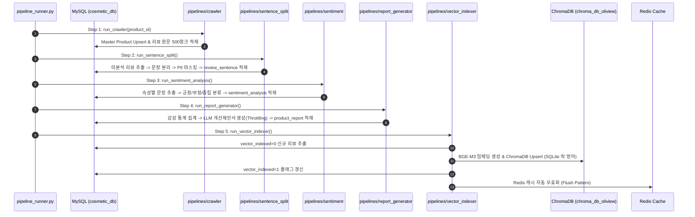

# Research: Oliview B-Team 전주기 데이터 및 서비스 파이프라인 통합 재구성

**Branch**: `041-bteam-unified-pipeline-restructure`  
**Date**: 2026-08-26  
**Status**: Completed  

---

## 1. 하위 프로젝트 현황 분석 및 마이그레이션 매핑

### 1.1 현행 디렉토리 및 기능 현황
| 현행 디렉토리 | 주요 기능 및 기술 스택 | 마이그레이션 대상 경로 |
| :--- | :--- | :--- |
| `bteam/oliview_core/` | 공통 RAG/캐시/게이트웨이 모듈 | `bteam/packages/core/oliview_core/` |
| `bteam/Oliview_Project/` (크롤러) | 올리브영 제품/리뷰 크롤링 스크립트 | `bteam/pipelines/crawler/` |
| `bteam/Oliview_Project/backend` | Flask REST API & 대시보드 백엔드 | `bteam/services/dashboard_backend/` |
| `bteam/Oliview_Project/frontend` | React 19 + Vite 대시보드 UI | `bteam/services/dashboard_frontend/` |
| `bteam/Oliview_aspect_sentence_split/` | 리뷰 문장 분리 스크립트 및 KoBERT 가중치 | 스크립트 $\rightarrow$ `bteam/pipelines/sentence_split/` 가중치 $\rightarrow$ `bteam/models/sentence_split/` |
| `bteam/Oliview_aspect_sentiment/` | 6대 속성별 감성 분류 모델 및 스크립트 | 스크립트 $\rightarrow$ `bteam/pipelines/sentiment/` 가중치 $\rightarrow$ `bteam/models/sentiment/` |
| `bteam/Oliview_LLM/` | 제품별 LLM 개선 제안 보고서 생성 스크립트 | `bteam/pipelines/report_generator/` |
| `bteam/Oliview_chatbot_a/` | Streamlit 대화형 RAG 챗봇 | `bteam/services/chatbot_a/` |
| `bteam/Oliview_chatbot_b/` | FastAPI 하이브리드 RAG 챗봇 | `bteam/services/chatbot_b/` |

---

## 2. 통합 아키텍처 및 파이프라인 오케스트레이션 설계

### 2.1 E2E 데이터 가치 사슬 (End-to-End Pipeline)

---

## 3. 핵심 엔지니어링 방어 기제

### 3.1 MySQL 청크 트랜잭션 및 DB 락 격리
- 크롤러 및 감성 분석 대량 쓰기 시 `READ COMMITTED` 격리 수준을 적용하고 500건 단위로 `session.commit()`을 수행하여 실시간 챗봇 질의 쿼리와의 Row Lock 경합을 방지.

### 3.2 ChromaDB SQLite 동시성 락 방어
- `vector_indexer`는 동시 읽기/쓰기 시 발생하는 `sqlite3.OperationalError: database is locked`를 방어하기 위해 지수 백오프(`retry_delay = 0.5 * (2 ** attempt)`) 재시도 로직을 적용.

### 3.3 LLM 추론 큐 Throttling
- `report_generator`의 프롬프트 호출 시 `max_concurrency=1~2` 및 0.5초 딜레이를 주어 실시간 챗봇 사용자의 P95 SLA(5초 이내)를 보호.

### 3.4 도커 빌드 격리
- 루트 `.dockerignore`에 `models/` 및 `*.sql`, `chroma_db_oliview/`를 선언하여 도커 데몬으로 수 GB의 가중치가 전송되는 현상을 100% 방지.

---

## 4. 결론
- 물리적 3계층 재구성을 통해 코드 중복을 80% 이상 제거하고, `pipeline_runner.py` 단일 실행으로 데이터 수집부터 챗봇 RAG 서빙까지 완전 자동화된 전주기 파이프라인을 구축 가능함.
