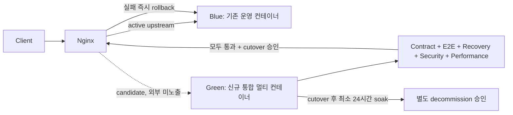

# Feature Specification: Oliview B-Team 전주기 데이터 및 서비스 파이프라인 통합 재구성

**Feature Branch**: `041-bteam-unified-pipeline-restructure`  
**Created**: 2026-08-26  
**Status**: Clarified & Remediation Revised (Round 6 Approved)
**Input**: User description: "C:\AISERVICE\bteam 폴더에 있는 하위 프로젝트들의 구조 검토와 재구성을 위한 리서치를 진행해서 스펙 작성. 올리브영 사이트에서 타겟 제품의 리뷰를 수집 -> 감성분석 -> 개선제안 보고서 생성. 리뷰 분석 정보를 바탕으로 챗봇 운영의 구조인데, 각 프로젝트들이 폴더별로 개별 구현되어있어서 통합 재구성해야 할것 같음"

---

## Clarification & Design Decisions *(speckit-clarify & Round 3 Multi-Persona Hardening)*

- **Q1 (디렉토리 재구성 및 마이그레이션 전략)**: B팀 하위 프로젝트들의 디렉토리 재구성 및 마이그레이션 전략을 어떻게 진행할 것인가?
  - **결정**: **4개 논리 계층(`packages/core`, `models/`, `pipelines/`, `services/`)으로 복제→checksum 검증→Green canonical 전환**하는 방식을 채택한다. Green 검증 중에는 `Copy-Item`과 같은 비파괴 복제만 허용하고 Blue가 사용하는 기존 폴더·bind mount·모델 원본은 이동·이름변경·수정하지 않는다. cutover·24시간 soak·rollback rehearsal 뒤 외부 변경 권한자가 발급한 `DECOMMISSION_APPROVED`가 있어야만 기존 자산을 recoverable archive로 이동할 수 있다. 래퍼나 심볼릭 링크는 운영 경로가 아니라 검증 기간의 호환 수단으로만 허용한다.
- **Q2 (전주기 파이프라인 오케스트레이션 방식)**: 전주기 파이프라인(크롤링 $\rightarrow$ 감성분석 $\rightarrow$ 보고서생성 $\rightarrow$ 벡터인덱싱) 오케스트레이션 방식을 어떻게 구현할 것인가?
  - **결정**: **통합 CLI 오케스트레이터 (`pipeline_runner.py`) + `--steps crawl,sentence_split,sentiment,report,index|all` + `--resume-run-id <run_id>` 체크포인트 재개**를 지원한다. `--product-id`는 내부 정수 PK, `--product-code`는 Olive Young `goodsNo`로 구분하며, 둘 중 하나 또는 `--all-products`를 명시적으로 요구한다. Resume은 지정한 실패 실행의 selector·steps와 정확히 일치할 때만 허용한다.
- **Q3 (ChromaDB 벡터 인덱스 동기화 방식)**: 수집/분석된 신규 리뷰 데이터의 ChromaDB 벡터 인덱스 동기화 방식을 어떻게 처리할 것인가?
  - **결정**: **versioned collection 기반 증분 동기화**를 채택한다. 현재 `oliview_review_sentences`(v1)는 문자열 `sentence_id`와 citation 식별자가 없는 legacy metadata를 사용하므로 Green 검증 중 덮어쓰지 않는다. Green은 `oliview_review_sentences_v2`에 `id=str(aspect_sentence_id)`, `source_review_id`를 포함한 계약으로 Upsert한다. 기존 `reviews`에는 호환 migration으로 `vector_indexed` 상태를 추가하고 v2 Upsert 성공 후에만 갱신한다. 승인된 cutover/soak 동안에는 v1 exact-shape dual-write와 collection별 lag artifact로 Blue 호환성을 별도 관리한다.
- **Q4 (LLM 개선 제안 보고서 연동 범위)**: 생성된 '제품별 LLM 개선 제안 보고서'의 서비스 연동 범위를 어떻게 설정할 것인가?
  - **결정**: 기존 `llm_product_reports` 및 `llm_product_attribute_reports`를 그대로 보존하고, additive `llm_product_report_claims`·`llm_product_report_citations` 테이블에 claim과 원천 리뷰 결속을 저장한다. 보고서·claim·citation은 한 트랜잭션에서 기록하며 citation의 리뷰가 실재하고 같은 제품에 속하는지 검증한다. 기존 citation 없는 보고서는 사실을 재구성하지 않고 `LEGACY_UNVERIFIED` abstention으로 투영한다. JSON/Markdown 보고서는 대시보드와 ChatA/ChatB에서 동일한 계약으로 조회·인용한다.
- **Q5 (패키지 및 가상환경 관리 전략)**: Python 패키지 및 가상환경(UV) 관리 전략을 어떻게 구성할 것인가?
  - **결정**: **`bteam` 루트의 단일 `pyproject.toml`/`uv.lock`과 단일 `Settings` schema**를 사용한다. uv workspace 구성원은 `packages/core`, `pipelines`, `services/dashboard_backend`, `services/chatbot_a`, `services/chatbot_b`의 다섯 Python package로 고정하고 각 경로에 `pyproject.toml`을 둔다. React frontend는 uv 구성원이 아니며 자체 `package-lock.json`으로 관리한다. 각 컨테이너에는 서비스별 allowlist에 포함된 환경 변수와 secret만 주입하며, 전체 비밀값이 담긴 공용 `.env`를 모든 컨테이너에 마운트하지 않는다.
- **Q6 (머신러닝 모델 가중치 파일 저장 위치)**: 문장분리 및 감성분석 모델 가중치(Weights) 파일들의 저장 위치를 어떻게 구성할 것인가?
  - **결정**: **공통 `models/` 폴더(`bteam/models/sentence_split`, `bteam/models/sentiment`, 필요한 경우 `bteam/models/embeddings`)로 가중치를 비파괴 복제하고 원본/복제본 checksum을 검증**한다. Green은 복제본을 read-only mount하며 기존 Blue 원본은 decommission 승인 전까지 제자리에서 변경 없이 보존한다.
- **Q7 (컨테이너 이름 및 게이트웨이 연동 호환성)**: 통합 Compose와 게이트웨이(Nginx) 연동 호환성을 어떻게 처리할 것인가?
  - **결정**: 통합 대상은 코드 저장소와 공통 package이지 단일 컨테이너가 아니다. `pipeline_runner`, Dashboard backend/frontend, ChatA, ChatB는 각각 독립 컨테이너로 유지하고 MySQL·Redis·ChromaDB persistence·Model Gateway도 별도 의존 서비스로 격리한다. Blue와 Green은 서로 다른 Compose project name과 color별 network alias를 사용하며, 고정 `container_name`으로 병행 실행을 방해하지 않는다. Green은 Blue가 점유한 host port를 재사용하지 않고 내부 candidate network 또는 충돌 없는 `127.0.0.1` 전용 검증 port만 사용한다.
- **Q8 (MySQL 보고서 스키마 관리)**: LLM 제품 보고서 저장을 위한 보고서 스키마 관리를 어떻게 처리할 것인가?
  - **결정**: 운영 DB에 대해 무조건적인 `CREATE TABLE IF NOT EXISTS`만 수행하지 않는다. 현재 스키마를 검사하고, 버전이 있는 additive migration으로 `reviews.vector_indexed`, claim/citation 테이블, pipeline history/lease와 필요한 인덱스를 추가한다. 기존 컬럼·테이블은 삭제·rename하지 않으며 migration lock, clone dry-run, fresh backup과 rollback 절차를 제공한다.
- **Q9 (오케스트레이터 스케줄링 옵션)**: `pipeline_runner.py` 오케스트레이터의 실행 및 스케줄링 방식을 어떻게 구성할 것인가?
  - **결정**: **온디맨드 CLI + foreground 장기 실행용 `--interval-hours`**를 채택한다. runner 자체는 daemonize하지 않으며, Docker restart policy 또는 외부 supervisor가 background 수명주기를 담당한다.
- **Q10 (보존·복구 및 검증 전략)**: 대규모 재구성 중 기존 자산의 무결성을 어떻게 보장할 것인가?
  - **결정**: Blue 원본과 Green 복제본의 manifest·SHA-256을 비교하고 SQL dump·모델 가중치·ChromaDB snapshot을 격리 환경에서 복구 테스트한다. inventory에는 secret 파일명·키 이름·redacted 존재 여부·파일 hash만 기록하고 값은 절대 기록하지 않는다. Git checkpoint는 소스 복구용으로만 사용하며 DB·벡터·파일 상태 복구를 대체하지 않는다.
- **Q11 (관측성 및 개인정보 보호)**: 파이프라인과 서비스의 장애 추적 및 민감정보 보호를 어떻게 보장할 것인가?
  - **결정**: 모든 단계는 `run_id`, 제품 식별자, 단계명, 상태, 처리 건수, latency를 구조화 로그로 기록한다. API key, 인증 토큰, 비밀번호, 원문 PII는 로그·외부 전송·LLM prompt에서 마스킹한다.
- **Q12 (기존 서비스 유지 및 전환 방식)**: 새 통합 구조를 만드는 동안 기존 컨테이너와 서비스를 어떻게 처리할 것인가?
  - **결정**: 기존 스택을 **Blue**, 새 통합 스택을 **Green**으로 정의한다. Green은 `bteam/docker-compose.green.yml`과 별도 Compose project/network alias로 병행 실행한다. 기본 `DEPLOYMENT_STAGE=VALIDATION`에서 Green의 쓰기는 복구한 MySQL/ChromaDB snapshot과 격리 Redis에만 허용하며 Blue 운영 data plane에 쓰지 않는다. Green의 Red→Green 계약 테스트, E2E, 복구, 보안, 성능, readiness가 모두 통과하기 전에는 외부 Nginx upstream과 운영 데이터 endpoint를 변경하지 않는다. 별도 cutover 승인 뒤에만 `DEPLOYMENT_STAGE=CUTOVER`를 사용하고, Blue의 사용자 HTTP 서비스는 유지한 채 background writer를 짧게 drain하여 fresh backup, backward-compatible additive migration 및 checkpoint 기반 final delta sync를 수행한다. cutover 후에도 Blue를 최소 24시간 실행 상태로 유지하고 rollback rehearsal과 관찰창을 통과한 뒤에만 별도 폐기 승인을 요청한다.
- **Q13 (레거시 cache와 승인 권한 경계)**: 제품 식별자가 없는 legacy Redis cache와 배포 승인을 어떻게 안전하게 처리할 것인가?
  - **결정**: legacy key는 제품-addressable key와 query/content-hash key로 inventory에서 분류한다. 전자는 결정적 매핑이 검증된 key만 표적 무효화하고, 후자는 scan/delete하지 않으며 prevalidated cache-bypass 또는 격리 empty Redis rollback profile을 사용한다. 구현 에이전트·배포 스크립트는 `CUTOVER_APPROVED`나 `DECOMMISSION_APPROVED`를 스스로 생성할 수 없고 외부 변경 권한자가 발급한 artifact를 검증만 한다.

---

## 1. Executive Summary & Problem Definition

### 1.1 현상 및 문제점 (Current State & Pain Points)
현재 `C:\AISERVICE\bteam` 하위 프로젝트는 다음과 같이 6개 이상의 폴더로 분산 격리(Siloed)되어 있습니다:
1. `Oliview_Project`: 올리브영 크롤러 모음 + Flask 백엔드 + React Vite 프론트엔드
2. `Oliview_aspect_sentence_split`: 리뷰 문장 분리 스크립트 및 모델
3. `Oliview_aspect_sentiment`: 속성별 감성 분석(긍정/부정/중립) 스크립트 및 모델
4. `Oliview_LLM`: 단일/전체 제품 대상 LLM 개선 제안 보고서 생성 스크립트
5. `Oliview_chatbot_a`: Streamlit 기반 RAG 챗봇
6. `Oliview_chatbot_b`: FastAPI 기반 하이브리드 RAG 챗봇

**핵심 결함**:
- **파이프라인 단절**: "크롤링 $\rightarrow$ 문장 분리 $\rightarrow$ 감성 분석 $\rightarrow$ LLM 보고서 생성 $\rightarrow$ 챗봇 RAG 서빙 $\rightarrow$ 대시보드 표출"의 핵심 가치 사슬이 하나의 통합 파이프라인으로 연결되어 있지 않고 개별 스크립트 수동 실행에 의존.
- **코드 및 설정 중복**: 각 폴더마다 독립된 `.env`, `pyproject.toml`, `common.py`, DB 연결 코드, LLM Gateway 호출 코드가 분산되어 있어 동기화 불일치 및 유지보수 비용 발생.
- **배포 및 패키지 관리 비효율**: 6개의 가상환경과 도커 컨테이너 설정이 분절되어 있어 데이터 변경 시 서비스 즉각 반영(End-to-End Reactive Refresh)이 불가능.

---

## 2. 통합 시스템 아키텍처 (Target Architecture)

```mermaid
flowchart TD
    subgraph Data_Pipeline["1. 통합 데이터 & AI 파이프라인 (Pipelines Layer)"]
        Crawler["1) OliveYoung Review Crawler\n(타겟 제품/리뷰 수집 & Master Upsert)"]
        Splitter["2) Aspect Sentence Splitter\n(6대 화장품 속성별 문장 분리 & PII 마스킹)"]
        Sentiment["3) Aspect Sentiment Classifier\n(긍정 / 부정 / 중립 분류)"]
        Reporter["4) LLM Report Generator\n(제품별 개선 제안 보고서 자동 생성, Throttling)"]
        Indexer["5) ChromaDB Vector Indexer\n(신규 리뷰 증분 벡터화 & SQLite 락 방어 & Redis Purge)"]
        Orchestrator["6) Unified Pipeline Orchestrator (pipeline_runner.py)\n(E2E 원클릭 실행 & 단계별 제어 & 주기 실행 & 체크포인팅)"]

        Crawler -->|원문 리뷰 저장 (500 청크 커밋)| DB[(MySQL cosmetic_db)]
        DB -->|미분석 리뷰 추출| Splitter
        Splitter -->|속성 분리 문장| Sentiment
        Sentiment -->|감성 라벨 적재| DB
        DB -->|감성 통계 집계| Reporter
        Reporter -->|개선제안서 저장| DB
        DB -->|신규 분석 리뷰 증분 추출 (vector_indexed=0)| Indexer
        Indexer -->|임베딩 Upsert & vector_indexed=1| VectorDB[("ChromaDB Vector Store")]
        Indexer -.->|캐시 즉시 무효화| Cache[(Redis L1~L5 Cache)]

        Orchestrator -.->|E2E / Step-by-Step / Retry / Chunking| Crawler
        Orchestrator -.-> Splitter
        Orchestrator -.-> Sentiment
        Orchestrator -.-> Reporter
        Orchestrator -.-> Indexer
    end

    subgraph Core_Layer["2. 공통 코어 계층 (Shared Core Package)"]
        CoreDB["Database Manager (MySQL Connection Pool & Auto Migration & Chunk Commit)"]
        CoreLLM["LLM / Embedding / Reranker Client (vLLM Throttling)"]
        CoreCache["Redis L1~L5 Cache Manager (Auto Invalidation)"]
        CoreGuard["Domain Guardrails & Sanitizer (PII Masking)"]
    end

    subgraph Service_Layer["3. 서비스 서빙 계층 (Serving & Delivery Layer)"]
        ChatA["ChatA: Streamlit 챗봇\n(/bteam/chata/)"]
        ChatB["ChatB: FastAPI 챗봇\n(/bteam/chatb/)"]
        DashboardBE["Oliview Backend API\n(Flask /api)"]
        DashboardFE["Oliview Frontend UI\n(React 19 + Vite)"]

        VectorDB --> ChatA
        VectorDB --> ChatB
        DB --> DashboardBE
        DashboardBE --> DashboardFE
        DB -.->|보고서 직접 인용| ChatA
        DB -.->|보고서 직접 인용| ChatB
    end

    Core_Layer -.-> Data_Pipeline
    Core_Layer -.-> Service_Layer
```

### 2.1 배포 단위와 Blue-Green 경계

| Deployment unit | Responsibility | Public exposure |
| :--- | :--- | :--- |
| `pipeline_runner` | crawl→split→sentiment→report→index orchestration | 없음 |
| `dashboard_backend` | Flask REST API | Nginx 경유 |
| `dashboard_frontend` | React 정적 UI | Nginx 경유 |
| `chatbot_a` | Streamlit ChatA | Nginx 경유 |
| `chatbot_b` | FastAPI ChatB | Nginx 경유 |
| MySQL / Redis / ChromaDB persistence / Model Gateway | 독립 데이터·캐시·모델 의존 서비스 | 내부 network만 허용 |

하나의 monorepo와 공통 Core를 사용하더라도 위 배포 단위를 한 컨테이너에 합치지 않는다. 각 단위는 독립적인 healthcheck, restart, resource limit, 로그와 rollback 경계를 가진다.



---

## 3. 재구성 디렉토리 표준 구조 (Target Directory Layout)

```text
bteam/
├── packages/
│   └── core/                           # [공통 모듈] DB, Gateway, Redis, 프롬프트, 가드레일
│       ├── pyproject.toml
│       ├── alembic/                    # additive, Blue-compatible versioned migrations
│       └── oliview_core/
│           ├── db/                     # MySQL 커넥션 풀, ORM 모델, 자동 마이그레이션, 청크 커밋
│           ├── gateway/                # vLLM Gateway 클라이언트 (LLM, Embedding, Reranker, Throttling)
│           ├── cache/                  # Redis 캐시 계층 (L1~L5 & Auto Invalidation)
│           ├── guardrails/             # 브랜드 검증, 무환각 새니타이저, PII 마스킹
│           ├── config.py               # 환경 변수 기반 Settings / APP_RUN_MODE
│           ├── logging.py              # 구조화 로그 및 민감정보 마스킹
│           └── models/                 # 공통 Pydantic 데이터 모델
├── models/                             # [공통 ML 모델 가중치 저장소] (.dockerignore로 빌드 격리)
│   ├── sentence_split/                 # 문장분리 KoBERT/HuggingFace 가중치
│   ├── sentiment/                      # 속성 감성분석 가중치
│   └── embeddings/                     # 필요한 경우 로컬 embedding fallback 가중치
├── pipelines/                          # [데이터 & 분석 파이프라인]
│   ├── pyproject.toml                  # uv workspace member
│   ├── Dockerfile                      # [NEW] 독립 pipeline_runner 이미지
│   ├── crawler/                        # 올리브영 타겟 제품 및 리뷰 크롤러 (Master Product Upsert)
│   ├── sentence_split/                 # 리뷰 문장 분리 모델 & 프로세서 (PII 마스킹)
│   ├── sentiment/                      # 6대 속성 기반 감성 분석 분류기
│   ├── report_generator/               # LLM 기반 제품별 개선 제안 보고서 생성기 (GPU Throttling)
│   ├── vector_indexer/                 # MySQL -> ChromaDB 벡터 인덱싱 동기화 (SQLite 락 방어 & Redis Purge)
│   └── pipeline_runner.py              # E2E 전주기 원클릭 오케스트레이터 CLI (--interval-hours 지원)
├── services/                           # [서빙 서비스]
│   ├── dashboard_backend/              # Flask API Green 복제본 + pyproject.toml
│   ├── dashboard_frontend/             # React 19 Vite Green 복제본 + package-lock.json
│   │   ├── package.json
│   │   └── package-lock.json            # uv workspace 외부의 locked frontend dependencies
│   ├── chatbot_a/                      # Streamlit Green 복제본 + pyproject.toml
│   └── chatbot_b/                      # FastAPI Green 복제본 + pyproject.toml
├── migration/                           # [NEW] Inventory, checksum, snapshot, rollback artifact
├── deployment/                          # [NEW] Candidate Nginx, cutover/rollback, service env allowlists
├── contracts/
│   ├── pipeline_runner_contract.json
│   ├── product_report_schema.json
│   └── deployment_gate_contract.json    # 승인·backup·migration·decommission gate artifact
├── tests/
│   └── fixtures/                         # PII, zero-search, citation, performance test corpus
│       ├── pii_corpus.jsonl
│       ├── zero_search_corpus.jsonl
│       ├── citation_fixture.json
│       └── performance_queries.jsonl
├── docker-compose.yml                  # [KEEP] 현재 Blue; Green 전체 검증 중 변경 금지
├── docker-compose.green.yml            # [NEW] 별도 project의 Green 멀티 컨테이너
├── docker-compose.production.yml       # [NEW] 2+ GPU Gateway/Redis HA override
├── .dockerignore                       # 2GB models/ 빌드 컨텍스트 격리
├── alembic.ini                         # versioned migration 설정
├── pyproject.toml                      # 정확히 5개 Python member를 선언한 uv workspace
├── uv.lock                             # 전체 Python member 단일 lock
└── README.md                           # 전주기 통합 운영 가이드
```

---

## 4. User Scenarios & Testing *(mandatory)*

### User Story 1 - E2E 전주기 데이터 파이프라인 원클릭 실행 (Priority: P1) 🎯 MVP

데이터 엔지니어/운영자는 `pipeline_runner.py` 단일 명령을 통해 특정 타겟 제품(예: "컬러그램 탕후루 꿀로스")의 리뷰 수집 $\rightarrow$ 문장 분리 $\rightarrow$ 감성 분석 $\rightarrow$ LLM 개선제안 보고서 생성 $\rightarrow$ 벡터 인덱스 갱신까지 중단 없이 완전 자동화된 파이프라인을 구동할 수 있어야 한다.

**Why this priority**: 현재 수동으로 4~5개 폴더의 스크립트를 개별 실행해야 하는 운영 단절을 근본적으로 제거하기 위함.

**Independent Test**:
```bash
uv run python pipelines/pipeline_runner.py --product-id 12345 --steps all
```
실행 후 기존 MySQL 스키마(`products`, `reviews`, `llm_product_reports`)와 ChromaDB 인덱스가 모두 정상 갱신되는지 확인한다.

---

### User Story 2 - 공통 코어 패키지(`packages/core`) 단일화 및 코드 중복 제거 (Priority: P1)

모든 서비스(`services/`)와 파이프라인(`pipelines/`)이 분산된 `common.py` 및 중복 DB 설정 대신 `oliview_core` 패키지와 공통 `Settings` schema를 사용한다. 실제 환경 변수와 secret은 컨테이너별 allowlist로 분리하여 각 서비스가 필요한 값만 받는다.

**Why this priority**: 코드 중복으로 인한 버그와 설정 불일치를 원천 차단.

**Independent Test**: 각 서비스 및 파이프라인에서 `from oliview_core.db import get_db_pool`, `from oliview_core.gateway import LLMGatewayClient`를 실행한다. 두 심볼은 각 패키지 `__init__.py`에서 public export되어야 하며, DB/Gateway 계약 테스트와 실제 health 호출이 모두 성공해야 한다.

---

### User Story 3 - 챗봇 및 대시보드 실시간 연동 무결성 보장 (Priority: P2)

새롭게 수집/분석된 리뷰 데이터와 LLM 개선제안 보고서가 pipeline `index` step 성공 이벤트 후 60초 이내에 대시보드(React/Flask)와 챗봇(ChatA/ChatB)의 RAG 검색 풀에 반영되어야 한다.

**Why this priority**: 리뷰 분석의 최종 목적은 대시보드 시각화와 챗봇 질의응답을 통한 비즈니스 가치 창출이기 때문.

**Independent Test**: 신규 리뷰 적재와 pipeline `index` step 성공 이벤트의 시각을 기록한 뒤, 60초 이내 ChatA/ChatB에서 해당 리뷰 내용이 `source_review_id` 인용 문서로 검색되는지 확인.

---

### User Story 4 - 도커 빌드 격리 및 게이트웨이 무중단 서빙 보장 (Priority: P3)

기존 Blue 컨테이너를 서비스 상태로 유지한 채 별도 Compose project의 Green 멀티 컨테이너 스택과 빌드 격리(`.dockerignore`)를 구성한다. 모델·SQL dump·ChromaDB가 build context에 포함되지 않게 하고, Green의 전체 품질 게이트와 readiness 통과 및 cutover 승인 후에만 Gateway Nginx를 전환한다. cutover 후 최소 24시간 Blue rollback 경로를 유지하여 외부 5xx 없는 배포를 달성한다.

**Why this priority**: 인프라 변경 시 발생할 수 있는 서비스 중단(502 Bad Gateway) 및 빌드 실패를 원천 방어.

**Independent Test**: 기존 Blue의 외부 endpoint가 계속 정상인지 먼저 확인한 뒤 `docker compose -f bteam/docker-compose.green.yml -p bteam-green up -d --build`로 Green을 병행 기동한다. Green의 `dashboard_backend`, `dashboard_frontend`, `chatbot_a`, `chatbot_b` health와 pipeline runner, MySQL/Redis/ChromaDB/Model Gateway readiness를 내부 candidate route에서 검증한다. Green은 복구 snapshot·격리 cache/vector store만 쓰며 DB audit에서 Green service identity의 Blue 운영 data write가 0건이어야 한다. 전체 품질 게이트 전에는 외부 upstream과 운영 데이터 endpoint를 변경하지 않는다. 승인된 cutover rehearsal에서 외부 5xx 0건, 즉시 Blue rollback, Blue 컨테이너·volume 무변경을 확인한다.

### Edge Cases & Expected Behavior

| Case | Expected behavior |
| :--- | :--- |
| 제품 선택자가 없거나 둘 이상인 경우 | 비정상 종료하고 DB·ChromaDB·Redis 쓰기를 수행하지 않는다. |
| 존재하지 않는 `product_id/product_code` | 명시적인 not-found 상태를 기록하고 해당 제품의 데이터는 변경하지 않는다. |
| 제품의 리뷰가 0건인 경우 | 빈 통계를 반환하고 근거 없는 후기·개선 주장을 생성하지 않으며 벡터 인덱싱을 건너뛴다. |
| 동일 제품의 어떤 단계든 이미 `RUNNING`인 경우 | 선택한 단계 전체 동안 `(product_pipeline, product:{product_id})` active lease를 유지하여 단일/전체 실행과 서로 다른 단계 간 중복을 동일하게 거부하거나 기존 실행을 반환한다. |
| 두 `--all-products` cycle이 동시에 시작되는 경우 | 전역 `(cycle, all)` coordinator lease로 두 번째 cycle을 쓰기 전에 거부한다. 첫 cycle도 각 제품 처리 시 product pipeline lease를 별도로 획득한다. |
| 동일 scope의 lease heartbeat가 만료된 경우 | 기존 `RUNNING` 이력을 `LEASE_EXPIRED` 사유의 `FAILED`로 원자적으로 전환한 뒤 새 owner만 lease를 획득한다. |
| 중간 단계 실패 또는 프로세스 중단 | 성공한 데이터는 보존하고 명시한 `--resume-run-id`의 실패 단계부터 Resume한다. 다중 후보를 임의 선택하지 않는다. |
| Redis·ChromaDB·LLM Gateway 장애 | 정의된 retry/backoff를 적용하고 최종 실패 상태와 재처리 범위를 기록한다. 성공 flag나 캐시 성공 상태를 선제적으로 기록하지 않는다. |
| migration·checksum·복구 검증 실패 | 후속 단계와 레거시 삭제를 중단하고 rollback 및 원본 보존 상태를 기록한다. |
| 검색 결과 0건 또는 인용 가능한 source review가 없는 경우 | 사실 기반 abstention을 반환하며 가짜 후기와 무인용 주장을 출력하지 않는다. |
| Green build·계약·복구·성능 검증 실패 | Blue 외부 서비스를 그대로 유지하고 Nginx candidate 전환을 금지한다. |
| Green이 검증 중 Blue 운영 data endpoint에 쓰기 연결을 시도 | startup/preflight를 실패시키고 Blue 데이터·cache·vector store를 변경하지 않는다. |
| cutover 또는 24시간 soak 중 오류 임계값 초과 | 즉시 사전 검증된 Blue rollback profile로 복귀한다. citation 호환성이 없는 legacy chatbot 경로는 사실 응답 대신 abstention을 반환하고 Green artifact를 보존한다. |

---

## 5. Requirements *(mandatory)*

### Functional Requirements

- **FR-001**: 시스템은 Blue 원본을 제자리에서 보존한 채 Green 복제본을 `packages/core`, `models/`, `pipelines`, `services`의 4개 표준 계층으로 재구성해야 한다. 루트 uv workspace는 정확히 `packages/core`, `pipelines`, `services/dashboard_backend`, `services/chatbot_a`, `services/chatbot_b`를 member로 선언하고 단일 `uv.lock`으로 관리해야 하며 React frontend는 자체 lockfile을 사용해야 한다.
- **FR-002**: 시스템은 `pipelines/pipeline_runner.py`를 구현하여 5단계 파이프라인을 `--steps`로 단일 제품 또는 전체 제품 단위로 실행하고 `--interval-hours` 및 `--resume-run-id`를 지원해야 한다. CLI는 `crawl,sentence_split,sentiment,report,index` comma-separated 문자열 또는 단독 `all`을 받는다. 중복은 거부하고 다중 단계 입력은 사용자 입력 순서와 무관하게 `crawl -> sentence_split -> sentiment -> report -> index`의 고정 DAG 순서로 canonical array를 만든다. `--interval-hours=0`은 단일 실행이고 양수는 supervisor가 관리하는 foreground 주기 실행이다. 주기 cycle 시작 시 immutable watermark를 기록하고, `crawl`은 `is_active=1 AND (review_checked_at IS NULL OR review_checked_at <= cycle_started_at - interval)`인 due product를 선택한다. `sentence_split/sentiment/report/index`는 각 단계의 성공 checkpoint 이후 생성·변경된 입력만 선택하며, cycle이 완전히 성공한 뒤에만 watermark를 전진시킨다.
- **FR-003**: 시스템은 `packages/core`에 DB 연결 풀, 기존 운영 스키마 호환 migration, Model Gateway 클라이언트, Redis 캐시, 가드레일, `Settings` 의존성 주입 primitive를 제공해야 한다. migration은 기존 보고서 테이블을 보존하면서 `llm_product_report_claims`와 `llm_product_report_citations`를 additive하게 추가해야 한다.
- **FR-004**: 시스템은 `pipeline_runner`, Dashboard backend/frontend, ChatA, ChatB를 독립 컨테이너로 유지하고 Compose service key·color별 network alias·Nginx upstream 매핑을 일치시켜야 한다. 단일 애플리케이션 컨테이너로 병합하거나 고정 `container_name` 또는 Blue와 중복되는 host port binding으로 Blue/Green 병행 실행을 방해해서는 안 된다. Green 검증 endpoint는 내부 candidate network 또는 충돌 없는 `127.0.0.1` port에만 노출한다.
- **FR-005**: 시스템은 기존 기능 보존을 characterization test와 서비스 계약 테스트로 입증해야 한다. 선언적인 “100% 보존”만으로 완료 처리할 수 없다.
- **FR-006 (파이프라인 멱등성·lease·체크포인팅)**: `pipeline_runner.py`는 `run_id`, 제품 식별자, 단계, 입력 범위, `scope_key`, 상태, 재시도 횟수, checkpoint version/payload를 DB에 기록해야 한다. 실행 이력의 `(run_id, step_name, scope_key)` unique와 별도로 active lease의 `(step_name, scope_key)`를 전역 유일하게 관리한다. `--all-products` coordinator는 `(cycle, all)` lease를 획득하고, 단일/전체 실행 모두 각 제품의 선택 단계 전체 동안 `(product_pipeline, product:{product_id})` lease를 유지해야 한다. 단계 진행은 history로 기록한다. owner token, heartbeat, expiry를 기록하며 기본 heartbeat는 15초, lease TTL은 60초이고 TTL은 heartbeat의 3배 이상이어야 하며 DB server UTC를 시간 기준으로 사용한다. Resume은 `--resume-run-id`로 지정한 `FAILED` 실행만 동일 selector·steps에서 허용하며, hard kill로 만료된 lease는 이전 이력을 `FAILED/LEASE_EXPIRED`로 전환한 뒤 회수한다.
- **FR-007 (증분 인덱싱 플래그 및 메타데이터 정합성)**: 기존 `reviews` 스키마의 `vector_indexed` 상태를 호환 migration으로 관리하고 분석 완료 및 `oliview_review_sentences_v2` Upsert 성공 건만 indexed로 표시해야 한다. v2 문서 ID는 `str(aspect_sentence_id)`, `metadata.source_review_id`와 호환 alias `metadata.review_id`는 동일한 실존 `reviews.review_id`여야 한다. legacy v1 collection은 Green validation에서 덮어쓰지 않는다.
- **FR-008 (도커 빌드 격리 & 가중치 볼륨 마운트)**: `bteam/` 루트 빌드 컨텍스트에서 모델·SQL dump·ChromaDB·가상환경을 제외하고 모델 가중치는 read-only volume으로 주입해야 한다.
- **FR-009 (Blue-Green Gateway 무중단 동기화)**: 기존 Blue upstream을 유지한 상태에서 Green candidate를 별도 alias와 복구 snapshot 기반 data plane으로 검증해야 한다. 외부 변경 권한자가 발급한 `CUTOVER_APPROVED` 뒤 Blue 사용자 HTTP 서비스는 유지한 채 background writer drain과 fresh backup을 수행하고 `BACKUP_READY`를 기록한 다음, Blue와 backward-compatible한 additive migration 및 checkpoint 기반 final delta sync를 수행해 `DATA_MIGRATION_READY`를 기록해야 한다. 이 artifact는 MySQL 호환성, v2 sync와 legacy v1 exact-shape dual-write lag 0, legacy Redis key class별 targeted invalidation 또는 cache-bypass 증거를 포함해야 한다. 구현 에이전트와 배포 스크립트는 승인 artifact를 자체 발급할 수 없으며, 유효한 artifact가 없으면 운영 데이터 쓰기·Nginx reload를 실행하지 않고 종료해야 한다. cutover 및 최소 24시간 soak 동안 Blue를 실행 상태로 유지하고 오류 임계값 초과 시 즉시 승인된 rollback profile로 복귀하며 외부 5xx가 없어야 한다.
- **FR-010 (MySQL 배치 청크 커밋 & 락 격리)**: 모든 대량 DB 쓰기는 `batch_size=500`, `autocommit=False`, `READ COMMITTED`를 적용하고 lock/deadlock 재시도 및 실패 상태를 기록해야 한다.
- **FR-011 (ChromaDB 안전 동기화 & 재시도 백오프)**: `vector_indexer`는 v2 배치 Upsert, 최대 3회 지수 백오프, 실패 건 보류 상태와 재처리 로그를 제공해야 한다. 승인된 cutover/soak에서는 같은 `aspect_sentence_id`로 legacy v1 exact-shape도 dual-write하고 collection별 checkpoint/lag를 기록하며, v1 실패는 `DATA_MIGRATION_READY`와 rollback 호환 판정을 실패시켜야 한다.
- **FR-012 (LLM GPU 추론 큐 부하 분산 & Throttling)**: LLM 동시성·지연·timeout과 `MODEL_GATEWAY_ENDPOINTS`는 `Settings`로 주입해야 한다. Compose의 기존 `GATEWAY_ENDPOINTS`는 호환 alias로 허용하되 canonical 설정은 `MODEL_GATEWAY_ENDPOINTS`로 정규화한다. PRODUCTION은 서로 다른 GPU-backed instance의 healthy Gateway endpoint를 2개 이상 요구하고 health-aware round-robin으로 분산하며, retry 시 실패 endpoint가 아닌 다른 healthy endpoint를 우선해야 한다. 기준 부하에서 챗봇 SLA를 검증해야 한다.
- **FR-013 (도커 멀티 패키징 & 프론트엔드 운영 설정)**: 각 서비스 이미지가 `/app/packages/core`를 설치하고, 프론트엔드는 운영용 정적 서버와 `/bteam/oliview/api` proxy 설정을 명시해야 한다.
- **FR-014 (마스터 상품 카탈로그 자동 Upsert & 데이터 정합성)**: 크롤러는 기존 `products.product_id`와 `products.product_code(goodsNo)`를 기준으로 상품을 먼저 Upsert하고 기존 FK 관계를 보존해야 한다.
- **FR-015 (파이프라인 완료 시 Redis 캐시 자동 무효화)**: Green cache key는 `bteam:{APP_RUN_MODE}:product:{product_id}:{report|rag}:v{version}` namespace를 사용한다. 보고서 DB commit과 v2 ChromaDB Upsert가 성공한 범위만 version bump/publish하고 partial failure 시 version을 전진시키지 않는다. legacy key는 inventory에서 (a) 결정적 product/target mapping이 있는 addressable key와 (b) `emb:*`, `rerank:*`, `olliview:l5:*` 같은 query/content-hash key로 분류한다. (a)만 정확한 key로 표적 무효화하고 (b)는 삭제하지 않으며 rollback 시 prevalidated cache-bypass 또는 격리 empty Redis profile을 사용한다. `FLUSHDB`, wildcard 삭제, production `KEYS`/전역 `SCAN`은 금지한다.
- **FR-016 (리뷰 PII 개인정보 마스킹 새니타이저)**: 저장소의 `tests/fixtures/pii_corpus.jsonl`로 정의된 PII 테스트 corpus에 대해 문장·벡터·LLM prompt·로그 경계에서 개인정보가 유출되지 않도록 마스킹해야 한다.
- **FR-017 (비파괴적 단계별 마이그레이션 및 롤백 안전장치)**: 소스·DB·모델·ChromaDB를 별도 checkpoint로 보존하고, Green validation에서는 기존 경로를 이동·rename·수정하지 않고 checksum이 일치하는 복제본만 사용해야 한다. 외부 `DECOMMISSION_APPROVED` 전에는 레거시 자산을 archive하거나 삭제하지 않아야 한다.
- **FR-018 (동적 운영·배포 모드 및 구조화 로깅)**: 시스템은 공통 `Settings` schema를 소비·검증하여 `APP_RUN_MODE=DEMO|PRODUCTION`, `DEPLOYMENT_STAGE=VALIDATION|CUTOVER`, timeout, SLA, retry, concurrency 정책을 동적으로 적용해야 한다. `VALIDATION`은 격리 write endpoint만 허용한다. `CUTOVER` 진입, 첫 운영 migration write, Nginx 전환은 각각 유효한 `CUTOVER_APPROVED`, `BACKUP_READY`, `DATA_MIGRATION_READY` artifact를 순서대로 요구한다. `CUTOVER_APPROVED`와 `DECOMMISSION_APPROVED`는 외부 변경 권한자와 approval reference를 가져야 하며 자동화는 이를 생성하지 않고 검증만 한다. 각 컨테이너에는 서비스별 allowlist 변수와 secret만 주입하고 전체 공용 `.env`를 마운트하지 않으며, 단계별 구조화 로그와 inventory에 민감정보 값을 기록하지 않아야 한다.
- **FR-019 (품질 게이트)**: 단위·계약·통합·성능·보안 테스트, ruff/mypy, `npm ci`/frontend lint/build 및 Compose contract를 `quickstart.md`의 Quality Gate Command Matrix에 지정된 작업 디렉터리·명령·환경으로 실행하여 모두 exit code 0을 반환하고 artifact를 보존해야 한다. Frontend gate는 Vite 8 lockfile에 맞는 Node `^20.19.0 || >=22.12.0`에서 실행해야 한다.
- **FR-020 (검색 0건 무환각 abstention)**: 검색 결과가 0건이거나 source review가 없거나 기존 보고서의 citation을 검증할 수 없는 경우 시스템은 생성된 후기 사실을 주장하지 않고 `NO_REVIEWS|NO_CITABLE_SOURCE|LEGACY_UNVERIFIED|GROUNDING_FAILED` 중 정해진 abstention 사유를 반환해야 한다.
- **FR-021 (실존 리뷰 인라인 citation 결속)**: 리뷰 사실을 포함하는 모든 보고서·챗봇 응답 주장은 `source_review_id`를 통한 인라인 citation에 결속되어야 한다. 보고서·claims·citations는 한 DB 트랜잭션으로 저장하고, citation의 `reviews.review_id` 존재·동일 `product_id` 소속·선택 quote의 PII 처리 및 원문 정규화 substring 일치를 검증해야 한다. grounded report의 각 claim은 citation을 1개 이상 가져야 하며 complaint/praise와 개선 제안의 근거 참조는 존재하는 claim_id만 가리켜야 한다. 검증할 수 없는 기존 보고서는 `LEGACY_UNVERIFIED` abstention으로 투영하고 무인용 claim은 출력 전에 차단한다.
- **FR-022 (통합 저장소·분리 배포 원칙)**: 코드와 dependency는 하나의 monorepo/UV workspace로 통합하되 애플리케이션 프로세스와 데이터·캐시·모델 의존 서비스는 독립 배포·healthcheck·restart·resource·rollback 경계를 유지해야 한다.
- **FR-023 (기존 서비스 보존 및 승인 기반 폐기)**: Green 구현과 전체 검증 동안 기존 Blue 폴더·bind mount·컨테이너·네트워크·볼륨·외부 서비스 경로와 운영 DB·Redis·ChromaDB를 변경·중지·삭제하지 않아야 한다. `DEPLOYMENT_STAGE=VALIDATION` startup preflight는 Green의 write endpoint가 snapshot/clone인지 검증해야 한다. Green cutover와 최소 24시간 soak, Blue rollback rehearsal가 성공하고 외부 변경 권한자가 발급한 유효한 `DECOMMISSION_APPROVED` artifact가 기록된 뒤에만 Blue를 중지하고 recoverable archive로 이동할 수 있다. 자동화는 이 승인을 스스로 생성해서는 안 된다.

---

### Retry & Timeout Defaults

아래 값은 `Settings` 기본값이며 환경 변수로 더 보수적으로 조정할 수 있다. retry 횟수를 늘려 SLA를 우회할 수는 없다.

| Dependency | Max attempts | Exponential backoff | Retryable conditions |
| :--- | :--- | :--- | :--- |
| MySQL write/deadlock | 3 | 0.2s base, 2s cap, jitter | deadlock, lock timeout, transient connection loss |
| ChromaDB Upsert | 3 | 0.5s base, 4s cap, jitter | SQLite lock, transient I/O |
| Redis | 3 | 0.1s base, 1s cap, jitter | timeout, connection reset |
| Model Gateway | 2 | 1s base, 5s cap, jitter | timeout, HTTP 429, HTTP 5xx; validation/other 4xx는 재시도 금지 |

`CHAT_TIMEOUT_SECONDS` 기본값은 DEMO 25초/PRODUCTION 10초, `REPORT_TIMEOUT_SECONDS`는 DEMO 180초/PRODUCTION 120초로 한다. 주기 cycle 최종 실패 후에는 60초 base·15분 cap의 backoff를 적용하고 정상 interval schedule로 복귀한다.

`LEASE_HEARTBEAT_SECONDS` 기본값은 15초, `LEASE_TTL_SECONDS` 기본값은 60초이며 TTL은 heartbeat의 3배 이상이어야 한다. lease 시간 비교는 애플리케이션 host clock이 아니라 MySQL server UTC를 사용한다.

---

### Cutover & Rollback Thresholds

- cutover 직전 final delta lag는 0이어야 하며 migration·rollback compatibility check가 실패하면 전환을 차단한다.
- Nginx access log에서 Green으로 라우팅된 요청의 외부 HTTP 5xx가 1건이라도 발생하면 즉시 Blue로 rollback한다.
- 30초 간격 readiness probe에서 네 HTTP 서비스 또는 필수 dependency가 2회 연속 실패하면 rollback한다.
- mode별 P95 SLA가 연속된 두 개의 5분 window에서 초과되면 rollback한다.
- PII 유출, 무인용 사실 claim, DB/ChromaDB 정합성 훼손은 건수와 무관하게 즉시 rollback한다. rollback 대상의 citation 호환성이 검증되지 않은 chatbot 경로는 안전한 abstention profile로 제한한다.

모든 판정은 color, request/run ID, 측정 window와 원인을 구조화 artifact로 남긴다.

---

### Performance Baseline Matrix

성능 측정은 동일한 fixture와 아래 기준을 사용한다. T042/T043은 실행 시 CPU·RAM·GPU·스토리지 모델과 실제 동시성·데이터량을 artifact에 기록하며, 기준값이 누락된 측정은 성공으로 인정하지 않는다.

| Mode | Resource envelope | Dataset / concurrency | Acceptance target |
| :--- | :--- | :--- | :--- |
| `DEMO` | 2 vCPU, 8 GiB RAM, GPU 미보장 | 1 product, 1,000 reviews, 최대 1 concurrent request | zero-search <= 3.0s, 일반 RAG <= 20.0s |
| `PRODUCTION` | Gateway replica당 8 vCPU, 32 GiB RAM, 1 x NVIDIA GeForce GTX 1070 8 GiB benchmark profile | 10 products, 10,000 reviews, 최대 10 concurrent requests | 챗봇 P95 <= 5.0s; report 생성 중에도 동일 기준 |

PRODUCTION 기준은 위 고정 benchmark profile을 사용한다. 실제 PRODUCTION topology는 서로 다른 GPU instance에 Gateway replica를 2개 이상 분산 배치하고, Redis primary+replica와 독립 failure domain의 Sentinel 3개 또는 동등한 quorum·failover를 제공하는 managed Redis HA endpoint를 사용해야 한다. 다른 GPU에서 측정한 결과는 별도 hardware-profile artifact와 재승인을 받아야 하며, profile이 다른 결과로 이 기준을 대체할 수 없다.

### Performance Benchmark Protocol

- 고정 입력은 `tests/fixtures/performance_queries.jsonl`의 100개 query(20 zero-search, 80 general RAG)를 사용하고 query당 입력은 최대 256 tokens, 응답은 최대 512 tokens로 제한한다.
- corpus의 첫 20개 query로 20회 warm-up하고 결과에서 제외한 뒤, 100개 corpus를 파일 순서대로 2회 통과하여 총 200회 측정 요청을 실행한다. DEMO concurrency는 1, PRODUCTION은 10이며 Redis/ChromaDB warm 상태에서 측정한다.
- 보고서 부하는 10개 제품, 제품당 10,000 reviews fixture를 대상으로 report concurrency 1로 5분 이상 지속한다.
- CPU·RAM·GPU·스토리지, container image digest, model revision, cache 상태, timeout, 시작·종료 시각과 원시 latency를 artifact에 기록한다.
- 현재 로컬 1 x GTX 1070 환경은 DEMO 검증만 유효하다. PRODUCTION 결과는 서로 다른 GPU instance의 Gateway replica 2개 이상과 Redis primary+replica+Sentinel quorum 또는 동등한 managed HA endpoint가 확인된 승인 환경에서만 유효하다.

---

## 6. Success Criteria *(mandatory)*

- **SC-001**: migration inventory에 등록된 모든 소스 파일·모델·설정이 누락 없이 4개 표준 계층에 매핑되고, Green 복제본 checksum이 원본과 일치하며 decommission 승인 전 레거시 원본은 제자리에서 보존되어야 한다. inventory와 artifact에 secret value 평문은 0건이어야 한다.
- **SC-002**: `pipeline_runner.py` 1회 실행으로 크롤링부터 보고서 생성 및 ChromaDB 갱신까지 E2E 자동 실행이 성공해야 한다.
- **SC-003**: 4개 HTTP 서비스의 정의된 health endpoint가 정상 응답하고 MySQL은 별도 readiness probe를 통과해야 한다. 새 인스턴스 전환 중 외부 5xx가 없어야 한다.
- **SC-004**: 사전 inventory에서 정의한 중복 후보의 80% 이상이 제거 또는 공통 모듈로 대체되고 측정 결과가 보존되어야 한다.
- **SC-005**: Docker build context에 모델 가중치, SQL dump, ChromaDB, 가상환경이 포함되지 않아야 하며 실제 전송 크기를 build 로그로 검증해야 한다.
- **SC-006**: 파이프라인 중간 오류 발생 시 기존 처리 데이터 유실 없이 실패 단계부터 재개(Resume)되어야 한다.
- **SC-007**: 별도 성능 기준표에 정의된 동시 부하·데이터량·하드웨어 조건에서 DB deadlock/lock error 없이 테스트 요청이 처리되고 실패 건은 재처리 상태로 남아야 한다.
- **SC-008**: Performance Benchmark Protocol의 고정 corpus·warm-up·요청 수·token cap·cache 상태와 기준 하드웨어에서 DEMO zero-search는 3초 이내, DEMO 일반 RAG는 20초 이내, PRODUCTION 챗봇 P95는 5초 이내여야 한다. LLM 대량 보고서 생성 중에도 해당 모드별 기준을 적용한다.
- **SC-009**: 신규 제품 리뷰 수집 시 마스터 상품 테이블 외래키 에러가 0건이고 Green versioned cache에서 이전 version 유령 데이터 노출이 0건이어야 한다. rollback profile은 non-addressable legacy cache를 읽지 않았다는 bypass/isolated Redis 증거를 남겨야 한다.
- **SC-010**: 준비된 PII 테스트 corpus의 전화번호·계좌·주민번호·이메일·식별자 패턴이 벡터 DB·LLM prompt·구조화 로그에 0건 유입되어야 한다.
- **SC-011**: DB dump, 모델 checksum, ChromaDB snapshot을 이용한 복구 테스트가 성공하고 복구 전 레거시 자산이 삭제되지 않아야 한다.
- **SC-012**: `quickstart.md`의 Quality Gate Command Matrix에 지정된 pytest, ruff, mypy, `npm ci`, frontend lint/build, Compose contract, performance, security 명령이 모두 exit code 0으로 통과해야 한다.
- **SC-013**: `tests/fixtures/zero_search_corpus.jsonl`에 대해 DEMO와 PRODUCTION 모두 가짜 후기 사실 주장이 0건이고, 모든 응답이 정의된 abstention 계약을 준수해야 한다.
- **SC-014**: 준비된 citation fixture의 리뷰 사실 주장 100%가 v2 `metadata.source_review_id`와 저장된 report citation에 결속되어야 한다. 각 ID는 실존하며 보고서와 동일 product에 속하고 quote는 PII 처리된 원문의 정규화 substring이어야 하며, 무인용·타제품·환각 ID 주장은 0건이어야 한다.
- **SC-015**: 신규 리뷰의 pipeline v2 `index` step 성공 이벤트 시각부터 Green Dashboard와 ChatA/ChatB RAG 검색 풀에 `source_review_id`가 포함된 문서가 노출되기까지의 시간이 60초 이내여야 한다. Blue rollback은 legacy v1 dual-write lag 0과 cache-bypass/격리 profile을 SC-017로 별도 검증하며 citation 비호환 경로에는 이 수치를 거짓 적용하지 않는다.
- **SC-016**: Green stack에서 `pipeline_runner`, Dashboard backend/frontend, ChatA, ChatB가 각각 독립 컨테이너로 기동되고 한 컨테이너의 restart가 다른 애플리케이션 컨테이너의 프로세스를 종료하지 않아야 한다.
- **SC-017**: Green 전체 품질 게이트 전까지 Blue 외부 endpoint의 가용성이 유지되고 Blue 폴더·bind mount·컨테이너·network·volume의 비승인 변경과 Green service identity에서 발생한 Blue 운영 data write가 각각 0건이어야 한다. 승인된 cutover 전에는 v1/v2 delta lag 0 및 legacy cache class별 target/bypass 증거가 있어야 한다. rollback rehearsal과 최소 24시간 soak 동안 외부 5xx와 stale/uncited factual response가 각각 0건이어야 하며, citation 비호환 legacy chatbot은 abstention profile을 사용한다. 외부 decommission 승인 전 Blue 컨테이너·볼륨·원본 폴더 삭제 또는 archive는 0건이어야 한다.
