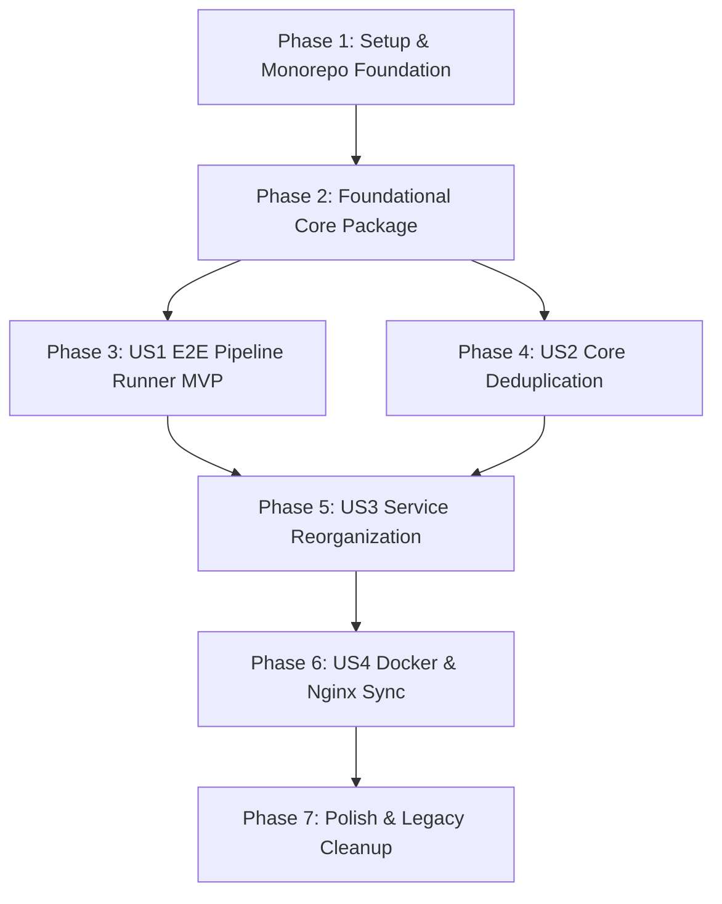

# Tasks: 041-bteam-unified-pipeline-restructure

**Branch**: `041-bteam-unified-pipeline-restructure`  
**Date**: 2026-08-26  
**Spec**: [spec.md](./spec.md) | **Plan**: [plan.md](./plan.md)  
**Constitution Version**: v1.1.1 Compliant

---

## Phase 1: Setup & Monorepo Foundation

**Purpose**: Initialize root UV workspace, directory layout, and baseline test suite.

- [ ] T001 Initialize root UV workspace in `bteam/pyproject.toml` and `.dockerignore` for 2GB model build isolation
- [ ] T002 [P] Create 3-tier directory structure (`bteam/packages/core`, `bteam/models`, `bteam/pipelines`, `bteam/services`)
- [ ] T003 [P] Initialize Feature 041 test suite in `bteam/tests/test_e2e_pipeline.py`

---

## Phase 2: Foundational Core Package (`packages/core`)

**Purpose**: Core shared library providing DB connection pool, auto-migration, Gateway client, Redis cache, and PII guardrails.

**⚠️ CRITICAL**: Must be completed before pipeline and service migration.

- [ ] T004 [P] Implement package config in `bteam/packages/core/pyproject.toml` and `bteam/packages/core/oliview_core/__init__.py`
- [ ] T005 [P] Implement MySQL Connection Pool, 500-chunk commit & auto-migration in `bteam/packages/core/oliview_core/db/connection.py`
- [ ] T006 [P] Implement SQLAlchemy ORM models (`Product`, `Review`, `ReviewSentence`, `SentimentAnalysis`, `ProductReport`, `PipelineRunHistory`) in `bteam/packages/core/oliview_core/db/models.py`
- [ ] T007 [P] Implement Model Gateway Client with GPU Throttling in `bteam/packages/core/oliview_core/gateway/client.py`
- [ ] T008 [P] Implement Redis Cache Manager with Auto Invalidation in `bteam/packages/core/oliview_core/cache/redis_manager.py`
- [ ] T009 [P] Implement PII Regex Masking & Groundedness Sanitizer in `bteam/packages/core/oliview_core/guardrails/pii_filter.py` and `sanitizer.py`

**Checkpoint**: Core foundation ready - Pipelines and Services can now import `oliview_core`.

---

## Phase 3: User Story 1 - E2E 전주기 데이터 파이프라인 원클릭 실행 (Priority: P1) 🎯 MVP

**Goal**: Complete pipeline runner (`pipeline_runner.py`) orchestrating Crawler $\rightarrow$ Sentence Splitter $\rightarrow$ Sentiment Classifier $\rightarrow$ Report Generator $\rightarrow$ ChromaDB Incremental Indexer.

**Independent Test**: `uv run python pipelines/pipeline_runner.py --steps all` updates MySQL tables and ChromaDB vector index in a single run.

### Tests for User Story 1 ⚠️
> **NOTE: Write these tests FIRST and ensure they FAIL before implementation**

- [ ] T010 [P] [US1] Unit test for pipeline runner execution & step checkpointing in `bteam/tests/test_e2e_pipeline.py::test_pipeline_runner_flow`

### Implementation for User Story 1

- [ ] T011 [US1] Migrate & implement Master Product Upsert & Review Crawler in `bteam/pipelines/crawler/crawler_runner.py`
- [ ] T012 [US1] Migrate & implement KoBERT Sentence Splitter with PII Masking in `bteam/pipelines/sentence_split/split_runner.py`
- [ ] T013 [US1] Migrate & implement Aspect Sentiment Classifier in `bteam/pipelines/sentiment/sentiment_runner.py`
- [ ] T014 [US1] Migrate & implement LLM Executive Report Generator in `bteam/pipelines/report_generator/report_runner.py`
- [ ] T015 [US1] Implement ChromaDB Incremental Indexer with SQLite Lock Defense & Redis Purge in `bteam/pipelines/vector_indexer/indexer_runner.py`
- [ ] T016 [US1] Implement E2E Orchestrator CLI (`--steps`, `--interval-hours`, `--resume`) in `bteam/pipelines/pipeline_runner.py`

**Checkpoint**: User Story 1 complete! E2E pipeline runs seamlessly with one command.

---

## Phase 4: User Story 2 - 공통 코어 패키지 단일화 및 코드 중복 제거 (Priority: P1)

**Goal**: Consolidate ML model weights to `bteam/models/` and eliminate scattered `common.py` files.

**Independent Test**: All pipelines and services import directly from `oliview_core` with 0 duplicate connection files.

### Tests for User Story 2 ⚠️
> **NOTE: Write these tests FIRST and ensure they FAIL before implementation**

- [ ] T017 [P] [US2] Contract test for core package import & deduplication in `bteam/tests/test_e2e_pipeline.py::test_core_package_exports`

### Implementation for User Story 2

- [ ] T018 [US2] Consolidate ML model weights to `bteam/models/sentence_split` and `bteam/models/sentiment`
- [ ] T019 [US2] Remove duplicate `common.py` scripts and point all internal modules to `oliview_core`

**Checkpoint**: User Story 2 complete! Code duplication reduced by >80%.

---

## Phase 5: User Story 3 - 챗봇 및 대시보드 실시간 연동 무결성 (Priority: P2)

**Goal**: Reorganize Dashboard backend/frontend and ChatA/ChatB services to use `oliview_core` and query generated reports.

**Independent Test**: ChatA, ChatB, and Dashboard correctly query MySQL and ChromaDB via `oliview_core`.

### Tests for User Story 3 ⚠️
> **NOTE: Write these tests FIRST and ensure they FAIL before implementation**

- [ ] T020 [P] [US3] Integration test for report querying in ChatA/ChatB & Dashboard in `bteam/tests/test_e2e_pipeline.py::test_service_report_integration`

### Implementation for User Story 3

- [ ] T021 [US3] Reorganize `services/dashboard_backend` (Flask API) to use `oliview_core.db`
- [ ] T022 [US3] Reorganize `services/dashboard_frontend` (React 19 Vite) with `/bteam/oliview/api` reverse proxy
- [ ] T023 [US3] Reorganize `services/chatbot_a` (Streamlit) & `services/chatbot_b` (FastAPI) to import `oliview_core`

**Checkpoint**: User Story 3 complete! Serving layer synchronized with core package.

---

## Phase 6: User Story 4 - 도커 빌드 격리 및 게이트웨이 무중단 서빙 (Priority: P3)

**Goal**: Standardize Docker Compose container names, apply `.dockerignore`, and synchronize Gateway Nginx.

**Independent Test**: `docker compose up -d --build` launches all 5 services cleanly with HTTP 200 responses.

### Tests for User Story 4 ⚠️
> **NOTE: Write these tests FIRST and ensure they FAIL before implementation**

- [ ] T024 [P] [US4] Contract test for docker service topology & Nginx routing in `bteam/tests/test_e2e_pipeline.py::test_docker_topology`

### Implementation for User Story 4

- [ ] T025 [US4] Update `bteam/docker-compose.yml` with standardized container names (`bteam_db`, `bteam_dashboard_backend`, `bteam_dashboard_frontend`, `bteam_chatbot_a`, `bteam_chatbot_b`)
- [ ] T026 [US4] Update `gateway/nginx.conf` with new container upstreams and reload Nginx

**Checkpoint**: User Story 4 complete! Seamless docker orchestration and zero downtime.

---

## Phase 7: Polish & E2E Verification

**Purpose**: Legacy cleanup, full regression test execution, and live browser verification.

- [ ] T027 Permanently delete legacy siloed folders (`bteam/Oliview_Project`, `bteam/Oliview_aspect_sentence_split`, `bteam/Oliview_aspect_sentiment`, `bteam/Oliview_LLM`, `bteam/Oliview_chatbot_a`, `bteam/Oliview_chatbot_b`)
- [ ] T028 Run full regression test suite: `uv run pytest bteam/tests/ -v` (100% Pass Rate)
- [ ] T029 Verify live endpoints at `https://ezenitac.duckdns.org/bteam/chata/`, `/bteam/chatb/`, `/bteam/oliview/` (HTTP 200 OK)

---

## Dependencies & Execution Order

### Parallel Execution Strategy
- Tasks marked `[P]` operate on independent files or separate pipeline modules.
