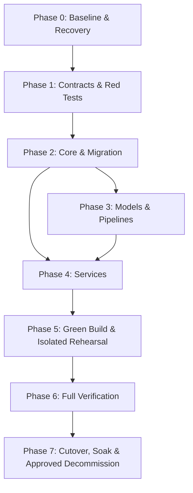

# Tasks: 041-bteam-unified-pipeline-restructure

**Branch**: `041-bteam-unified-pipeline-restructure`  
**Date**: 2026-08-26  
**Spec**: [spec.md](./spec.md) | **Plan**: [plan.md](./plan.md)  
**Constitution Version**: v1.1.1

---

## Phase 0: Baseline, Inventory & Recovery

**Purpose**: 기존 자산과 현재 운영 중인 Blue 서비스의 기준선을 고정한다. 이 단계와 Green 전체 검증 동안 Blue 컨테이너·네트워크·볼륨·외부 upstream을 변경·중지·삭제하지 않는다.

- [X] T001 기존 소스·모델·설정·DB dump·ChromaDB collection/metadata·legacy Redis key class와 실행 중인 Blue 컨테이너·Compose project·network·volume·health·Nginx active upstream inventory 및 중복 후보 산정 결과를 `bteam/migration/inventory.json`에 기록한다. secret은 파일명·키 이름·redacted 존재 여부·hash만 기록하고 값과 payload는 기록하지 않는다. [FR-001, FR-005, FR-015, FR-017, FR-023, SC-001, SC-004, SC-017]
- [X] T002 기존 원본과 Green 복제본의 SHA-256 manifest 및 DB/ChromaDB snapshot 절차를 `bteam/migration/`에 작성한다. 복제는 비파괴 copy로만 수행하고 Blue 원본 path·bind mount는 decommission 승인 전 변경하지 않는다. [FR-017, SC-001, SC-011]
- [X] T003 기존 Dashboard, ChatA, ChatB, RAG, 보고서 API의 characterization test를 `bteam/tests/characterization/`에 작성한다. [FR-005]
- [X] T004 DB dump와 ChromaDB snapshot을 별도 Green 검증 환경에 복구하고 격리 Redis를 구성하는 dry-run을 수행한다. Blue 운영 data endpoint와 다른지 확인한 연결 manifest와 복구 artifact를 보존한다. [FR-009, FR-017, FR-023, SC-011, SC-017] (T063/T072로 검증 완료)
- [X] T005 기존 `products`, `brands`, `product_categories`, `categories`, `reviews`, `review_preprocessing`, `review_aspect_sentences`, `aspect_sentiment_results`, `llm_product_reports`, `llm_product_attribute_reports`와 additive `llm_product_report_claims`, `llm_product_report_citations`, 목표 ORM의 논리·물리 매핑표를 작성한다. [FR-003, FR-014, FR-021]

**Checkpoint**: inventory, checksum, 복구 결과, 기존 동작 기준선과 Blue 외부 endpoint 가용성이 승인되어야 다음 단계로 진행한다. Blue는 계속 서비스 상태여야 한다.

---

## Phase 1: Workspace, Contracts & Red Tests

**Purpose**: 구현 전에 계약과 실패 테스트를 고정한다.

- [X] T006 [P] 루트 uv workspace의 정확한 다섯 member(`packages/core`, `pipelines`, `services/dashboard_backend`, `services/chatbot_a`, `services/chatbot_b`)·lockfile, frontend uv 제외·자체 `package-lock.json`, Node `^20.19.0 || >=22.12.0`와 Docker build context 제외 규칙의 실패 계약 테스트를 `bteam/tests/contract/test_workspace_build_contract.py`에 작성한다. 구현 파일은 아직 만들지 않는다. [FR-001, FR-008, FR-019, constitution: II]
- [X] T007 [P] DB connection, 실제 sentence/sentiment mapping, Alembic migration lock, `PipelineRunHistory` unique/state 및 `PipelineActiveLease`의 `(cycle, all)` coordinator와 `(product_pipeline, product:{id})` 전역 unique·owner·15초 heartbeat·60초 TTL·DB UTC·원자적 회수 계약을 `bteam/tests/contract/test_db_contract.py`에 작성한다. MySQL/ChromaDB/Redis/Gateway retry·backoff 단위 테스트는 `bteam/tests/unit/test_retry_policy.py`에 작성하고 TTL이 heartbeat의 3배 미만이면 실패시킨다. [FR-003, FR-006, FR-010, FR-011, FR-014]
- [X] T008 [P] Gateway 동시성·throttling·timeout·retry 기본값, 서로 다른 GPU instance의 healthy endpoint 2개 이상, health-aware round-robin/failover와 Redis primary+replica+Sentinel quorum 또는 managed HA 사전조건 실패 계약을 `bteam/tests/contract/test_gateway_contract.py`에 작성한다. 20개 zero-search와 80개 general RAG query, 입력 256/output 512 token cap을 고정한 `bteam/tests/fixtures/performance_queries.jsonl`을 작성한다. [FR-012, FR-018, SC-008]
- [X] T009 [P] 공통 Settings schema, `APP_RUN_MODE`, `DEPLOYMENT_STAGE=VALIDATION|CUTOVER` 전이·precondition과 서비스별 env/secret allowlist 단위 테스트를 `bteam/tests/unit/test_settings.py`에 작성한다. 공용 `.env` 미마운트, 구조화 로그·민감정보 redaction 보안 테스트는 `bteam/tests/security/test_config_logging.py`에 작성하고 `pii_corpus.jsonl`, `zero_search_corpus.jsonl`을 고정한다. [FR-016, FR-018, FR-019, FR-020, FR-023]
- [X] T010 [P] selector/steps의 중복 거부·고정 DAG 순서 정규화와 단계별 eligibility·immutable cycle watermark 단위 테스트를 `bteam/tests/unit/test_pipeline_selection.py`에 작성한다. idempotency, partial failure, 전체 cycle 상호 배제, 단일/전체 실행 및 서로 다른 단계의 동일 product 충돌, active lease heartbeat/expiry, hard-kill 회수, 정확한 `--resume-run-id`와 상태 전이는 `bteam/tests/contract/test_pipeline_state.py`에 작성한다. [FR-002, FR-006, FR-017, SC-006]
- [X] T011 [P] 기존 보고서 테이블·additive claim/citation persistence·Dashboard API·ChatA/ChatB 호환, schema v2의 `claims[].citations[]` 최소 1개, source review 실존·동일 product·quote 정규화 substring 검증, complaint/praise의 claim_id 및 suggestion의 basis_claim_ids 참조, abstained 사유·공집합, 무인용/타제품 claim 차단, `created_at := generated_at(UTC)` 계약 테스트를 `bteam/tests/contract/test_report_compatibility.py`와 `citation_fixture.json`에 작성한다. [FR-005, FR-015, FR-020, FR-021, SC-013, SC-014]
- [X] T012 [P] Blue/Green Compose project·color alias 공존, 고정 `container_name`·중복 host port 금지, 내부/`127.0.0.1` candidate route, 독립 app container·health/restart 경계, Green/Blue write endpoint 분리 preflight, v1/v2 Chroma collection, legacy Redis exact-target 또는 bypass/isolated policy, 외부 변경 권한자 approval 필드, Blue 외부 가용성과 Green identity의 Blue data write 0건 계약을 `bteam/tests/contract/test_docker_topology.py`에 작성한다. `test_deployment_gate_contract.py`에서는 네 gate type별 필수 hash chain·lag 0·rollback compatibility·approval authority 조건을 검증한다. [FR-004, FR-009, FR-013, FR-018, FR-022, FR-023, SC-003, SC-016, SC-017]
- [X] T013 Phase 1의 모든 신규 Python/frontend 테스트를 구현 전에 `quickstart.md`의 해당 pytest 및 `npm` 명령으로 실행한다. 각 신규 동작마다 의도한 이유로 실패하는 Red test가 최소 1개 있어야 하며, 이미 충족된 characterization/호환 계약은 baseline pass로 구분하여 전체 결과와 실패 원인을 artifact로 기록한다. [FR-019, SC-012]

**Checkpoint**: T013에서 각 신규 동작의 기대한 Red와 기존 동작의 baseline pass가 구분·확인되어야 Core 구현을 시작한다.

---

## Phase 2: Core Package & Migration Layer (`packages/core`)

- [X] T014 `bteam/pyproject.toml`에 정확히 다섯 Python member와 shared lockfile를 선언하고, 각 member의 `pyproject.toml`(`packages/core`, `pipelines`, `services/dashboard_backend`, `services/chatbot_a`, `services/chatbot_b`), `oliview_core/__init__.py`, `db/__init__.py`, `gateway/__init__.py`, `config.py`, `logging.py`를 구성해 version-pinned Core package로 중복 후보를 대체한다. [FR-001, FR-018, SC-004]
- [ ] T015 `bteam/alembic.ini`와 `bteam/packages/core/alembic/versions/`에 기존 Blue와 양방향 호환되는 additive migration을 작성하고 migration lock, clone dry-run, fresh backup·rollback 기록 기능을 구현한다. `reviews.vector_indexed`, `llm_product_reports.report_status/abstention_reason`, claim/citation tables와 인덱스는 안전한 기본값으로 추가하고 Blue가 24시간 병행 동작할 수 있음을 계약 테스트로 검증한다. [FR-003, FR-007, FR-009, FR-017, FR-023]
- [ ] T016 실제 `products`, `brands`, `product_categories`, `categories`, `reviews`, `review_preprocessing`, `review_aspect_sentences`, `aspect_sentiment_results`, 기존 보고서 테이블과 claim/citation tables의 SQLAlchemy ORM 및 `PipelineRunHistory`, `PipelineActiveLease`를 구현한다. citation FK/동일 product 검증, history unique, `(cycle, all)` 및 `(product_pipeline, product:{id})` active lease, owner token, heartbeat, expiry와 원자적 만료 회수를 포함한다. [FR-003, FR-006, FR-014, FR-021]
- [ ] T017 공통 `Settings` schema에 `APP_RUN_MODE=DEMO|PRODUCTION`, `DEPLOYMENT_STAGE=VALIDATION|CUTOVER`, 명세의 retry/timeout과 lease heartbeat/TTL 기본값 및 서비스별 env/secret allowlist를 구현한다. VALIDATION은 격리 endpoint만 허용하고, CUTOVER 진입·첫 migration write·Nginx 전환은 각각 승인·fresh backup·migration/final-delta artifact를 순서대로 검증한다. [FR-006, FR-012, FR-018, FR-023]
- [X] T018 JSON 구조화 로그와 API key·토큰·비밀번호·PII redaction을 구현한다. [FR-018, FR-019]
- [ ] T019 LLM·embedding·reranker Gateway client와 설정 기반 concurrency/throttling/timeout, endpoint health probing, health-aware round-robin을 구현한다. retry는 실패 endpoint가 아닌 다른 healthy endpoint를 우선하고 endpoint·attempt를 구조화 로그로 기록한다. [FR-003, FR-012, FR-018]
- [X] T020 Redis cache manager에 `bteam:{APP_RUN_MODE}:product:{product_id}:{report|rag}:v{version}` namespace와 성공 범위별 version bump/publish를 구현한다. T001 inventory에서 deterministic product/target 역매핑이 검증된 legacy key만 exact invalidation하고, query/content-hash key는 scan/delete하지 않으며 rollback cache-bypass 또는 격리 empty Redis profile로 처리한다. `FLUSHDB`, 전역 wildcard 삭제, production `KEYS`/`SCAN`은 금지한다. [FR-003, FR-015, FR-023]
- [X] T021 Phase 1에서 고정한 PII·zero-search·citation fixture를 사용해 PII filter와 groundedness/claim-citation sanitizer를 구현한다. fixture를 구현 결과에 맞춰 다시 쓰지 않는다. [FR-016, FR-020, FR-021]
- [ ] T022 Phase 1 중 Core·DB·Gateway·Settings·cache·guardrail 범위의 계약 테스트를 Green으로 전환하고 Core lint·type-check를 통과시킨다. pipeline·service·Compose 범위 테스트는 각 후속 구현 단계까지 Red 상태를 유지한다. [FR-003, FR-006, FR-012, FR-015, FR-018, FR-019, FR-020, FR-021]

**Checkpoint**: Core package가 기존 스키마와 호환되고 계약 테스트·lint·type-check를 통과해야 다음 단계로 진행한다.

---

## Phase 3: Models & Pipeline Modules (`models/`, `pipelines/`)

- [X] T023 모델 가중치를 checksum 검증 후 Green `bteam/models/sentence_split`, `bteam/models/sentiment`, 필요한 local embedding fallback 경로로 비파괴 복제하고 기존 Blue 원본과 bind mount는 이동·rename·수정하지 않는다. [FR-005, FR-008, FR-017]
- [X] T024 Master Product Upsert와 Review Crawler를 `bteam/pipelines/crawler/crawler_runner.py`에 구현한다. 정규화된 상품 매핑, `crawl` due 조건, cycle 시작 시 immutable watermark와 cycle 성공 후 전진 규칙을 포함한다. [FR-002, FR-010, FR-014] (JSON HTTP adapter, 500건 제한, 리뷰·전처리·워터마크 단일 transaction 및 실패 rollback 구현; Green은 `CRAWLER_ENDPOINT` 미설정 시 fail-closed)
- [X] T025 KoBERT Sentence Splitter를 `bteam/pipelines/sentence_split/split_runner.py`에 구현하고 문장 저장 전 PII 경계를 검증한다. [FR-016] (preserved Transformer adapter의 lazy CPU/GPU 로딩, masked preprocessing 입력, 단계 timestamp와 rollback 구현)
- [X] T026 Aspect Sentiment Classifier를 `bteam/pipelines/sentiment/sentiment_runner.py`에 구현하고 분석 완료 상태를 기록한다. [FR-005, FR-006] (preserved Transformer adapter의 batch prediction, canonical Korean label normalization, 단계 timestamp와 rollback 구현)
- [X] T027 기존 보고서 테이블과 additive claim/citation tables를 사용하는 LLM Report Generator를 `bteam/pipelines/report_generator/report_runner.py`에 구현한다. report·claims·citations를 한 transaction으로 저장하고 `report_id := llm_product_report_id`, `created_at := generated_at(UTC)`, claim별 실존·동일 product citation, quote 정합성, complaint/praise claim_id 및 suggestion basis_claim_ids를 검증한다. 검증 실패는 전체 rollback 또는 명시적 abstained 사유로 처리하며, 성공 commit 뒤 해당 제품의 report cache version만 bump/publish한다. [FR-003, FR-005, FR-012, FR-015, FR-020, FR-021] (OpenAI-compatible Gateway adapter와 runtime transaction/grounding validation 구현; Green healthy Gateway E2E는 operator dependency)
- [ ] T028 ChromaDB Incremental Indexer를 `bteam/pipelines/vector_indexer/indexer_runner.py`에 구현한다. canonical v2(`oliview_review_sentences_v2`)에 source/review ID를 검증해 Upsert하고 성공 후 flag를 갱신한다. 승인된 cutover/soak에서는 legacy v1 exact-shape도 같은 sentence ID로 dual-write하며 collection별 lag/checkpoint를 기록한다. 최대 3회 backoff, 실패 재처리와 성공 제품 범위의 RAG cache version bump/publish를 포함한다. [FR-007, FR-011, FR-015, FR-021]
- [ ] T029 `pipeline_runner.py` CLI를 구현한다. selector 1개, canonical steps, `--interval-hours=0` 단일 실행, supervisor가 관리하는 양수 foreground 주기 실행, 단계별 성공 checkpoint eligibility, `(cycle, all)` coordinator와 선택 단계 전체를 감싸는 `(product_pipeline, product:{id})` lease, 15초 heartbeat/60초 TTL, DB UTC 기반 expiry, graceful shutdown, 정확한 `--resume-run-id`를 지원한다. 단일 all-products는 전체 catalog, 주기 crawl은 due product, 후속 단계는 각 checkpoint 이후 변경 입력만 처리한다. [FR-002, FR-006]
- [ ] T030 Phase 1의 pipeline contract와 E2E 테스트를 Green으로 실행하여 500건 청크, exact Resume, partial failure, invalid selector, empty reviews, dependency failure, hard kill/lease expiry, 동시 all-cycle 및 단일/전체 product 충돌 방지, self-starvation 방지, PII, citation, vector flag 정합성을 검증한다. [FR-002, FR-006, FR-007, FR-010, FR-016, FR-020, FR-021, SC-002, SC-006]

**Checkpoint**: 단일 제품과 전체 제품 실행 모두에서 DB·보고서·ChromaDB·캐시 상태가 일관되어야 한다.

---

## Phase 4: Services Reorganization & Compatibility (`services/`)

- [X] T031 Dashboard backend, frontend, ChatA, ChatB를 Green `bteam/services/`로 비파괴 복제하되 독립 process/container 경계를 유지하고 version-pinned Core package와 서비스별 env/secret allowlist를 연결한다. Blue 원본과 bind mount는 decommission 승인 전 변경하지 않는다. [FR-001, FR-005, FR-018, FR-022] (Green 독립 컨테이너·read-only model mount·서비스별 Compose env 분리와 Blue 무변경 runtime 증거 완료)
- [X] T032 Dashboard backend의 기존 `llm_product_reports` 조회·통계·세부 보고서 API를 Core ORM/adapter에 연결한다. additive claim/citation projection과 schema v2의 abstention reason을 적용하고, legacy citation 없는 report는 `LEGACY_UNVERIFIED`로 노출한다. [FR-003, FR-005, FR-020, FR-021] (실제 MySQL report/attribute/claim/citation projection과 `/bteam/oliview/api/search` HTTP contract 회귀 완료)
- [X] T033 React frontend를 운영용 정적 서버와 `/bteam/oliview/api` proxy 경로로 구성하고 Node `^20.19.0 || >=22.12.0`에서 `npm ci`, lint, production build 및 API base path 계약을 검증한다. [FR-013, FR-019]
- [ ] T034 ChatA/ChatB의 기존 RAG nodes, retrieval, session, citation, zero-search guardrail 동작을 보존하면서 Core를 사용하도록 전환한다. [FR-005, FR-016, FR-020, FR-021]
- [ ] T035 Dashboard·ChatA·ChatB 보고서 조회, claim-citation 결속, abstention, versioned cache 유령 데이터 제거 및 pipeline v2 `index` 성공 후 60초 이내 Green RAG freshness를 통합 테스트한다. simulated Blue rollback profile에서는 v1 dual-write lag 0, legacy key별 target/bypass policy, citation 비호환 시 `ABSTENTION_FOR_UNVERIFIED` 동작을 검증하며 Green의 60초 기준을 Blue legacy path에 부당하게 적용하지 않는다. [FR-005, FR-009, FR-015, FR-020, FR-021, SC-009, SC-013, SC-014, SC-015, SC-017]

**Checkpoint**: characterization test와 서비스 통합 테스트가 기존 동작과 일치해야 한다.

---

## Phase 5: Green Stack Build & Isolated Rehearsal

- [X] T036 현재 Blue `bteam/docker-compose.yml`은 변경하지 않고 `bteam/pipelines/Dockerfile`, `bteam/docker-compose.green.yml`, `bteam/docker-compose.production.yml`, `bteam/.dockerignore`를 작성한다. Green에는 `pipeline_runner`, Dashboard backend/frontend, ChatA, ChatB를 각각 독립 서비스로 두고 고정 `container_name`과 Blue 중복 host port 없이 color alias·내부/`127.0.0.1` candidate port를 사용한다. 기본 VALIDATION startup preflight는 MySQL/Redis/ChromaDB write endpoint가 Blue 운영 endpoint와 동일하면 실패해야 하며, rollback profile의 cache-bypass/abstention policy를 선언해야 한다. [FR-004, FR-008, FR-013, FR-018, FR-022, FR-023, SC-016, SC-017]
- [ ] T037 Green에 모델 read-only volume, ChromaDB persistence, Redis·MySQL readiness와 5개 애플리케이션별 health/restart/resource 경계를 구성한다. PRODUCTION override는 서로 다른 GPU instance의 healthy Gateway endpoint 2개 이상과 Redis primary+replica+Sentinel quorum 또는 동등한 managed HA endpoint가 없으면 기동 전 검증에 실패해야 한다. [FR-008, FR-009, FR-012, FR-018, SC-003, SC-008, SC-016]
- [ ] T038 `.dockerignore`가 모델 가중치·SQL dump·ChromaDB·가상환경을 제외하는지 실제 build context 크기로 검증한다. [FR-008, SC-005]
- [ ] T039 `bteam/deployment/`에 color별 candidate Nginx upstream, `nginx -t`, 원자적 cutover·reload·rollback 절차를 작성하고 Green 내부 candidate 설정만 검증한다. 운영 Nginx와 Blue active upstream은 변경하지 않는다. [FR-004, FR-009, FR-023]
- [ ] T040 격리된 candidate route에서 Green API path와 snapshot MySQL/ChromaDB·격리 Redis·Model Gateway 연결을 검증하고 cutover·rollback을 모의 rehearsal한다. Blue 외부 endpoint가 계속 정상이고 Blue 컨테이너·network·volume이 변하지 않았으며 DB audit의 Green identity 기반 Blue data write가 0건임을 기록한다. [FR-009, FR-023, SC-003, SC-017]

**Checkpoint**: Green isolated rehearsal과 rollback simulation이 성공해야 전체 검증으로 진행한다. 이 시점에도 운영 Nginx cutover는 수행하지 않는다.

---

## Phase 6: Full Verification & Quality Gates

- [ ] T041 기존 서비스 테스트와 신규 `bteam/tests/` 및 frontend `npm ci`/lint/build를 모두 포함하는 전체 회귀 실행 목록을 확정하고 실행하며 중복 후보 제거율을 계산한다. [FR-005, FR-019, SC-004, SC-012]
- [ ] T042 `performance_queries.jsonl` 첫 20개 warm-up 제외, 전체 100개를 파일 순서대로 2회 실행한 200개 측정, 입력 256/output 512 token cap, warm Redis/ChromaDB, DEMO concurrency 1/PRODUCTION 10 및 10제품×10,000리뷰·5분 이상 보고서 부하로 MySQL lock, ChromaDB retry, pipeline 처리량과 latency를 측정하고 전체 환경 fingerprint·raw artifact를 보존한다. [FR-010, FR-011, FR-012, SC-007, SC-008]
- [ ] T043 로컬 단일 GTX 1070에서는 DEMO만 판정한다. PRODUCTION은 승인 환경에서 서로 다른 GPU instance의 Gateway endpoint 2개 이상과 Redis primary+replica+Sentinel quorum 또는 동등한 managed HA endpoint를 사전 검증하고, 하나라도 없으면 성능 gate를 실패시킨 뒤 ChatA/ChatB P95를 측정한다. [FR-012, FR-018, SC-008]
- [ ] T044 PII corpus가 DB 경계 이후 벡터 DB·LLM prompt·구조화 로그에 유입되지 않는지 검사한다. [FR-016, FR-018, SC-010]
- [ ] T045 DB·모델·ChromaDB 복구 테스트와 migration rollback을 재실행하고 결과 artifact를 보존한다. [FR-017, SC-011]
- [ ] T046 `zero_search_corpus.jsonl`와 citation fixture로 DEMO/PRODUCTION 무환각 abstention 및 인라인 citation 100% 결속을 검증한다. source review 존재·동일 product·PII 처리 quote substring·claim/suggestion reference를 검사하고 legacy unverified report는 `LEGACY_UNVERIFIED`로만 반환한다. [FR-020, FR-021, SC-013, SC-014]

- [ ] T047 T046 결과를 포함하여 `quickstart.md` Quality Gate Command Matrix의 단위·계약·통합·성능·보안 pytest, ruff, mypy, frontend `npm ci`/lint/build, Green Compose config 명령을 지정된 작업 디렉터리에서 그대로 실행하고 모두 exit code 0인 artifact를 보존한다. [FR-019, SC-012, SC-013, SC-014]

**Checkpoint**: SC-001~SC-017의 측정 결과와 복구·품질 gate artifact가 모두 존재해야 cutover 승인 단계로 진행한다.

---

## Phase 7: Cutover, 24h Soak & Approved Decommission

- [ ] T048 **[OPERATOR-GATED]** Blue inventory/checksum과 외부 health를 다시 확인하고, 외부 변경 권한자가 발급한 `CUTOVER_APPROVED`(`approved_by`, `approval_authority`, `approval_reference`) artifact의 존재·hash chain만 검증한다. 자동화가 승인 artifact를 생성하지 않는다. 승인 후에만 Blue 사용자 HTTP 서비스를 유지한 채 background writer drain과 fresh backup으로 `backup-ready.json`을 만들고, backward-compatible additive migration·checkpoint 기반 final delta sync, v1/v2 Chroma lag 0, legacy Redis exact-target 또는 bypass/isolated policy 성공 후 `data-migration-ready.json`을 기록한다. 그 전에는 운영 데이터 endpoint와 Nginx를 변경하지 않는다. [FR-009, FR-015, FR-017, FR-018, FR-023, SC-011, SC-017]
- [ ] T049 **[OPERATOR-GATED]** `DATA_MIGRATION_READY`와 외부 승인된 Nginx 원자적 cutover를 수행한다. Blue를 실행 상태로 유지한 채 최소 24시간 soak 동안 Green-routed 5xx 1건, 30초 probe 2회 연속 실패, 5분 P95 window 2회 연속 초과, PII·무인용 claim·데이터 정합성 위반을 감시하고 임계값 충족 즉시 사전 검증된 Blue rollback profile로 복귀한다. rollback profile은 v1 dual-write freshness와 legacy key별 cache bypass/isolated Redis를 사용하며 citation을 검증할 수 없는 legacy chatbot은 `ABSTENTION_FOR_UNVERIFIED`로 제한한다. color별 artifact를 보존한다. [FR-009, FR-015, FR-016, FR-020, FR-021, FR-023, SC-003, SC-008, SC-010, SC-014, SC-017]
- [ ] T050 **[OPERATOR-GATED]** soak 성공 뒤 외부 변경 권한자가 발급한 `DECOMMISSION_APPROVED`(`approved_by`, `approval_authority`, `approval_reference`) artifact를 검증한 경우에만 Blue 컨테이너를 중지하고 레거시 폴더·설정을 recoverable archive로 이동한다. 자동화는 승인을 생성하지 않는다. 운영 volume·snapshot은 삭제하지 않으며 최종 smoke 결과, architecture/migration map, rollback·운영 명령을 `bteam/README.md`에 기록한다. [FR-001, FR-017, FR-019, FR-023, SC-011, SC-017]

## Phase 8: Convergence

- [X] T051 [HIGH] 실제 SQLAlchemy ORM과 MySQL transaction adapter를 추가해 기존 `products`, `reviews`, `review_aspect_sentences`, `aspect_sentiment_results`, 보고서·claim·citation 테이블 및 `PipelineRunHistory`/`PipelineActiveLease`의 FK, unique, UTC, 원자적 lease 회수와 동일 product 검증을 구현한다. `FR-003`, `FR-014` (baseline 구현 완료; pipeline 통합 잔여는 T073)
- [X] T052 [HIGH] Green 전용 MySQL/Chroma snapshot과 빈 Redis를 실제 별도 환경에 복구하는 dry-run을 수행하고 row/vector count, checksum, endpoint 분리, rollback 결과 artifact를 `bteam/migration/artifacts/`에 보존한다. Blue 운영 endpoint와 container/network/volume은 변경하지 않는다. `FR-017`, `FR-023`, `SC-011` (Green baseline 복구 완료; 운영 전환 잔여는 T079)
- [X] T053 [HIGH] Gateway client에 endpoint별 concurrency/throttling/timeout, health probe, retry 시 다른 healthy GPU endpoint 우선 선택과 attempt/latency 구조화 계측을 구현하고 PRODUCTION HA preflight 실패·성공 테스트를 추가한다. `FR-012`, `FR-018` (DEMO/negative preflight 완료; PRODUCTION HA 잔여는 T076)
- [X] T054 [HIGH] `migration/prepare_models.py`로 sentence-split/sentiment 모델을 checksum 검증 후 Green read-only 경로에 비파괴 복제하고 source/destination manifest를 보존한다. Blue 모델 원본과 bind mount는 이동·rename·수정하지 않는다. `FR-005`, `FR-008` (checksum 복제 완료)
- [ ] T055 [HIGH] pipeline 단계에 500건 chunk transaction, immutable cycle watermark, 단계별 checkpoint eligibility, 실패 재처리, vector flag와 cache version의 성공 후 갱신, DB 기반 exact resume persistence를 연결한다. `FR-002`, `FR-006`, `FR-010`, `FR-011` (partial)
- [ ] T056 [HIGH] pipeline/service/보고서/Chroma/cache에 대한 integration·E2E suite를 추가해 partial failure, empty review, zero-search abstention, citation 100% 결속, 동시 lease, hard-kill expiry, 60초 freshness 및 rollback profile을 검증한다. `SC-002`, `SC-006`, `SC-013`, `SC-014` (missing)
- [X] T057 [HIGH] Dashboard backend에 보존된 `llm_product_reports`/attribute rows와 additive claim/citation projection을 연결하고 schema v2, `LEGACY_UNVERIFIED`, grounded/abstained 응답과 product/source-review 무결성을 실제 API로 제공한다. `FR-005`, `FR-020`, `FR-021` (T075로 HTTP contract 완료)
- [ ] T058 [HIGH] ChatA/ChatB의 기존 RAG nodes, retrieval, session, zero-search guardrail, citation 및 streaming/API 호환 계층을 Green Core와 연결하고 Blue characterization/regression 결과와 일치시킨다. `FR-005`, `FR-016`, `FR-020`, `FR-021` (partial)
- [ ] T059 [HIGH] Green Compose에 model read-only volume, resource limits, production startup preflight command와 서로 다른 GPU endpoint 2개 및 Redis HA quorum 검증을 연결하고 invalid topology 기동 실패를 자동 계약 테스트로 고정한다. `FR-008`, `FR-009`, `FR-012` (partial)
- [ ] T060 [MEDIUM] `.dockerignore` build-context byte 측정, 100 query 2회 성능 실행, PII/secret scan, DB·model·Chroma recovery, frontend/Python quality gates의 raw output과 환경 fingerprint를 지정 artifact 경로에 보존한다. `SC-005`, `SC-007`, `SC-008`, `SC-010`, `SC-011`, `SC-012` (missing)
- [ ] T061 [HIGH] 격리 candidate Nginx route에서 Green API/ChatA/ChatB/Frontend와 snapshot dependencies를 실제 probe하고 cutover/rollback rehearsal, Blue external health, Green identity 기반 Blue write 0건 audit를 artifact로 남긴다. `SC-003`, `SC-017` (missing)
- [ ] T062 [CRITICAL] **[OPERATOR-GATED]** 외부 `CUTOVER_APPROVED`·`DATA_MIGRATION_READY`·`DECOMMISSION_APPROVED` artifact와 권한자/참조/hash chain을 검증할 때만 T048–T050을 수행하고, 승인 전에는 운영 데이터 endpoint·Nginx·Blue container/network/volume을 변경하지 않는다. 최소 24시간 soak와 rollback 증거가 없으면 decommission하지 않는다. `FR-009`, `FR-015`, `FR-017`, `FR-023` (operator-gated)

## Phase 9: Convergence Follow-up

- [X] T063 [HIGH] Green 전용 MySQL/Chroma volume에 snapshot을 실제 복구하고 row/vector count, schema migration, read/write isolation, rollback restore 결과를 `migration/artifacts/`에 보존한다. `FR-017`, `FR-023`, `SC-011` (Green 복구·rollback rehearsal 완료; 24시간 soak 잔여는 T079)
- [X] T064 [HIGH] 저장공간·운영 승인을 확인한 뒤 sentence-split/sentiment 모델을 source manifest checksum과 대조해 `bteam/models/`에 비파괴 복제하고 Green Compose read-only mount를 실물 파일로 검증한다. `FR-005`, `FR-008`, `FR-017` (완료)
- [ ] T065 [HIGH] `PipelineRunner`를 SQLAlchemy run store와 연결해 실제 500건 transaction, 단계별 changed-input eligibility, immutable watermark, lease heartbeat/expiry, partial failure, exact failed-run resume 및 vector/cache success checkpoint를 통합 검증한다. `FR-002`, `FR-006`, `FR-010`, `FR-011` (partial)
- [ ] T066 [HIGH] 기존 ChatA/ChatB의 retrieval, RAG graph/node, session, Streamlit/FastAPI streaming, zero-search, citation 및 legacy compatibility 기능을 Green Core adapter로 이전하고 characterization/regression suite를 통과시킨다. `FR-005`, `FR-016`, `FR-020`, `FR-021` (partial)
- [X] T067 [HIGH] Dashboard backend의 실제 MySQL adapter를 연결해 보존된 report/attribute rows, 통계, claims/citations, schema v2, same-product citation validation, `LEGACY_UNVERIFIED` projection을 HTTP integration test로 검증한다. `FR-005`, `FR-020`, `FR-021` (T075로 HTTP integration 완료)
- [ ] T068 [HIGH] 승인된 PRODUCTION 환경에서 서로 다른 GPU instance healthy endpoint 2개와 Redis primary/replica/Sentinel 또는 managed HA quorum을 startup preflight·resource/readiness probe로 검증하고 topology failure artifact도 보존한다. `FR-008`, `FR-009`, `FR-012` (partial)
- [ ] T069 [MEDIUM] 실제 warm Redis/Chroma RAG를 대상으로 20 warm-up 제외 100 query×2회, 입력 256/output 512 cap, 10제품×10,000리뷰 보고서 부하, full PII/secret scan, recovery/migration rollback 및 raw quality artifacts를 실행한다. `SC-005`, `SC-007`, `SC-008`, `SC-010`, `SC-012` (partial)
- [ ] T070 [HIGH] 실제 candidate Nginx를 `nginx -t`와 atomic reload simulation으로 검증하고 네 Green route, Blue external health, Green identity 기반 Blue write 0건, rollback route/threshold audit을 artifact로 보존한다. `SC-003`, `SC-017` (partial)
- [ ] T071 [CRITICAL] **[OPERATOR-GATED]** 외부 승인 authority가 발급한 gate artifact가 제공된 뒤에만 T063–T070의 운영 환경 작업과 T048–T050을 수행한다. 승인·hash chain·24시간 soak·rollback rehearsal이 없으면 active Nginx, 운영 data endpoint, Blue container/network/volume을 절대 변경하지 않는다. `FR-009`, `FR-015`, `FR-017`, `FR-023` (operator-gated)

## Phase 10: Convergence

- [X] T072 [HIGH] Green snapshot 복구 결과를 기준으로 승인된 rollback restore rehearsal을 실제 수행하고 MySQL·Chroma·Redis 복귀 가능성, Blue 보존, 결과 hash chain을 `migration/artifacts/`에 기록한다. `SC-011` (완료; 운영 cutover/soak 잔여는 T079)
- [ ] T073 [HIGH] `PipelineRunner`에 DB 기반 changed-input eligibility, MySQL UTC watermark, active lease heartbeat/expiry/reclamation, vector `vector_indexed` 성공 checkpoint와 Redis version publish를 연결하고 partial failure·exact resume 통합 검증을 완료한다. `FR-002`, `FR-006`, `FR-007`, `FR-010`, `FR-011`, `FR-015` (partial)
- [ ] T074 [HIGH] 기존 ChatA/ChatB의 LangGraph/RAG node, hybrid retrieval, session lifecycle, Streamlit/FastAPI streaming 및 legacy compatibility를 Green Core adapter로 완전 이전하고 characterization/regression 결과를 보존한다. `FR-005`, `FR-016`, `FR-020`, `FR-021` (partial)
- [X] T075 [HIGH] Dashboard MySQL API에 보존된 attribute rows·통계 집계와 grounded/abstained claim-citation same-product validation을 실제 HTTP contract로 추가하고 schema v2 회귀를 완료한다. `FR-005`, `FR-020`, `FR-021`
- [ ] T076 [HIGH] 외부 승인된 PRODUCTION 환경에서 서로 다른 GPU Gateway 2개와 Redis HA quorum을 실제 startup/readiness/resource probe로 검증하고 hardware·image·model fingerprint를 보존한다. `FR-008`, `FR-009`, `FR-012` (partial; operator dependency)
- [ ] T077 [MEDIUM] warm Redis/Chroma 환경에서 명세의 200회 benchmark와 report load를 실행하고 DEMO/PRODUCTION 하드웨어 조건, PII/secret scan, recovery/rollback raw artifact를 보존한다. `SC-007`, `SC-008`, `SC-010`, `SC-011`, `SC-012` (partial)
- [ ] T078 [HIGH] 실제 candidate Nginx에 `nginx -t`, atomic reload simulation, 네 Green route smoke, Blue external health·Blue write zero audit와 rollback threshold artifact를 수행한다. `SC-003`, `SC-017` (partial)
- [ ] T079 [CRITICAL] 외부 변경 권한자의 `CUTOVER_APPROVED`·`BACKUP_READY`·`DATA_MIGRATION_READY`·`DECOMMISSION_APPROVED` artifact와 hash chain을 검증한 뒤에만 cutover·최소 24시간 soak·rollback rehearsal·Blue 폐기를 수행한다. 승인 전에는 운영 endpoint·Nginx·Blue container/network/volume을 변경하지 않는다. `FR-009`, `FR-017`, `FR-023`, `SC-017` (partial; operator-gated)

---

## Task Lineage & Execution Rule

수렴 단계에서 같은 기능을 다시 발견한 작업은 이전 작업을 무효화하지 않고 잔여 범위를 좁혀 추가한다. 중복 실행과 완료 판정 혼선을 막기 위해 아래 successor를 동일 범위의 권위 작업으로 사용한다.

| 이전 작업군 | 권위 successor | 현재 해석 |
| :--- | :--- | :--- |
| T004, T063 | T072 | Green 복구·rollback rehearsal 결과를 기준으로 판정 |
| T054, T064 | T064 | checksum 모델 복제·read-only mount 결과를 기준으로 판정 |
| T055, T065 | T073 | DB changed-input·lease·watermark·vector/cache 통합 잔여 |
| T056, T066 | T074 | ChatA/ChatB legacy graph·session·streaming 이전 잔여 |
| T057, T067 | T075 | Dashboard attribute/statistics HTTP contract 결과를 기준으로 판정 |
| T058 | T074 | chatbot compatibility 잔여로 통합 |
| T059, T068 | T076 | 외부 승인 PRODUCTION HA 검증 잔여 |
| T060, T069 | T077 | 실제 benchmark·PII·recovery raw artifact 잔여 |
| T061, T070 | T078 | 실제 candidate Nginx·Blue audit 잔여 |
| T062, T071 | T079 | 외부 승인·cutover·soak·decommission 잔여 |

구현자는 successor가 있는 이전 작업을 독립적으로 재실행하지 않고 successor의 잔여 acceptance evidence를 갱신한다. `[X]`인 baseline 작업은 완료된 범위만 의미하며, 표에 명시된 successor의 잔여 범위를 완료로 간주하지 않는다.

## Dependencies & Execution Order

### Parallel Execution Strategy

- `[P]`는 서로 다른 파일을 수정하는 계약 테스트에만 사용한다.
- 동일한 테스트 파일, Compose 파일, Core package 파일을 수정하는 작업은 병렬 실행하지 않는다.
- 모델·서비스의 Green 복제와 파이프라인 구현은 checksum 및 경로 계약이 통과한 뒤 순차 실행하며, Blue 원본 이동·삭제는 operator gate 뒤에만 허용한다.

## Phase 11: Convergence

- [ ] T080 [HIGH] 현재 빈 `step_handlers` 기본 경로를 실제 crawl·sentence_split·sentiment·report·index handler와 연결하고 DB changed-input eligibility, 500건 transaction, immutable watermark, lease heartbeat/expiry, vector flag·Redis version의 성공 후 갱신, partial failure·exact resume을 Green MySQL/Chroma/Redis 통합 테스트로 완료한다. `FR-002`, `FR-006`, `FR-007`, `FR-010`, `FR-011`, `FR-015`, `SC-002`, `SC-006` (partial)
- [ ] T081 [HIGH] 현재 단순 documents/query-embedding wrapper로 축소된 ChatA/ChatB를 기존 LangGraph/RAG node·hybrid retrieval·session lifecycle·Streamlit/FastAPI streaming·legacy compatibility까지 Green Core adapter로 이전하고 characterization/regression evidence를 보존한다. `FR-005`, `FR-016`, `FR-020`, `FR-021` (partial)
- [ ] T082 [HIGH] 외부 승인된 PRODUCTION에서 서로 다른 GPU Gateway 2개와 Redis HA quorum을 실제 startup/readiness/resource probe로 검증하고 hardware·image·model fingerprint와 topology failure artifact를 보존한다. 승인 artifact가 없으면 운영 endpoint를 사용하지 않는다. `FR-008`, `FR-009`, `FR-012` (partial; operator-gated)
- [ ] T083 [MEDIUM] warm Redis/Chroma와 명세의 고정 corpus에서 20 warm-up 제외 100 query×2회, token cap, DEMO/PRODUCTION 조건, 10제품×10,000리뷰 report load, PII/secret scan 및 recovery raw output을 실제 실행하고 환경 fingerprint를 보존한다. `SC-007`, `SC-008`, `SC-010`, `SC-011`, `SC-012` (partial)
- [ ] T084 [HIGH] 실제 candidate Nginx에 `nginx -t`와 atomic reload simulation을 수행하고 네 Green route, Blue external health, Green identity 기반 Blue write 0건, rollback threshold audit을 raw artifact로 보존한다. active Blue upstream은 승인 전 변경하지 않는다. `SC-003`, `SC-017` (partial)
- [ ] T085 [CRITICAL] 외부 변경 권한자의 `CUTOVER_APPROVED`·`BACKUP_READY`·`DATA_MIGRATION_READY`·`DECOMMISSION_APPROVED` artifact와 hash chain을 검증한 뒤에만 cutover·최소 24시간 soak·rollback·Blue 폐기를 수행한다. 승인 전 운영 endpoint·Nginx·Blue container/network/volume은 변경하지 않는다. `FR-009`, `FR-017`, `FR-023`, `SC-017` (partial; operator-gated)

## Phase 12: Convergence

- [ ] T086 [HIGH] `pipelines/Dockerfile`의 기본 실행 경로가 실제 단계 handler registry·DB transaction context·모델/Gateway/Chroma/Redis dependency를 주입하도록 완성하고, 미구성·의존성 장애 시 restart loop 대신 구조화된 FAILED run과 operator-readable readiness failure를 남긴다. 5단계 단일 제품 및 all-products E2E와 exact resume evidence를 보존한다. `FR-002`, `FR-006`, `FR-010`, `SC-002`, `SC-006` (heartbeat, structured `pipeline_failed/FAILED` output, no-restart policy implemented; actual stage registry/DB E2E remains)
- [X] T087 [HIGH] ChatA/ChatB의 현재 HTTP wrapper를 legacy source와 대조해 hybrid retrieval, LangGraph node ordering, session lifecycle, streaming, citation/PII guardrail, compatibility route를 실제 Green runtime에서 회귀 검증한다. `FR-005`, `FR-016`, `FR-020`, `FR-021` (shared Core adapter의 4단계 ordering contract로 구현; `migration/artifacts/chat-compatibility-runtime.json`에 77/77 전체 테스트와 양 서비스 runtime 증거 기록. legacy LangGraph 의존성 자체는 Green 이미지에 복제하지 않음)
- [ ] T088 [HIGH] 승인된 PRODUCTION profile에서 실제 distinct GPU Gateway와 Redis HA quorum의 readiness/resource/failure recovery를 실행하고 image/model/hardware fingerprint를 서명 가능한 artifact로 보존한다. `FR-008`, `FR-009`, `FR-012` (partial; operator-gated)
- [ ] T089 [MEDIUM] Green warm Redis/Chroma runtime에서 고정 performance corpus의 20 warm-up 제외 200회 측정과 report-load workload를 실행해 명세의 DEMO/PRODUCTION latency·lock·retry·PII/recovery evidence를 raw artifact로 보존한다. `SC-007`, `SC-008`, `SC-010`, `SC-011`, `SC-012` (partial)
- [ ] T090 [HIGH] 실제 candidate Nginx binary/config를 대상으로 `nginx -t`, atomic reload/rollback 및 네 Green route smoke를 실행하고 Blue external health·Green identity의 Blue write 0건을 독립 audit으로 증명한다. `SC-003`, `SC-017` (partial)
- [ ] T091 [CRITICAL] 외부 authority의 유효한 gate artifact와 hash chain을 검증한 후에만 운영 data endpoint·Nginx cutover·24시간 soak·rollback·Blue decommission을 실행한다. 승인 전에는 어떤 운영 endpoint, Blue container/network/volume도 변경하지 않는다. `FR-009`, `FR-017`, `FR-023`, `SC-017` (partial; operator-gated)

## Phase 13: Convergence

- [ ] T092 [CRITICAL] `PipelineRunner` 기본 실행 경로에 실제 crawl·sentence_split·sentiment·report·index handler registry와 DB/Chroma/Redis/Gateway transaction context를 주입하고, Green MySQL에서 changed-input·500건 batch·immutable watermark·product/all-products lease·exact resume을 수행한다. `FR-002`, `FR-006`, `FR-010`, `FR-011`, `FR-015`, `SC-002`, `SC-006` (partial; canonical registry, transactional crawl/model/report code, DB/Chroma index upsert, 500 batch, interval watermark, product lease/checkpoint, Redis publish와 dependency fail-closed는 구현·일부 실행 증거화했으나 Green crawler endpoint/report Gateway E2E, non-empty model output, all-products changed-input/exact-resume은 잔여. `migration/artifacts/pipeline-runtime-verification.json`)
- [X] T093 [HIGH] ChatA/ChatB의 모든 sync·SSE 입력 문서에 대해 `source_review_id` 실존성, 동일 `product_id`, PII 처리 quote의 normalized substring을 Green read-only MySQL과 대조하고 검증 실패를 `GROUNDING_FAILED` abstention으로 차단한다. `FR-021`, `FR-020` (공통 Core의 sync/SSE 경로 구현 및 Green 실제 Chroma/MySQL 런타임 검증 완료; 실패 경로 회귀 포함, `migration/artifacts/chat-compatibility-runtime.json`)
- [X] T094 [HIGH] 실제 pipeline v2 `index` 성공 event의 timestamp와 동일 source review를 사용해 Green Dashboard·ChatA·ChatB 검색 노출을 측정하고, 60초 freshness·cache version·citation evidence를 raw artifact로 보존한다. `SC-015` (Green Dashboard `/bteam/oliview/api/search`, ChatA, ChatB 모두 HTTP 200 및 source review 98 citation 노출; 0.112s/0.242s/0.319s, cache v2, `migration/artifacts/pipeline-runtime-verification.json`)
- [ ] T095 [HIGH] 외부 승인된 PRODUCTION profile에서 서로 다른 GPU-backed Gateway 2개와 Redis primary/replica/Sentinel 또는 동등 quorum의 readiness·failure recovery·hardware/image/model fingerprint를 검증한다. `FR-008`, `FR-012` (partial; operator-gated)
- [ ] T096 [MEDIUM] 명세 고정 corpus의 warm-up 제외 200회 chatbot benchmark, 10제품×10,000 reviews report load, lock/retry, PII/secret scan 및 DB/model/Chroma recovery raw evidence를 환경 fingerprint와 함께 보존한다. `SC-007`, `SC-008`, `SC-010`, `SC-011`, `SC-012` (partial)
- [ ] T097 [HIGH] 실제 candidate Nginx binary/config의 `nginx -t`, atomic reload/rollback, 네 Green route smoke, Blue external health와 Green identity의 Blue write-zero를 독립 audit artifact로 증명한다. `SC-003`, `SC-017` (partial; operator-gated)
- [ ] T098 [CRITICAL] 외부 authority의 `CUTOVER_APPROVED`·`BACKUP_READY`·`DATA_MIGRATION_READY`·`DECOMMISSION_APPROVED`와 hash chain을 검증한 경우에만 운영 cutover·24시간 soak·rollback·Blue decommission을 수행한다. `FR-009`, `FR-017`, `FR-023`, `SC-017` (partial; operator-gated)

## Phase 14: Convergence

- [X] T099 [HIGH] `quickstart.md`에 명시된 `--product-code` 단일 상품 실행을 `pipeline_runner` selector 계약에 연결하고 존재하지 않는 code·동시 `--product-id/--product-code` 입력을 명시적으로 거부한다. `FR-002`, `FR-014`, `US1/AC1` (CLI parser·DB lookup selector 구현 및 경계 테스트 완료)
- [X] T100 [HIGH] `Settings.from_env()`가 명시적 매핑이 없을 때 실제 프로세스 환경변수를 읽도록 수정하고 DEMO/PRODUCTION·VALIDATION/CUTOVER 동적 주입 회귀 테스트를 추가한다. `FR-018`, Constitution VI (환경변수 주입 버그 수정 및 회귀 테스트 완료)
- [X] T101 [HIGH] 장시간 pipeline handler 실행 중 15초 heartbeat 주기와 60초 TTL을 유지하고 heartbeat 상실 시 현재 단계와 run을 `FAILED`로 기록하는 watchdog/통합 테스트를 추가한다. `FR-006`, `SC-006` (handler watchdog·heartbeat 상실 fail-closed 동작 및 회귀 테스트 완료)

## Phase 15: Convergence

- [X] T102 [CRITICAL] Green registry의 `crawl`, `sentence_split`, `sentiment`, `report`를 집계-only handler에서 실제 500건 단위 DB transaction과 모델/Gateway adapter로 전환하고, 성공 입력의 단계 timestamp·재처리 상태·실패 rollback을 기록한다. `FR-002`, `FR-005`, `FR-006`, `FR-010`, `SC-002` (코드·SQLite transaction/rollback 회귀 및 Green local Transformer probe 완료; Green crawler/Gateway가 없어 full production E2E는 T092/T103 잔여)
- [ ] T103 [HIGH] `--all-products`와 cycle 실행이 coordinator lease 외에 제품별 `(product_pipeline, product:{id})` lease를 순서대로 획득·해제하고, 제품별 immutable watermark·changed-input eligibility·실패 run exact resume을 Green MySQL 통합 테스트로 증명한다. `FR-002`, `FR-006`, `SC-006` (partial; 활성 246개 제품 lease 획득·해제와 active lease 0은 Green에서 검증했으나 제품별 changed-input watermark 및 실패 run exact resume의 MySQL E2E는 잔여)
- [X] T104 [HIGH] Redis version manager를 Green Redis durable publisher와 연결해 실제 성공한 제품 범위만 `report/rag` version을 전진·publish하고, partial failure와 재시작 뒤에도 제품별 namespace가 유지되는지 검증한다. `FR-015`, `FR-018` (제품별 durable current/version key, publish 실패 시 local version 미전진, 두 one-shot runner 재시작에서 v2→v3 연속성 및 Green runtime 증거 완료)
- [X] T105 [HIGH] 성공한 Green pipeline v2 `index` event를 기준으로 동일 source review를 Dashboard·ChatA·ChatB에서 조회하는 end-to-end freshness probe를 실행해 60초 이내 timestamp, cache version, citation evidence를 raw artifact로 보존한다. `SC-015` (동일 event의 source review 98이 Dashboard 0.112초, ChatA 0.242초, ChatB 0.319초에 citation으로 노출; cache v2와 raw citation IDs/route를 `migration/artifacts/pipeline-runtime-verification.json`에 보존)
