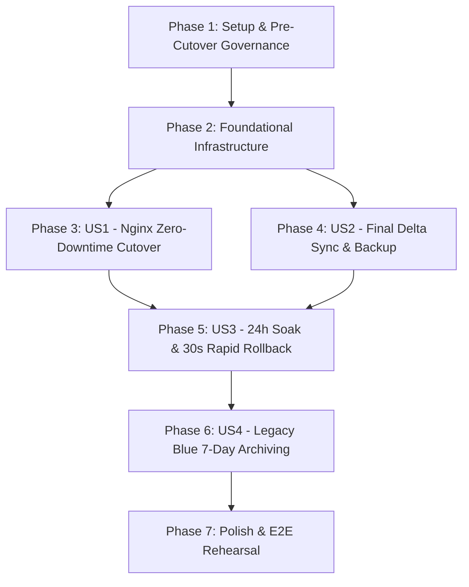

# Tasks: 042-bteam-production-cutover

**Feature**: `042-bteam-production-cutover`  
**Date**: 2026-08-28  
**Spec**: [spec.md](./spec.md) | **Plan**: [plan.md](./plan.md)  
**Constitution Version**: v1.1.1

---

## Phase 1: Setup & Pre-Cutover Governance

**Purpose**: 프로젝트 디렉토리 초기화 및 승인 서명 거버넌스 기반 구성

- [X] T001 컷오버 및 전환 아티팩트 디렉토리(`bteam/migration/approvals/`, `bteam/migration/artifacts/`, `bteam/migration/snapshots/`, `bteam/migration/archive/`, `bteam/deployment/nginx/`)를 생성한다.
- [X] T002 [P] 4대 필수 필드(`approved_by`, `approval_authority`, `approval_reference`, `previous_gate_sha256`) 해시 체인을 검증하는 스크립트를 `bteam/migration/verify_gate.py`에 구현한다. [FR-001, FR-011]
- [X] T003 [P] 승인 서명 누락, 해시 불일치 시 fail-closed 검증 실패를 테스트하는 계약 테스트를 `bteam/tests/contract/test_cutover_gate_contract.py`에 작성한다. [FR-001, FR-011, Constitution II]

---

## Phase 2: Foundational Data & Upstream Infrastructure

**Purpose**: 컷오버 전 필수 계약 검증 및 Nginx 업스트림 템플릿 구성

- [X] T004 [P] Nginx 라우팅 계약 및 `proxy_next_upstream` 3회 재시도 정책을 검증하는 계약 테스트를 `bteam/tests/contract/test_nginx_route_contract.py`에 작성한다. [FR-006, SC-001]
- [X] T005 [P] 24시간 Soak 모니터링 임계치 및 4대 롤백 트리거 계약 테스트를 `bteam/tests/contract/test_soak_monitoring_contract.py`에 작성한다. [FR-008, FR-009, SC-004, SC-006]
- [X] T006 `proxy_next_upstream` 3회 재시도 규칙이 포함된 Green Candidate 설정(`bteam/deployment/nginx/bteam.candidate.conf`)과 Blue Rollback 설정(`bteam/deployment/nginx/bteam.rollback.conf`)을 작성한다. [FR-006, FR-009]

---

## Phase 3: User Story 1 - 무중단 실운영 컷오버 및 실시간 트래픽 전환 (Priority: P1) 🎯 MVP

**Goal**: Nginx 업스트림 원자적 전환으로 외부 5xx 0건 및 0초 다운타임 실현

**Independent Test**: Nginx Symlink 교체 및 reload 후 4개 엔드포인트와 20개 Zero-search 픽스처가 100% 정상 응답(200 OK)하는지 검증

- [X] T007 [P] [US1] 컷오버 직후 4개 엔드포인트(`dashboard_ui`, `dashboard_api`, `chatbot_a`, `chatbot_b`) 및 20개 Zero-search 픽스처 응답을 검증하는 스모크 테스트를 `bteam/tests/integration/test_post_cutover_smoke.py`에 작성한다. [FR-007, SC-001, SC-005]
- [X] T008 [US1] `nginx -t` 사전 구문 검사, 원자적 Symlink 교체(`bteam.candidate.conf` $\rightarrow$ `bteam.conf`), 무중단 `nginx -s reload`를 수행하는 전환 CLI를 `bteam/deployment/nginx/switch_upstream.py`에 구현한다. [FR-006, SC-001]
- [X] T009 [US1] Nginx 업스트림 전환 중 `proxy_next_upstream` 3회 재시도 동작 및 5xx 0건을 검증하는 통합 테스트를 `bteam/tests/integration/test_nginx_cutover_atomic.py`에 구현한다. [FR-006, SC-001]

---

## Phase 4: User Story 2 - 최종 데이터 델타 동기화 및 정합성 보증 (Priority: P1)

**Goal**: 백그라운드 15초 Graceful Drain 및 MySQL/ChromaDB Lag 0 최종 동기화

**Independent Test**: `BACKUP_READY`와 `DATA_MIGRATION_READY` 아티팩트가 생성되고 Blue-Green 간 레코드 랙이 0건인지 검증

- [X] T010 [P] [US2] `PipelineActiveLease` 기반 15초 Graceful Drain 및 `mysqldump --single-transaction` 백업을 검증하는 통합 테스트를 `bteam/tests/integration/test_drain_and_backup.py`에 작성한다. [FR-002, SC-002]
- [X] T011 [US2] 15초 Graceful Drain 실행 후 일관된 MySQL 스냅샷을 생성하고 `BACKUP_READY` 아티팩트를 기록하는 스크립트를 `bteam/migration/execute_drain_backup.py`에 구현한다. [FR-002, SC-002]
- [X] T012 [P] [US2] ChromaDB v2(`oliview_review_sentences_v2`) 레코드 수와 MySQL 분석 완료 리뷰 건수의 1:1 대조를 검증하는 테스트를 `bteam/tests/integration/test_chroma_lag_sync.py`에 작성한다. [FR-004, SC-002]
- [X] T013 [US2] Alembic additive 마이그레이션 적용, ChromaDB v2 랙(Lag = 0) 검증, Redis 표적 무효화/바이패스 적용 및 `DATA_MIGRATION_READY` 아티팩트를 기록하는 스크립트를 `bteam/migration/sync_final_delta.py`에 구현한다. [FR-003, FR-004, FR-005, SC-002]

---

## Phase 5: User Story 3 - 24시간 안전 관찰(Soak) 및 긴급 롤백 가동 (Priority: P2)

**Goal**: 24시간 헬스 프로브 감시 및 이상 징후 시 30초 이내 즉각 Blue 롤백

**Independent Test**: 5xx 1건 발생 등 4대 트리거 시뮬레이션 시 30초 내 Nginx가 Blue로 원복되는지 검증

- [X] T014 [P] [US3] 4대 롤백 트리거(5xx 1건, 프로브 2연속 실패, SLA 2연속 초과, PII/환각 1건) 감지 시 롤백 발동을 시뮬레이션하는 테스트를 `bteam/tests/integration/test_soak_monitor_daemon.py`에 작성한다. [FR-008, FR-009, SC-004, SC-006]
- [X] T015 [US3] 30초 주기 프로브, 5분 윈도우 P95 지연시간 측정, 4대 트리거 실시간 감시 및 시계열 메트릭(`soak_metrics.jsonl`)을 기록하는 데몬을 `bteam/deployment/monitor_soak.py`에 구현한다. [FR-008, FR-009, FR-011, SC-004]
- [X] T016 [US3] 롤백 트리거 시 30초 이내에 `bteam.rollback.conf`로 Symlink를 원복하고 캐시 바이패스 프로파일을 가동하는 롤백 오케스트레이션을 `bteam/deployment/nginx/switch_upstream.py`에 구현한다. [FR-009, SC-006]

---

## Phase 6: User Story 4 - 레거시 Blue 자산의 안전 격리 및 7일 보존 아카이빙 (Priority: P3)

**Goal**: 24시간 Soak 통과 및 승인 후 Blue 컨테이너 정지 및 7일 보존 아카이브 이동

**Independent Test**: `DECOMMISSION_APPROVED` 서명 검증 후 Blue 컨테이너만 graceful 정지되고 7일 retention manifest가 생성되는지 검증

- [X] T017 [P] [US4] `DECOMMISSION_APPROVED` 서명 검증 및 7일 롤백 보존 메타데이터 생성을 검증하는 통합 테스트를 `bteam/tests/integration/test_archive_blue_stack.py`에 작성한다. [FR-010, SC-007]
- [X] T018 [US4] Blue 컨테이너 graceful 정지, 소스 코드 시크릿 Redaction, `bteam/migration/archive/` 7일 보존 디렉토리 이동 및 `blue_manifest.json` 생성 스크립트를 `bteam/migration/archive_blue_stack.py`에 구현한다. [FR-010, SC-007, SC-008]

---

## Phase 7: Polish & End-to-End Cutover Rehearsal

**Purpose**: 매뉴얼 갱신 및 전 과정 E2E 드라이런 검증

- [X] T019 [P] `bteam/README.md`에 컷오버 사전 점검, 실행, 24시간 Soak 모니터링, 30초 긴급 롤백, 7일 보존 후 정리 매뉴얼을 갱신한다. [FR-011]
- [X] T020 `quickstart.md` 가이드에 따라 승인 검증 $\rightarrow$ 드레인/백업 $\rightarrow$ 델타 동기화 $\rightarrow$ 컷오버 $\rightarrow$ 스모크 테스트 $\rightarrow$ 롤백 리허설 전 과정을 모의 실행한다. [SC-001, SC-002, SC-006]
- [X] T021 전체 단위/계약/통합 테스트, Ruff linter, Mypy type-checker, Vite production build를 실행하고 모두 exit code 0을 달성한다. [FR-011, Constitution II]

---

## Dependencies & Execution Order

### Parallel Execution Rules
- `[P]` 표시된 작업은 파일 충돌이 없으므로 병렬 작성 및 실행이 가능합니다.
- `Phase 1 & 2`의 계약 테스트 작성이 완료된 후 User Story 구현으로 진입합니다 (TDD 선행).
- `User Story 1`과 `User Story 2`는 `Phase 2` 완료 후 병렬로 개발할 수 있으며, `Phase 5`의 24시간 Soak 모니터링은 두 스토리가 모두 준비된 후 가동됩니다.

---

## Implementation Strategy

### MVP First (User Story 1 & 2)
1. **1단계**: 승인 검증 및 Nginx 원자적 전환(US1) + 백그라운드 15초 드레인 및 델타 동기화(US2) 완료
2. **2단계**: 컷오버 직후 스모크 테스트(`test_post_cutover_smoke.py`) 통과로 즉시 실운영 트래픽 처리 검증
3. **3단계**: 24시간 Soak 모니터링(US3) 및 7일 보존 아카이빙(US4) 순차 가동
