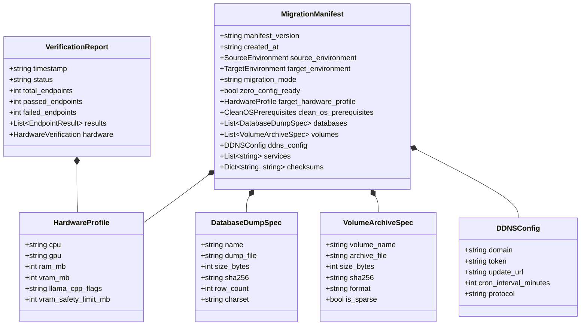

# Data Model & State Transitions: 043-docker-volume-ubuntu-migration-pack

**Feature**: `043-docker-volume-ubuntu-migration-pack`  
**Date**: 2026-08-28  
**Scope**: 마이그레이션 매니페스트, 볼륨 스펙, 데이터베이스 덤프 스펙, 검증 보고서 및 전이 라이프사이클

---

## 1. 핵심 엔티티 정의 (Core Entities)

### 1.1 MigrationManifest (매니페스트 v2.0)
- `manifest_version` (string, required): 매니페스트 스키마 버전 (`"2.0.0"`).
- `created_at` (string, ISO 8601): 패키지 빌드 일시.
- `source_environment` (object): 소스 OS, 플랫폼, 호스트명.
- `target_environment` (string): 대상 OS (`"Ubuntu Linux 24.04 LTS (x86_64)"`).
- `migration_mode` (string): 마이그레이션 모드 (`"DEV_PLATFORM_TRANSFER"`).
- `zero_config_ready` (bool): `.env` 실사용 시크릿 완비 여부 (`true`).
- `target_hardware_profile` (HardwareProfile): 타겟 CPU/GPU/RAM 사양 및 빌드 플래그.
- `clean_os_prerequisites` (object): Docker, NVIDIA driver, toolkit 자동 설치 설정.
- `databases` (list of DatabaseDumpSpec): 논리 덤프 메타데이터 목록.
- `volumes` (list of VolumeArchiveSpec): Docker named volume 물리 아카이브 메타데이터.
- `ddns_config` (DDNSConfig): DuckDNS 연동 설정.
- `services` (list of string): 번들된 10개 서비스 목록.
- `checksums` (dict): SHA-256 해시 매핑.

### 1.2 HardwareProfile (하드웨어 프로파일)
- `cpu` (string): CPU 모델명 및 명령어 세트 (`"Intel Core i7-930 (SSE4.2, Non-AVX)"`).
- `gpu` (string): GPU 모델명 및 아키텍처 (`"NVIDIA GeForce GTX 1070 8GB (Pascal sm_61)"`).
- `ram_mb` (int): 시스템 RAM 용량 (`24576`).
- `vram_mb` (int): GPU VRAM 용량 (`8192`).
- `llama_cpp_flags` (string): 컴파일러 플래그 (`"-DGGML_CUDA=ON -DCMAKE_CUDA_ARCHITECTURES=61 -march=native"`).
- `vram_safety_limit_mb` (int): VRAM 안전 한계 (`5000`).

### 1.3 DatabaseDumpSpec & VolumeArchiveSpec
- `DatabaseDumpSpec`:
  - `name`: 데이터베이스 식별자 (`"pilos_v2"`, `"oliview_project"`).
  - `dump_file`: 덤프 파일 상대 경로 (`"database/pilos_v2.sql.gz"`).
  - `size_bytes`: 파일 크기 (바이트).
  - `sha256`: SHA-256 체크섬.
  - `row_count`: 총 레코드 수.
- `VolumeArchiveSpec`:
  - `volume_name`: 대상 Docker 볼륨 명칭 (`"ateam_db_data"`, `"bteam_mysql_data"`, `"green_chroma_data"`, `"redis_data"`).
  - `archive_file`: 볼륨 아카이브 파일 경로 (`"volumes/ateam_db_data.tar.gz"`).
  - `size_bytes`: 파일 크기.
  - `sha256`: SHA-256 체크섬.
  - `is_sparse`: Sparse File 보존 여부 (`true`).

---

## 2. 마이그레이션 라이프사이클 및 상태 전이 (Lifecycle & State Transitions)

```mermaid
stateDiagram-v2
    [*] --> SOURCE_INSPECT: make_migration_pack.py 실행
    SOURCE_INSPECT --> EXPORTING_DB: DB 연결 & Dirty Page 플러시
    EXPORTING_DB --> EXPORTING_VOLUMES: Docker Volume tarball 생성 (sparse)
    EXPORTING_VOLUMES --> BUNDLING_SOURCE: .env 및 소스 1:1 클린 어셈블리
    BUNDLING_SOURCE --> GENERATING_MANIFEST: SHA-256 체크섬 & 매니페스트 v2.0
    GENERATING_MANIFEST --> ARCHIVING: 단일 .tar.gz 압축 패키징
    ARCHIVING --> TRANSFER_READY: 마이그레이션 팩 생성 완료

    TRANSFER_READY --> TARGET_UNPACK: 우분투 서버로 SCP 전송 및 압축 해제
    TARGET_UNPACK --> PREREQUISITE_CHECK: bootstrap_restore.sh 실행
    PREREQUISITE_CHECK --> PROVISIONING_INFRA: Docker/GPU 드라이버 자동 설치 (필요 시)
    PROVISIONING_INFRA --> RESTORING_VOLUMES: Docker 볼륨 및 Mutex DB 복원
    RESTORING_VOLUMES --> SYNCING_DDNS: DuckDNS IPv4 갱신 & 5분 크론 등록
    SYNCING_DDNS --> COMPOSE_NORMALIZE: WSL2 경로 제거 & GPU 디렉티브 정규화
    COMPOSE_NORMALIZE --> STARTING_SERVICES: 인프라 Healthy 확인 후 앱 순차 기동
    STARTING_SERVICES --> VERIFYING: verify_migration.py 11개 엔드포인트 E2E 검증
    VERIFYING --> MIGRATION_COMPLETE: 100% Pass (Exit 0)
```

### 상태 전이 규칙
1. **SOURCE_INSPECT $\rightarrow$ EXPORTING_DB**: MySQL 컨테이너 응답 및 `FLUSH TABLES WITH READ LOCK` 확인 후 진입.
2. **EXPORTING_DB $\rightarrow$ EXPORTING_VOLUMES**: 덤프 생성 완료 및 SHA-256 해시 일치 시 진입.
3. **TARGET_UNPACK $\rightarrow$ PREREQUISITE_CHECK**: `.env`에 `chmod 600` 적용 및 스크립트에 `chmod +x` 부여.
4. **PROVISIONING_INFRA $\rightarrow$ RESTORING_VOLUMES**: Docker daemon 및 `nvidia` 런타임 활성화 확인 후 진입.
5. **RESTORING_VOLUMES $\rightarrow$ STARTING_SERVICES**: 물리 볼륨 추출 성공 시 SQL 중복 덤프 복원을 건너뛰는 Mutex 규칙 적용.
6. **STARTING_SERVICES $\rightarrow$ VERIFYING**: DB, Redis, Model Gateway 인프라 Healthy 상태 확인 후 웹/API 컨테이너 기동.
7. **VERIFYING $\rightarrow$ MIGRATION_COMPLETE**: 11개 엔드포인트 전수 200 OK 및 `verification_report.json` 저장 완료.
