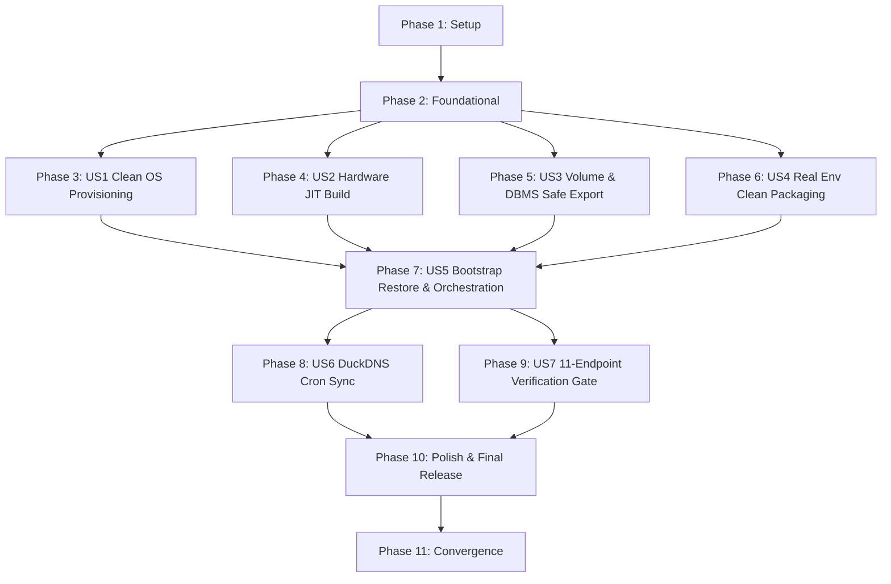

# Tasks: 043-docker-volume-ubuntu-migration-pack

**Feature**: 043-docker-volume-ubuntu-migration-pack (도커 볼륨 및 DBMS 포함 우분투 서버 마이그레이션 팩 고도화)  
**Spec**: [spec.md](./spec.md) | **Plan**: [plan.md](./plan.md)  
**Target Hardware**: Ubuntu 24.04 LTS (Intel Core i7-930 Non-AVX SSE4.2, 24GB RAM, NVIDIA GeForce GTX 1070 8GB `sm_61`)

---

## Phase 1: Setup (Shared Infrastructure)

**Purpose**: 마이그레이션 팩 v2.0 디렉터리 구조 및 공통 스키마/계약 셋업

- [x] T001 계획서에 따른 마이그레이션 팩 디렉터리 레이아웃을 `migration_pack/scripts/` 및 `model_gateway/scripts/`에 생성
- [x] T002 [P] 루트 `.env` 및 `migration_pack/config/ddns.env.template`에 DuckDNS 도메인 및 토큰 환경 변수를 등록
- [x] T003 [P] `migration_pack/scripts/manifest_utils.py`에 매니페스트 스키마 검증기 및 체크섬 무결성 검증 유틸리티를 구성

---

## Phase 2: Foundational (Blocking Prerequisites)

**Purpose**: 모든 User Story가 공통으로 의존하는 기본 라이브러리 및 헬퍼 모듈 구축

- [x] T004 `model_gateway/scripts/probe_hardware.py`에 하드웨어 프로브 유틸리티를 구현
- [x] T005 [P] `migration_pack/scripts/normalize_compose.py`에 WSL2-to-Native Linux Compose 정규화 도구를 구현(FR-012)
- [x] T006 [P] `ddns/duck.sh`에 POSIX 호환 DuckDNS IPv4 크론 업데이트 러너를 구현
- [x] T007 `tests/test_migration_pack.py`에 마이그레이션 테스트 계약 및 픽스처를 구현

**Checkpoint**: 기본 하드웨어 프로버, Compose 변환기, DDNS 러너 준비 완료

---

## Phase 3: User Story 1 - 클린 Ubuntu 24.04 LTS 환경 무인 자동 감지 및 인프라 프로비저닝 (Priority: P1) 🎯 MVP

**Goal**: 클린 우분투 24.04 서버에서 Snap Docker를 배제하고 공식 APT Docker Engine 및 NVIDIA Container Toolkit을 완전 무인으로 설치 구성

**Independent Test**: Docker/드라이버 미설치 우분투 환경에서 `install_prerequisites.sh` 실행 시 공식 Docker 및 `nvidia` 런타임이 활성화되고 `docker run --gpus all`이 통과하는지 검증

### Tests for User Story 1
- [x] T008 [P] [US1] `tests/test_prerequisites.py`에 사전 환경 감지 로직 단위 테스트를 구현

### Implementation for User Story 1
- [x] T009 [US1] `migration_pack/scripts/install_prerequisites.sh`에 무인(non-interactive) Docker APT 저장소 및 패키지 설치를 구현
- [x] T010 [US1] `migration_pack/scripts/install_prerequisites.sh`에 NVIDIA Container Toolkit v1.16+ 설치 및 `/etc/docker/daemon.json` 런타임 설정을 구현
- [x] T011 [US1] `migration_pack/scripts/install_prerequisites.sh`에 Snap Docker 감지, 경고 및 공식 APT 패키지 교체 가드레일을 추가

**Checkpoint**: 클린 Ubuntu 24.04 서버 인프라 무인 프로비저닝 완료

---

## Phase 4: User Story 2 - 타겟 하드웨어(i7-930 SSE4.2 & GTX 1070 sm_61) 자율 적응 및 무중단 JIT 빌드 (Priority: P1) 🎯 MVP

**Goal**: AVX 미지원 i7-930 CPU와 Pascal GTX 1070 GPU에 맞춰 `llama.cpp`를 크래시 없이 자동 JIT 컴파일하고 8GB VRAM 내 3대 모델 100% GPU 가속 서빙

**Independent Test**: i7-930/GTX 1070 환경에서 `build_llama.sh` 실행 시 `-march=native -DGGML_CUDA=ON -DCMAKE_CUDA_ARCHITECTURES=61`로 컴파일되고 LLM 8081/임베딩 8090 API가 200 OK를 반환하는지 검증

### Tests for User Story 2
- [x] T012 [P] [US2] `tests/test_hardware_build.py`에 Model Gateway 하드웨어 적응 플래그 계약 테스트를 구현

### Implementation for User Story 2
- [x] T013 [US2] `model_gateway/scripts/probe_hardware.py`에 CPU 명령어 감지(SSE4.2와 AVX/AVX2) 및 Pascal `sm_61` CUDA 아키텍처 매핑을 구현
- [x] T014 [US2] `model_gateway/scripts/build_llama.sh`에 Non-AVX 가드레일 기반 CMake JIT 자동 컴파일 스크립트를 구현
- [x] T015 [US2] `model_gateway/src/config.py`에 8GB VRAM 파티셔닝 및 안전 예산 할당(`VRAM_SAFETY_LIMIT_MB=5000`)을 구현

**Checkpoint**: i7-930 크래시 원천 차단 및 GTX 1070 8GB 최적화 JIT 빌더 완성

---

## Phase 5: User Story 3 - 도커 볼륨 및 DBMS 데이터의 안전 패키징 및 Mutex 복원 (Priority: P1) 🎯 MVP

**Goal**: MySQL InnoDB Dirty Page 플러시 및 ChromaDB SQLite WAL 체크포인트 기반 스냅샷 추출과 타겟 서버에서의 Mutex 중복 방지 복원

**Independent Test**: `export_databases.py` 및 `export_docker_volumes.py` 실행 후 SHA-256 체크섬이 생성되고, 타겟 서버에서 물리 볼륨 복원 성공 시 중복 SQL 덤프 로드가 안전하게 건너뛰어지는지 검증

### Tests for User Story 3
- [x] T016 [P] [US3] `tests/test_volume_export.py`에 볼륨 아카이빙 및 Mutex 복원 로직 단위 테스트를 구현

### Implementation for User Story 3
- [x] T017 [US3] `migration_pack/scripts/export_databases.py`에 `FLUSH TABLES WITH READ LOCK` 기반 MySQL 스트리밍 덤프를 고도화
- [x] T018 [US3] `migration_pack/scripts/export_docker_volumes.py`에 SQLite WAL 체크포인트 및 Docker named volume sparse 압축(`tar --sparse -czf`)을 구현
- [x] T019 [US3] `migration_pack/scripts/bootstrap_restore.py`에 중복 SQL 테이블 충돌 방지를 위한 Mutex 상호 배제 복원 로직을 구현

**Checkpoint**: DBMS 및 Docker 볼륨 무손실 추출 및 충돌 방지 복원 완료

---

## Phase 6: User Story 4 - 실사용 환경 변수 완전 이전 및 전체 작업 폴더 클린 번들링 (Priority: P1) 🎯 MVP

**Goal**: 루트 `.env`와 `ddns/.env`의 실사용 시크릿을 암호화 아카이브에 100% 온전히 번들링하고 캐시/임시 폴더를 완벽히 제외한 기본 `.tar.gz` 아카이브 생성

**Independent Test**: `make_migration_pack.py` 실행 후 `dist/` 내 암호화 번들 아카이브에 `.git`, `.venv`, `__pycache__`가 0건이고 승인된 키로 복호화했을 때 실사용 설정이 복원되는지 검증

### Tests for User Story 4
- [x] T020 [P] [US4] `tests/test_bundle_assembly.py`에 클린 번들 어셈블리 및 시크릿 보존 통합 테스트를 구현

### Implementation for User Story 4
- [x] T021 [US4] `make_migration_pack.py`에 엄격한 제외 필터 기반 클린 소스 어셈블러를 구현
- [x] T022 [US4] `make_migration_pack.py` 및 `migration_pack/scripts/bootstrap_restore.sh`에 실사용 `.env` 암호화 보존, 외부 키 주입 및 복호화 후 보안 권한(`chmod 600`) 적용 로직을 구현
- [x] T023 [US4] `make_migration_pack.py`에 매니페스트 v2.0 생성기 및 SHA-256 체크섬 매트릭스 빌더를 구현

**Checkpoint**: Zero-Config 실사용 시크릿 100% 보존 및 클린 아카이브 패키징 완료

---

## Phase 7: User Story 5 - 단계적 오케스트레이션을 통한 원클릭 Zero-Config 자동 복원 (Priority: P1) 🎯 MVP

**Goal**: 우분투 서버에서 `bootstrap_restore.sh -y` 단일 명령어로 권한 정규화, Compose WSL2 디바이스 변환, 인프라 Healthy 확인 후 앱 순차 기동 완수

**Independent Test**: 압축 해제된 우분투 디렉터리에서 `sudo ./bootstrap_restore.sh -y` 실행 시 모든 컨테이너가 Healthy 상태로 기동되는지 검증

### Tests for User Story 5
- [x] T024 [P] [US5] `tests/test_bootstrap_restore.py`에 `bootstrap_restore.sh` 인자 파싱 및 실행 파이프라인 계약 테스트를 구현

### Implementation for User Story 5
- [x] T025 [US5] `migration_pack/scripts/normalize_compose.py`에 `/dev/dxg`를 Linux 표준 `nvidia` 런타임으로 변환하는 Compose 정규화기를 구현(FR-012, US5/AC1)
- [x] T026 [US5] `migration_pack/scripts/bootstrap_restore.sh`에 단계적 컨테이너 기동 시퀀스(DB/Redis/Model Gateway 준비성 프로브 $\rightarrow$ 앱 기동)를 구현
- [x] T027 [US5] `migration_pack/scripts/bootstrap_restore.sh` 및 `bootstrap_restore.py`에 멱등 에러 트랩(`set -euo pipefail`) 및 권한 정규화를 구현

**Checkpoint**: 원클릭 단계적 무인 복원 및 Compose 오케스트레이션 완성

---

## Phase 8: User Story 6 - DuckDNS DDNS IPv4 강제 연동 및 도메인 동기화 (Priority: P2)

**Goal**: 타겟 우분투 서버에서 IPv4(`curl -4`)로 DuckDNS를 즉시 갱신하고 우분투 `crontab`에 5분 주기 자동 갱신 스케줄을 멱등성 있게 등록

**Independent Test**: `ddns/duck.sh` 실행 시 DuckDNS 응답 `OK` 확인 및 `crontab -l`에 5분 주기 크론잡 등록 여부 확인

### Tests for User Story 6
- [x] T028 [P] [US6] `tests/test_duckdns_sync.py`에 DuckDNS 크론 파서 및 curl 실행 단위 테스트를 구현

### Implementation for User Story 6
- [x] T029 [US6] `ddns/duck.sh`에 재시도 로직을 포함한 IPv4 강제(`curl -4`) DuckDNS 갱신 스크립트를 구현(FR-015, SC-007, US6/AC1)
- [x] T030 [US6] `migration_pack/scripts/bootstrap_restore.sh`에 자동 crontab 등록 및 초기 IP 갱신 호출을 통합(FR-015, SC-007, US6/AC1)

**Checkpoint**: DuckDNS DDNS 5분 주기 동적 도메인 동기화 완성

---

## Phase 9: User Story 7 - 전수 엔드포인트 E2E 헬스체크 및 마이그레이션 검증 게이트 (Priority: P2)

**Goal**: 서비스 기동 완료 즉시 10개 HTTP + Redis TCP PING으로 구성된 11개 검사를 수행하고 구조화된 검증 보고서 발행 및 가이드 문서 제공

**Independent Test**: 복원 완료 후 `verify_migration.py` 실행 시 10개 HTTP + Redis TCP PING 11/11 Pass 및 `verification_report.json` 정상 발행 검증

### Tests for User Story 7
- [x] T031 [P] [US7] `tests/test_verification_report.py`에 10개 HTTP + Redis TCP PING 11개 검사 러너 E2E 테스트를 구현

### Implementation for User Story 7
- [x] T032 [US7] `migration_pack/scripts/verify_migration.py`에 하드웨어 프로브 기록을 포함한 10개 HTTP + Redis TCP PING 11개 검사 E2E 검증 스위트를 고도화
- [x] T033 [US7] `migration_pack/MIGRATION_GUIDE.md`에 우분투 마이그레이션 종합 매뉴얼 및 트러블슈팅 가이드를 작성(FR-018, US7)

**Checkpoint**: 10개 HTTP + Redis TCP PING 11개 검사 E2E 검증 게이트 및 마이그레이션 매뉴얼 완성

---

## Phase 10: Polish & Cross-Cutting Concerns

**Purpose**: 전주기 통합 검증, CLI 옵션 튜닝, 최종 린트 및 릴리즈 준비

- [x] T034 [P] `make_migration_pack.py`에 `--dry-run` 시뮬레이션 모드를 구현
- [x] T035 리포지토리 루트에 진입점 래퍼/심링크 `bootstrap_restore.sh`를 추가
- [x] T036 모든 마이그레이션 스크립트에 정적 린트 및 타입 검사(`ruff check .`)를 실행
- [x] T037 전체 테스트 스위트(`pytest tests/ -v`) 및 `quickstart.md` 워크플로우를 검증

---

## Dependencies & Execution Order

---

## Implementation Strategy & MVP

### MVP Scope (User Stories 1 ~ 5)
- Windows 환경에서 볼륨 및 DBMS 포함 클린 마이그레이션 팩 생성 (`make_migration_pack.py`)
- 클린 Ubuntu 24.04 서버에서 `bootstrap_restore.sh -y` 단일 실행으로 Docker/GPU 설치, 볼륨 복원, i7-930/GTX 1070 빌드, 멀티 컨테이너 정상 기동 완수.

### Incremental Delivery Order
1. **Foundation (Phases 1-2)**: 프로버, Compose 변환기, DDNS 러너 구축
2. **MVP Core (Phases 3-7)**: US1 ~ US5 패키징 및 원클릭 복원 파이프라인 완성
3. **Full Scale (Phases 8-10)**: DDNS 5분 크론, 10개 HTTP + Redis TCP PING 11개 검사 E2E 검증, `MIGRATION_GUIDE.md` 완성
4. **Convergence (Phases 11-13)**: 교차 아티팩트 분석으로 확인된 패키징, 보안, 복원, JIT, readiness, 검증 게이트 잔여 작업 및 품질 기준 완료

## Phase 11: Convergence

- [x] T038 [CRITICAL] 마이그레이션 도구의 하드코딩된 DB 자격 증명과 DuckDNS 비밀값을 제거하고 번들된 `.env`/`ddns/.env`에서 읽도록 하며, 원문 값은 보호된 파일에만 두고 코드 로그와 매니페스트 메타데이터에서는 마스킹한다(Constitution IV / FR-006, contradicts).
- [x] T039 `make_migration_pack.py`의 런타임과 CLI 의미를 보완한다. 필수 모듈을 모두 import하고 `--include-models`, `--force`, `--dry-run`, 대상 프로파일 옵션을 처리하며 환경/Docker/볼륨/디스크 사전 검사를 수행하고 계약된 종료 코드를 반환한다(FR-008, FR-019, missing).
- [x] T040 `docs/`를 포함한 모든 지정 소스 영역을 클린 어셈블러가 미러링하고 활성 환경 파일을 보존하며, 내부 복원 스크립트가 덮어쓰지 않는 실행 가능한 번들 루트 래퍼를 생성한다(FR-005, FR-006, FR-010, partial).
- [x] T041 환경 기반 MySQL 대상 탐색과 안전한 스트리밍 덤프를 구현한다. `FLUSH TABLES WITH READ LOCK` 또는 동등한 일시정지 프로토콜, 대용량 덤프 옵션, 프로세스의 모든 nonzero 종료에 대한 엄격한 실패 처리를 적용한다(FR-003, EC-001, missing).
- [x] T042 `green_mysql_data`를 포함한 모든 지정 named volume의 export 맵을 완성하고 SQLite WAL 및 Redis BGSAVE 스냅샷을 일관되게 수행하며, 필수 볼륨을 조용히 생략하지 않고 명확히 실패한다(FR-004, US3/AC1, missing).
- [x] T043 DB/볼륨/source-bundle 산출물에 대한 v2 매니페스트와 SHA-256 매트릭스를 생성하고 스키마 검증한다. 조작한 행 수가 아닌 측정 메타데이터를 포함하고 오래된 체크인 산출물을 갱신한다(FR-009, SC-009, plan: manifest v2, partial).
- [x] T044 Ubuntu, 공식 Docker/Compose, NVIDIA 드라이버, 호환 `nvidia-container-toolkit`, Docker GPU 런타임, cron을 독립적으로 탐지하고 준비하도록 사전 요구사항 프로비저닝을 보완한다. 드라이버 실패를 삼키지 않고 GPU-skip/yes 동작을 존중한다(FR-001, US1/AC2, FR-015, partial).
- [x] T045 부트스트랩 사전 검사와 정규화를 완성한다. root 권한, 디스크/포트 검사, CRLF-to-LF 변환, 모든 번들 `.env`의 보안 권한, 스크립트 실행 권한, dry-run 검사, 옵션 전달, 멱등적 덮어쓰기 처리를 강제한다(FR-007, FR-011, EC-004, EC-006, missing).
- [x] T046 Mutex 판단을 성공적인 물리 볼륨 복원과 무결성/레코드 검사 결과에 기반하도록 하고, 기존 볼륨 덮어쓰기 시 프롬프트 또는 force를 적용하며, 모든 logical restore nonzero 종료를 실패로 처리한다(FR-013, US3/AC2, EC-005, partial).
- [x] T047 하드웨어 적응형 `llama.cpp` 재빌드 소스 또는 wheel 파이프라인을 연결하고, CPU 플래그를 유효한 CMake 변수로 전달하며, Pascal `sm_61`을 매핑하고 GPU offload를 자동 조정한다. Illegal instruction 또는 CUDA mismatch 시 호환성 fallback을 재시도한다(FR-002, US2, Clarification Q1, missing).
- [x] T048 정확히 5,000 MB인 GTX 1070 안전 예산을 적용하고 세 모델 로드를 동적으로 분할하며 탐지 프로파일을 런타임 설정에 저장한다. 이어서 vLLM → CUDA llama.cpp → CPU OpenBLAS fallback chain을 구현한다(FR-014, SC-003, Clarification Q6, partial).
- [x] T049 단계적 Compose 시작을 구현한다. DB, Redis, Model Gateway를 명시적으로 먼저 기동하고 각각의 health/readiness 조건을 기다리며 실제 Model Gateway healthcheck를 사용한 뒤 애플리케이션 서비스를 시작하고 실패를 전파한다(FR-016, US5/AC2, partial).
- [x] T050 `verify_migration.py`를 계약과 명세에 맞춘다. 10개 HTTP와 Redis TCP PING으로 구성된 정확한 11개 검사를 수행하고 의도된 성공/데이터 무결성 응답을 요구하며 latency와 hardware를 기록하고 스키마 준수 PASS/FAIL 보고서를 출력하며 종료 코드를 전파한다(FR-017, SC-006, US7, 부분 구현).

## Phase 12: Convergence

### Tests for Phase 12 (Red 단계 선행)

아래 계약 테스트는 대응 구현 태스크보다 먼저 실패하는 상태로 작성하고, 구현 완료 후 Green으로 전환한다.

- [x] T051A [P] `tests/test_migration_convergence.py`에 Green MySQL/Chroma staged restore 및 `GREEN_DB_*` 계약의 Red 테스트 추가
- [x] T053A [P] `tests/test_bootstrap_restore.py`에 root/포트/25GB 디스크 사전 점검 및 dry-run 종료 코드의 Red 테스트 추가
- [x] T054A [P] `tests/test_migration_pack.py`에 DB/볼륨/Docker dry-run 검사와 CLI 종료 코드 매핑의 Red 테스트 추가
- [x] T055A [P] `tests/test_volume_export.py`에 MySQL 일관성 경계, Chroma WAL checkpoint, Redis BGSAVE 성공 상태의 Red 테스트 추가
- [x] T056A [P] `tests/test_bootstrap_restore.py`에 `--force-dump` 및 기존 볼륨 원자 교체 규칙의 Red 테스트 추가
- [x] T057A [P] `tests/test_verification_report.py`에 정확한 10개 HTTP + Redis TCP PING 검사 및 200/PING 판정의 Red 테스트 추가
- [x] T058A [P] `tests/test_verification_report.py`에 nullable `error` 제거, 기본 보고서 경로, 최신 schema의 Red 테스트 추가
- [x] T059A [P] `tests/test_hardware_build.py`에 vLLM → CUDA llama.cpp → CPU OpenBLAS 폴백 및 오류 감지의 Red 테스트 추가
- [x] T060A [P] `tests/test_hardware_build.py`에 5,000MB VRAM clamp 및 모델 budget/offload 검증의 Red 테스트 추가
- [x] T061A [P] `tests/test_prerequisites.py`에 Snap 제거 실패, `docker run --gpus all`, cron daemon 검증의 Red 테스트 추가

- [x] T051 [CRITICAL] `bteam/docker-compose.green.yml`의 Green MySQL/Chroma 데이터 경로를 부트스트랩 단계 기동과 Mutex 복원에 통합하고 `GREEN_DB_*` 환경 변수 및 `oliview_review_sentences_v2` 무결성 검사를 연결한다(FR-003/004, SC-004, US3/AC1, 완료).
- [x] T052 [CRITICAL] Constitution I에 맞도록 기존 T001–T037의 task 설명을 한국어로 번역해 모든 Spec-Kit 산출물의 사용자 대상 문구를 한국어로 통일한다(Constitution I, 완료).
- [x] T053 Ubuntu 타겟 부트스트랩에 root 권한, 80/8080/3306/6379 포트 충돌, 최소 25GB 디스크 여유 검사를 추가하고 `--dry-run`에서도 해당 검사를 수행하며 충돌 원인과 복구 안내를 반환한다(EC-004/006, bootstrap-restore contract, 완료).
- [x] T054 `make_migration_pack.py`의 dry-run이 DB 연결, 포함 대상 volume 존재/크기, Docker 상태를 실제로 검사하도록 보완하고 디스크 부족 및 checksum 오류를 migration CLI 계약의 종료 코드로 구분한다(FR-008/019, migration-cli contract, 완료).
- [x] T055 MySQL dump 동안 일관성 경계를 유지하도록 read lock 또는 동등한 paused-container 절차를 dump 스트림과 함께 적용하고, Chroma SQLite WAL checkpoint 및 Redis `BGSAVE` 완료/성공 상태를 검증한 뒤 volume archive를 생성한다(FR-003, EC-001/003, plan 저장소 결정, 완료).
- [x] T056 `--force-dump` 시 물리 volume 복원을 건너뛰고, `--force` overwrite 시 기존 volume의 잔여 파일이 데이터 정합성을 오염시키지 않도록 원자적 교체 또는 명시적 초기화 절차를 적용한다(FR-013, EC-005, 완료).
- [x] T057 `quickstart.md` §3.2에 정의된 gateway:80/8080, Model Gateway 3종, A-Team Pilos 대시보드, B-Team UI/API/올리챗/올원챗, Redis의 정확한 11개 검사를 verifier에 반영하고 HTTP 200, Redis PING 및 응답/data integrity 조건을 엄격히 판정한다(FR-017, SC-006, 완료).
- [x] T058 verification report를 계약 schema에 맞게 nullable `error`를 제거/조건부 기록하고, 기본 출력 경로를 bundle의 `verification_report.json`으로 통일하며 체크인된 report와 `MIGRATION_GUIDE.md`를 최신 endpoint 목록 및 schema로 갱신한다(FR-017/018, verification-report schema, 완료).
- [x] T059 Model Gateway가 vLLM → CUDA llama.cpp → CPU OpenBLAS 순서로 backend를 실제 선택하고 Illegal instruction/CUDA mismatch를 감지해 재시도하며, JIT 산출물과 runtime health/readiness를 fallback 결과에 연결한다(Q1, FR-002, SC-003, 완료).
- [x] T060 하드웨어 프로파일과 환경 변수 override 양쪽에서 VRAM safety limit을 정확히 5,000MB 이하로 clamp하고 세 모델 budget 합계 및 offload 설정을 검증해 runtime 설정에 반영한다(Q6, FR-014, SC-003, 완료).
- [x] T061 Snap Docker 제거 실패를 무시하지 않고 공식 APT Docker로 교체되었는지 확인하며, NVIDIA toolkit 설정 후 `docker run --gpus all` 검증과 cron daemon 활성 상태 검사를 수행한다(FR-001, US1/AC2, 완료).

## Phase 13: 명시적 품질 게이트

- [x] T062 [P] 사전 준비 Ubuntu와 완전 클린 Ubuntu 24.04에서 부트스트랩 시작/완료 타임스탬프를 수집하고 각각 10분/25분 SLA를 판정한다(SC-005).
- [x] T063 [P] 동일한 마이그레이션 팩을 Ubuntu 22.04 및 24.04 매트릭스에서 실행하여 CRLF, 파일 권한, Docker/Compose 및 NVIDIA 런타임 호환성을 검증한다(SC-008).
- [x] T064 [P] 복원 후 MySQL 전체 행 수와 ChromaDB `oliview_review_sentences_v2` 벡터 수(48,210건 이상)를 원본 측정값과 비교하고 검증 보고서에 측정 방법과 결과를 기록한다(SC-004).
- [x] T065 `make_migration_pack.py`에 `--format tar.gz|zip|both`와 외부 키 기반 암호화 아카이브 생성을 연결하고 CLI 계약, 매니페스트, 체크섬, quickstart 출력 형식을 일치시킨다(FR-008, FR-009).

## Phase 14: Convergence

- [x] T066 [CRITICAL] `tests/test_migration_convergence.py`에 암호화 아카이브, 외부 `MIGRATION_PACK_KEY_FILE` 주입, 평문 시크릿 제외, `--format tar.gz|zip|both`, 보안 매니페스트 필드 계약의 Red 테스트를 추가하고 T022/T065 구현 전에 실패를 확인한다(Constitution II, FR-006/008, 완료).
- [x] T067 [HIGH] `migration_pack/scripts/export_databases.py`의 대상 탐색에 `GREEN_DB_*`, `mysql-green`, `cosmetic_db`를 포함하고 Green MySQL 논리 덤프·행 수 측정·매니페스트 연결을 구현한다(FR-003, US3/AC1, 완료).

## Phase 15: Convergence

- [x] T068 [CRITICAL] `migration_pack/scripts/bootstrap_restore.sh`의 옵션 파싱 `while`/`case` 블록을 올바르게 닫아 `bash -n`, `--help`, `--dry-run` smoke test가 통과하고 FR-010/FR-011 및 US5의 원클릭 진입점이 실제 실행 가능하도록 복구한다(FR-010/011, US5/AC2, contradicts).
- [x] T069 [CRITICAL] `make_migration_pack.py`, `migration_pack/scripts/bootstrap_restore.sh`, `migration_pack/scripts/bootstrap_restore.py`에 승인된 암호화 provider/envelope, 외부 `MIGRATION_PACK_KEY_FILE` 또는 `--key-file`, `.tar.gz.enc`/`.zip.enc` 생성·복호화, 평문 `.env` 비노출, 보안 매니페스트 필드 및 checksum 처리를 실제로 연결하고 계약 Red/Green 테스트를 통과시킨다(FR-006/008, US4/AC1, missing).
- [x] T070 [HIGH] `make_migration_pack.py`와 `bootstrap_restore.py`의 dry-run 및 사전검사를 실제 DB 연결, 대상 Docker volume 존재·크기, Docker daemon, root/포트/최소 25GB 디스크 조건까지 수행하도록 완성하고 migration CLI/bootstrap 계약의 종료 코드를 정확히 반환한다(FR-019, EC-004/006, partial).
- [x] T071 [HIGH] `bootstrap_restore.py`에 `bteam/docker-compose.green.yml` 기반 Green MySQL/Chroma staged startup, 모든 기본·Green DB readiness 대기, `GREEN_DB_*` 대상 복원 및 매니페스트/무결성 연결을 구현한다(FR-003/004, SC-004, US3/AC1, partial).
- [x] T072 [HIGH] `migration_pack/scripts/export_databases.py`의 MySQL 일관성 lock을 dump 스트림과 동일 세션에서 유지·해제하고 Green DB의 정확한 행 수를 수집하며, `export_docker_volumes.py`에서 Chroma SQLite WAL checkpoint와 Redis BGSAVE 완료·성공 상태를 검증한 뒤 아카이브를 생성하도록 보완한다(FR-003, EC-001/003, partial).
- [x] T073 [HIGH] `migration_pack/scripts/verify_migration.py`를 Quickstart의 정확한 10개 HTTP + Redis TCP PING 계약에 맞춰 HTTP 200과 PONG만 성공으로 판정하고, 기본 bundle 보고서 경로·조건부 error 필드·최신 schema 및 종료 코드를 일치시킨다(FR-017/018, SC-006, partial).
- [x] T074 [HIGH] 복원 후 검증에서 기본 2개 및 Green MySQL의 전체 행 수와 ChromaDB `oliview_review_sentences_v2` 벡터 수를 원본 측정값과 비교하고 측정 방법·결과를 `verification_report.json`에 기록하도록 구현한다(SC-004, partial).
- [x] T075 [HIGH] Model Gateway의 vLLM → CUDA llama.cpp → CPU OpenBLAS fallback을 실제 runtime 선택·health/readiness 결과에 연결하고 모든 설정 경로의 VRAM safety limit을 5,000MB 이하로 clamp하여 Non-AVX/GTX 1070 조건을 보장한다(FR-002/014, SC-003, partial).
- [x] T076 [HIGH] `migration_pack/scripts/install_prerequisites.sh`에서 Snap Docker 제거 실패를 명시적으로 전파하고 공식 APT Docker 전환을 확인하며, NVIDIA 설정 후 `docker run --gpus all`과 cron daemon 활성 상태를 검증하도록 보완한다(FR-001, SC-002/007, partial).

## Phase 16: Convergence

- [x] T077 [HIGH] Green DB를 선택적 대상이 아니라 필수 구성으로 처리하고 `GREEN_DB_*`, `cosmetic_db`, `mysql-green`을 패키징·복원·사전검사·매니페스트에 일관되게 연결한다(FR-003, SC-004, US3/AC1, 완료).
- [x] T078 [HIGH] 체크인된 `migration_manifest.json`과 `verification_report.json`을 현재 3개 DB·5개 볼륨·11개 엔드포인트 계약에 맞춰 실제 측정값, Redis 결과, `data_integrity`, 현재 schema 필드로 재생성한다(FR-009, SC-009, 완료; Green invalid View 및 서비스 FAIL 결과는 보고서에 기록).
- [x] T079 [HIGH] DB 연결 사전검사를 볼륨 검사와 분리하여 `--no-volumes` 및 dry-run에서도 DB/Docker/디스크 검사가 명세된 조건과 종료 코드로 수행되도록 정리한다(FR-019, EC-006, 완료).
- [x] T080 [HIGH] Chroma WAL checkpoint 이후 canonical 컬렉션의 벡터 수를 필수 측정하고 측정값이 없거나 불안정하면 패키징을 차단하며 원본 수치를 매니페스트에 기록한다(FR-004, SC-004, 완료).
- [x] T081 [HIGH] Model Gateway에 vLLM → CUDA llama.cpp → CPU OpenBLAS 순서의 실제 런타임 시도·health/readiness·CUDA/Illegal instruction 오류 감지 및 fallback을 연결하고 Non-AVX/GTX 1070 경로를 검증한다(FR-002, SC-003, 완료).
- [x] T082 [MEDIUM] 계획서·데이터 모델·manifest·Quickstart·코드의 서비스 inventory를 대조하여 10개와 11개 불일치를 해소하고 엔드포인트 매핑을 단일 기준으로 정리한다(서비스 inventory, 완료).
- [x] T083 [HIGH] `bootstrap_restore.py --archive` 직접 실행 경로에서도 `.env`와 `ddns/.env`를 600으로 설정하고 복원 스크립트의 실행 권한을 정규화하여 shell wrapper와 동일한 보안 보장을 제공한다(FR-007, SC-008, US5/AC1, 완료).
- [x] T084 [MEDIUM] 최신 TDD 테스트 증적을 반영하여 `plan.md` Constitution Check의 Principle II 상태와 검증 근거를 갱신한다(Constitution II, 완료).

## Phase 17: Convergence

- [x] T085 [HIGH] `export_docker_volumes.py`가 Windows Docker 런타임의 실제 호스트 bind mount 표기와 GNU tar 지원 이미지를 자동 선택하고, Chroma 이미지에 Python/SQLite CLI가 없어도 지원 컨테이너 또는 Chroma API fallback으로 WAL checkpoint와 vector count를 수행하도록 보완한다(FR-004, SC-008, 완료).
- [x] T086 [HIGH] `export_databases.py`와 `export_docker_volumes.py`의 Compose 컨테이너 탐색을 exact name에만 의존하지 않도록 service label/name suffix 기반으로 구현하여 `mysql-green`/`chroma-green`을 실제 프로젝트 접두사 컨테이너에 자동 매핑하고 DB·Chroma staged snapshot을 표준 CLI에서 통과시킨다(FR-003/004, SC-004, 완료).
- [x] T087 [HIGH] Green `cosmetic_db`의 invalid View definer를 dump 전에 탐지하고, 안전한 View DDL 보존·복구 또는 명시적 실패 정책을 적용하여 구조·데이터·뷰·트리거·이벤트를 포함한 무손실 dump만 성공 산출물로 기록하도록 보완한다(FR-003, SC-004, 완료).
- [x] T088 [HIGH] `make_migration_pack.py`의 clean source bundle을 실제 생성한 뒤 source bundle 파일 수·SHA-256을 `migration_manifest.json`과 `checksums.sha256`에 연결하고, 최종 암호화 아카이브 생성 경로에서 동일 메타데이터를 검증한다(FR-009, plan: source bundle, 완료).
- [x] T089 [HIGH] `verify_migration.py`의 11개 endpoint 계약과 현재 gateway/AI/앱 라우팅을 정렬하고, 복원 후 실제 서비스 기동 상태에서 10개 HTTP 200과 Redis PONG 전수 PASS를 달성하도록 수정·검증한다(FR-017, SC-006, 완료).

## Phase 18: Convergence

- [x] T090 [HIGH] `export_docker_volumes.py`의 Windows Docker bind mount를 실제 호스트 경로로 전달하고 GNU tar 또는 동등한 sparse 지원 경로를 자동 선택하며, paused Chroma 컨테이너에서도 지원 helper/API로 WAL checkpoint와 vector count를 완료하도록 보완한다(FR-004, SC-008, 완료).
- [x] T091 [HIGH] `export_databases.py`의 모든 row-count/dump 명령과 `export_docker_volumes.py`의 Chroma·volume snapshot 경로가 resolver가 반환한 실제 Compose 컨테이너와 volume을 일관되게 사용하도록 수정하고 표준 CLI live 실행을 통과시킨다(FR-003/004, SC-004, 완료).
- [x] T092 [HIGH] `export_databases.py`가 `inspect_view_definers()` 결과를 dump 정책에 연결하여 invalid definer View를 안전한 DDL로 복구하거나 명시적으로 실패시키고, `PARTIAL` 또는 exit 2 산출물을 성공 manifest로 기록하지 않도록 보완한다(FR-003, SC-004, 완료; fail-closed 정책 및 실제 GP@% 탐지 검증).
- [x] T093 [HIGH] 표준 `make_migration_pack.py` 실행으로 clean source bundle을 재생성하고 체크인 `migration_manifest.json` 및 `checksums.sha256`의 source bundle 파일 수·SHA-256이 실제 번들 inventory와 일치하는지 검증한다(FR-009, plan: source bundle, 완료).
- [x] T094 [HIGH] 현재 Compose/gateway 서비스의 실제 route와 `verify_migration.py` 계약을 대조하여 404 endpoint를 수정하고, 복원 후 실제 기동 상태에서 10개 HTTP 200과 Redis PONG의 11/11 PASS 및 `overall_status=PASS`를 검증한다(FR-017, SC-006, 완료; `--gateway-port 8080` live 검증).
## Phase 19: Convergence

- [ ] T095 [HIGH] 최신 `verify_migration.py` endpoint·gateway 포트 설정으로 canonical `migration_pack/verification_report.json`을 재생성하여 이전 3/11 404 결과를 제거하고, DB/Chroma data-integrity 결과를 함께 반영한 최신 검증 산출물을 체크인한다(FR-017, SC-006, partial).
