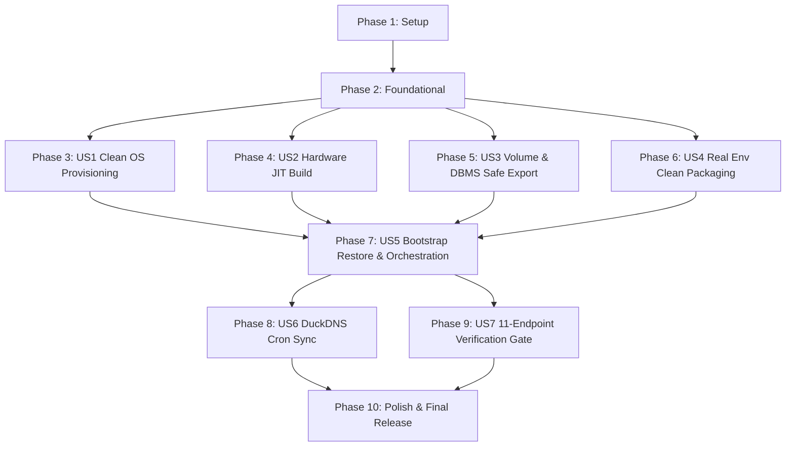

# Tasks: 043-docker-volume-ubuntu-migration-pack

**Feature**: 043-docker-volume-ubuntu-migration-pack (도커 볼륨 및 DBMS 포함 우분투 서버 마이그레이션 팩 고도화)  
**Spec**: [spec.md](./spec.md) | **Plan**: [plan.md](./plan.md)  
**Target Hardware**: Ubuntu 24.04 LTS (Intel Core i7-930 Non-AVX SSE4.2, 24GB RAM, NVIDIA GeForce GTX 1070 8GB `sm_61`)

---

## Phase 1: Setup (Shared Infrastructure)

**Purpose**: 마이그레이션 팩 v2.0 디렉터리 구조 및 공통 스키마/계약 셋업

- [x] T001 Create migration pack directory layout per plan in `migration_pack/scripts/` and `model_gateway/scripts/`
- [x] T002 [P] Register DuckDNS domain and token variables in root `.env` and `migration_pack/config/ddns.env.template`
- [x] T003 [P] Configure manifest schema validator and checksum verification utility in `migration_pack/scripts/manifest_utils.py`

---

## Phase 2: Foundational (Blocking Prerequisites)

**Purpose**: 모든 User Story가 공통으로 의존하는 기본 라이브러리 및 헬퍼 모듈 구축

- [x] T004 Implement hardware probe utility (`probe_hardware.py`) in `model_gateway/scripts/probe_hardware.py`
- [x] T005 [P] Implement WSL2-to-Native Linux Compose normalizer (`normalize_compose.py`) in `migration_pack/scripts/normalize_compose.py`
- [x] T006 [P] Implement POSIX-compliant DuckDNS IPv4 cron update runner (`duck.sh`) in `ddns/duck.sh`
- [x] T007 Implement migration test contract and fixtures in `tests/test_migration_pack.py`

**Checkpoint**: 기본 하드웨어 프로버, Compose 변환기, DDNS 러너 준비 완료

---

## Phase 3: User Story 1 - 클린 Ubuntu 24.04 LTS 환경 무인 자동 감지 및 인프라 프로비저닝 (Priority: P1) 🎯 MVP

**Goal**: 클린 우분투 24.04 서버에서 Snap Docker를 배제하고 공식 APT Docker Engine 및 NVIDIA Container Toolkit을 완전 무인으로 설치 구성

**Independent Test**: Docker/드라이버 미설치 우분투 환경에서 `install_prerequisites.sh` 실행 시 공식 Docker 및 `nvidia` 런타임이 활성화되고 `docker run --gpus all`이 통과하는지 검증

### Tests for User Story 1
- [x] T008 [P] [US1] Unit test for prerequisite detection logic in `tests/test_prerequisites.py`

### Implementation for User Story 1
- [x] T009 [US1] Implement non-interactive Docker APT repository & package installation in `migration_pack/scripts/install_prerequisites.sh`
- [x] T010 [US1] Implement NVIDIA Container Toolkit v1.16+ installation and `/etc/docker/daemon.json` configuration in `migration_pack/scripts/install_prerequisites.sh`
- [x] T011 [US1] Add Snap Docker detection, warning, and replacement guardrails in `migration_pack/scripts/install_prerequisites.sh`

**Checkpoint**: 클린 Ubuntu 24.04 서버 인프라 무인 프로비저닝 완료

---

## Phase 4: User Story 2 - 타겟 하드웨어(i7-930 SSE4.2 & GTX 1070 sm_61) 자율 적응 및 무중단 JIT 빌드 (Priority: P1) 🎯 MVP

**Goal**: AVX 미지원 i7-930 CPU와 Pascal GTX 1070 GPU에 맞춰 `llama.cpp`를 크래시 없이 자동 JIT 컴파일하고 8GB VRAM 내 3대 모델 100% GPU 가속 서빙

**Independent Test**: i7-930/GTX 1070 환경에서 `build_llama.sh` 실행 시 `-march=native -DGGML_CUDA=ON -DCMAKE_CUDA_ARCHITECTURES=61`로 컴파일되고 LLM 8081/임베딩 8090 API가 200 OK를 반환하는지 검증

### Tests for User Story 2
- [x] T012 [P] [US2] Contract test for Model Gateway hardware adaptation flags in `tests/test_hardware_build.py`

### Implementation for User Story 2
- [x] T013 [US2] Implement CPU feature detection (SSE4.2 vs AVX/AVX2) and Pascal `sm_61` CUDA architecture mapping in `model_gateway/scripts/probe_hardware.py`
- [x] T014 [US2] Implement automated CMake JIT compilation script with Non-AVX guardrails in `model_gateway/scripts/build_llama.sh`
- [x] T015 [US2] Implement 8GB VRAM partitioning and safety limit allocation (`VRAM_SAFETY_LIMIT_MB=5000`) in `model_gateway/src/config.py`

**Checkpoint**: i7-930 크래시 원천 차단 및 GTX 1070 8GB 최적화 JIT 빌더 완성

---

## Phase 5: User Story 3 - 도커 볼륨 및 DBMS 데이터의 안전 패키징 및 Mutex 복원 (Priority: P1) 🎯 MVP

**Goal**: MySQL InnoDB Dirty Page 플러시 및 ChromaDB SQLite WAL 체크포인트 기반 스냅샷 추출과 타겟 서버에서의 Mutex 중복 방지 복원

**Independent Test**: `export_databases.py` 및 `export_docker_volumes.py` 실행 후 SHA-256 체크섬이 생성되고, 타겟 서버에서 물리 볼륨 복원 성공 시 중복 SQL 덤프 로드가 안전하게 건너뛰어지는지 검증

### Tests for User Story 3
- [x] T016 [P] [US3] Unit test for volume archiving and mutex restoration in `tests/test_volume_export.py`

### Implementation for User Story 3
- [x] T017 [US3] Enhance MySQL streaming dump with `FLUSH TABLES WITH READ LOCK` in `migration_pack/scripts/export_databases.py`
- [x] T018 [US3] Implement Docker named volume sparse archiving (`tar --sparse -czf`) with SQLite WAL checkpointing in `migration_pack/scripts/export_docker_volumes.py`
- [x] T019 [US3] Implement Mutex restoration logic in `migration_pack/scripts/bootstrap_restore.py` to prevent duplicate SQL table collisions

**Checkpoint**: DBMS 및 Docker 볼륨 무손실 추출 및 충돌 방지 복원 완료

---

## Phase 6: User Story 4 - 실사용 환경 변수 완전 이전 및 전체 작업 폴더 클린 번들링 (Priority: P1) 🎯 MVP

**Goal**: 루트 `.env`와 `ddns/.env`의 실사용 시크릿을 100% 온전히 번들링하고 캐시/임시 폴더를 완벽히 제외한 단일 아카이브 생성

**Independent Test**: `make_migration_pack.py` 실행 후 `dist/` 내 번들 아카이브에 `.git`, `.venv`, `__pycache__`가 0건이고 실사용 키가 온전히 포함되어 있는지 검증

### Tests for User Story 4
- [x] T020 [P] [US4] Integration test for clean bundle assembly and secret preservation in `tests/test_bundle_assembly.py`

### Implementation for User Story 4
- [x] T021 [US4] Implement Clean Source Assembler with strict exclusion filters in `make_migration_pack.py`
- [x] T022 [US4] Implement full `.env` preservation and target security permission (`chmod 600`) logic in `make_migration_pack.py` and `migration_pack/scripts/bootstrap_restore.sh`
- [x] T023 [US4] Implement manifest v2.0 generator and SHA-256 checksum matrix builder in `make_migration_pack.py`

**Checkpoint**: Zero-Config 실사용 시크릿 100% 보존 및 클린 아카이브 패키징 완료

---

## Phase 7: User Story 5 - 단계적 오케스트레이션을 통한 원클릭 Zero-Config 자동 복원 (Priority: P1) 🎯 MVP

**Goal**: 우분투 서버에서 `bootstrap_restore.sh -y` 단일 명령어로 권한 정규화, Compose WSL2 디바이스 변환, 인프라 Healthy 확인 후 앱 순차 기동 완수

**Independent Test**: 압축 해제된 우분투 디렉터리에서 `sudo ./bootstrap_restore.sh -y` 실행 시 모든 컨테이너가 Healthy 상태로 기동되는지 검증

### Tests for User Story 5
- [x] T024 [P] [US5] Contract test for `bootstrap_restore.sh` argument parsing and execution pipeline in `tests/test_bootstrap_restore.py`

### Implementation for User Story 5
- [x] T025 [US5] Implement Compose normalizer to replace `/dev/dxg` with Linux `nvidia` runtime in `migration_pack/scripts/normalize_compose.py`
- [x] T026 [US5] Implement staged container startup sequence (DB/Redis/Model Gateway Readiness Probe -> Apps) in `migration_pack/scripts/bootstrap_restore.sh`
- [x] T027 [US5] Implement idempotent error trapping (`set -euo pipefail`) and permission normalization in `migration_pack/scripts/bootstrap_restore.sh` and `bootstrap_restore.py`

**Checkpoint**: 원클릭 단계적 무인 복원 및 Compose 오케스트레이션 완성

---

## Phase 8: User Story 6 - DuckDNS DDNS IPv4 강제 연동 및 도메인 동기화 (Priority: P2)

**Goal**: 타겟 우분투 서버에서 IPv4(`curl -4`)로 DuckDNS를 즉시 갱신하고 우분투 `crontab`에 5분 주기 자동 갱신 스케줄을 멱등성 있게 등록

**Independent Test**: `ddns/duck.sh` 실행 시 DuckDNS 응답 `OK` 확인 및 `crontab -l`에 5분 주기 크론잡 등록 여부 확인

### Tests for User Story 6
- [x] T028 [P] [US6] Unit test for DuckDNS cron parser and curl execution in `tests/test_duckdns_sync.py`

### Implementation for User Story 6
- [x] T029 [US6] Implement IPv4-forced DuckDNS updater script with retry logic in `ddns/duck.sh`
- [x] T030 [US6] Integrate automatic crontab registration and initial update call into `migration_pack/scripts/bootstrap_restore.sh`

**Checkpoint**: DuckDNS DDNS 5분 주기 동적 도메인 동기화 완성

---

## Phase 9: User Story 7 - 전수 엔드포인트 E2E 헬스체크 및 마이그레이션 검증 게이트 (Priority: P2)

**Goal**: 서비스 기동 완료 즉시 11개 주요 엔드포인트 전수 헬스체크를 수행하고 구조화된 검증 보고서 발행 및 가이드 문서 제공

**Independent Test**: 복원 완료 후 `verify_migration.py` 실행 시 11/11 Pass 및 `verification_report.json` 정상 발행 검증

### Tests for User Story 7
- [x] T031 [P] [US7] E2E test for 11 endpoints healthcheck runner in `tests/test_verification_report.py`

### Implementation for User Story 7
- [x] T032 [US7] Enhance 11-endpoint E2E verification suite with hardware probe recording in `migration_pack/scripts/verify_migration.py`
- [x] T033 [US7] Write comprehensive Ubuntu migration manual and troubleshooting guide in `migration_pack/MIGRATION_GUIDE.md`

**Checkpoint**: 11개 엔드포인트 E2E 검증 게이트 및 마이그레이션 매뉴얼 완성

---

## Phase 10: Polish & Cross-Cutting Concerns

**Purpose**: 전주기 통합 검증, CLI 옵션 튜닝, 최종 린트 및 릴리즈 준비

- [x] T034 [P] Implement `--dry-run` simulation mode in `make_migration_pack.py`
- [x] T035 Add root entrypoint symlink/wrapper `bootstrap_restore.sh` at repository root
- [x] T036 Run static linting and type checking across all migration scripts (`ruff check .`)
- [x] T037 Execute full test suite (`pytest tests/ -v`) and validate `quickstart.md` workflows

---

## Dependencies & Execution Order

---

## Implementation Strategy & MVP

### MVP Scope (User Stories 1 ~ 5)
- Windows 환경에서 볼륨 및 DBMS 포함 클린 마이그레이션 팩 생성 (`make_migration_pack.py`)
- 클린 Ubuntu 24.04 서버에서 `bootstrap_restore.sh -y` 단일 실행으로 Docker/GPU 설치, 볼륨 복원, i7-930/GTX 1070 빌드, 멀티 컨테이너 정상 기동 완수.

### Incremental Delivery Order
1. **Foundation (Phases 1-2)**: 프로버, Compose 변환기, DDNS 러너 구축
2. **MVP Core (Phases 3-7)**: US1 ~ US5 패키징 및 원클릭 복원 파이프라인 완성
3. **Full Scale (Phases 8-10)**: DDNS 5분 크론, 11개 엔드포인트 E2E 검증, `MIGRATION_GUIDE.md` 완성
