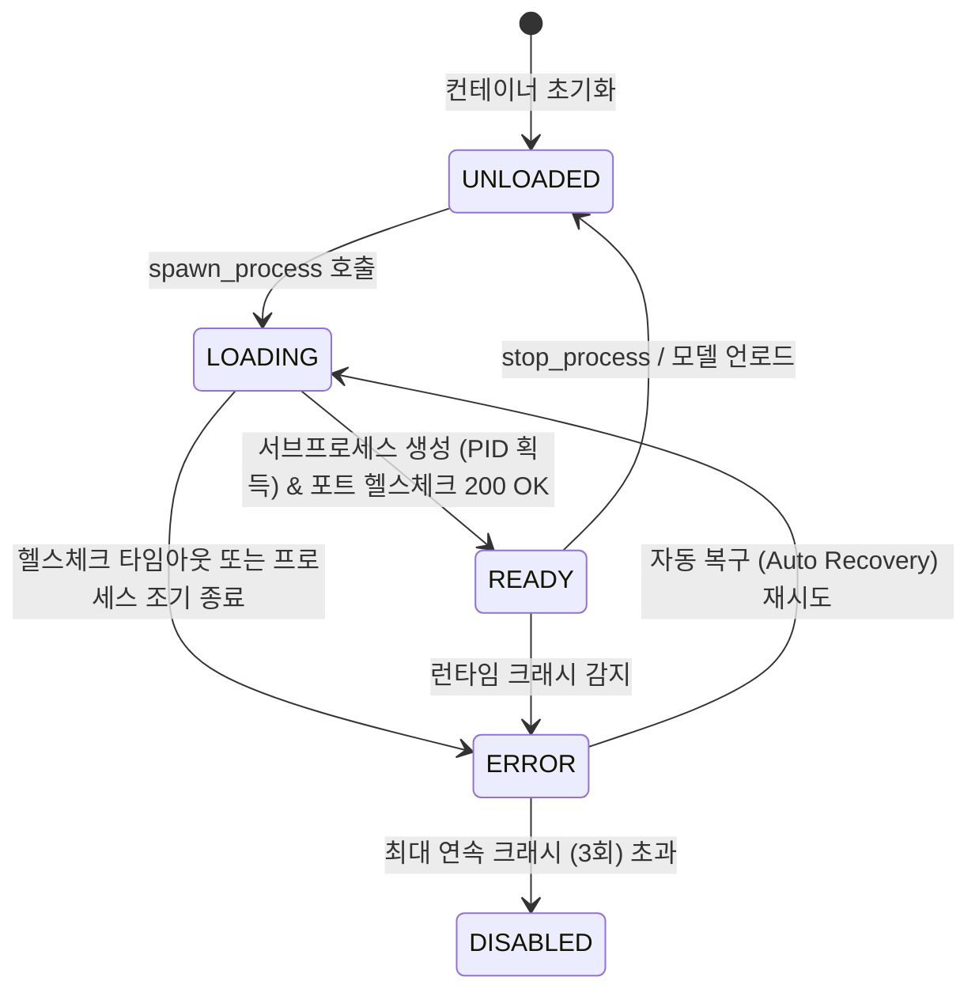

# Data Model: 모델 게이트웨이 LLM/임베딩/리랭커 온로드 및 GPU VRAM 가속 정상화

**Feature**: `044-fix-model-gateway-onload`
**Date**: 2026-09-02
**Status**: Completed

## 1. 주요 엔티티 및 스키마 정의

### 1.1 `ProcessStatusEnum` (프로세스 상태 열거형)
```python
class ProcessStatusEnum(str, Enum):
    UNLOADED = "UNLOADED"          # 프로세스 미기동 상태
    DOWNLOADING = "DOWNLOADING"    # 모델 파일 다운로드 진행 중
    LOADING = "LOADING"            # 서브프로세스 스폰 및 VRAM 온로드 진행 중
    VRAM_OFFLOADED = "VRAM_OFFLOADED" # VRAM 오프로드 확인 완료
    READY = "READY"                # 헬스체크 통과 및 추론 서빙 준비 완료 (PID 필수)
    ERROR = "ERROR"                # 기동 실패 또는 비정상 종료
    DISABLED = "DISABLED"          # 연속 크래시로 인한 비활성화 상태
```

### 1.2 `ProcessState` (프로세스 수명주기 상태 모델)
```python
class ProcessState(BaseModel):
    model_config = ConfigDict(frozen=True)

    status: ProcessStatusEnum = Field(default=ProcessStatusEnum.UNLOADED, description="현재 프로세스 구동 상태")
    model_id: Optional[str] = Field(default=None, description="로딩된 모델 식별자 (예: 'qwen3.5-2b')")
    port: Optional[int] = Field(default=None, description="서빙 바인딩 포트 (8089, 8090, 8091)")
    pid: Optional[int] = Field(default=None, description="OS 프로세스 PID (READY 상태 시 반드시 양의 정수)")
    error_message: Optional[str] = Field(default=None, description="에러 발생 시 상세 메시지")
    exit_code: Optional[int] = Field(default=None, description="프로세스 종료 코드")
    vram_offloaded: Optional[bool] = Field(default=None, description="VRAM 오프로드 검증 완료 여부")
    vram_offloaded_100pct: bool = Field(default=False, description="VRAM 100% 오프로드 완료 여부")
    active_requests: int = Field(default=0, description="현재 처리 중인 활성 스트림/요청 수")
```

### 1.3 `LlamaServerBinaryInfo` (서빙 바이너리 메타데이터 모델)
```python
class LlamaServerBinaryInfo(BaseModel):
    model_config = ConfigDict(frozen=True)

    binary_path: str = Field(..., description="실행할 바이너리 또는 python 인터프리터 경로")
    is_cuda_enabled: bool = Field(default=True, description="CUDA GPU 가속 활성화 여부 (-ngl 999 결정)")
    build_source: str = Field(default="PATH", description="바이너리 취득 출처 (PATH / JIT_BIN / LOCAL_BIN / PYTHON_MODULE_FALLBACK)")
    version_info: Optional[str] = Field(default=None, description="바이너리 버전 정보")
    runtime_backend: str = Field(default="llama.cpp-cuda", description="선택된 런타임 백엔드")
```

### 1.4 `RuntimeProfile` (런타임 하드웨어 프로파일 및 Fallback 엔티티)
```python
class RuntimeProfile(BaseModel):
    vram_safety_limit_mb: int = Field(default=5000, description="VRAM 안전 사용 상한선 (MB)")
    model_vram_budget_mb: Dict[str, int] = Field(
        default_factory=lambda: {"llm": 2600, "embedding": 1200, "reranker": 1200},
        description="모델 타입별 VRAM 예산"
    )
    runtime_fallback_chain: List[str] = Field(
        default_factory=lambda: ["llama.cpp-cuda", "llama.cpp-cpu-openblas"],
        description="기본 런타임 Fallback 순서 (ENABLE_EXTERNAL_VLLM 미활성화 시 vllm 제외)"
    )
    enable_external_vllm: bool = Field(default=False, description="외장 vLLM 클러스터 프로브 활성화 여부")
    external_vllm_url: str = Field(default="http://127.0.0.1:8000/health", description="외장 vLLM 헬스체크 URL (8081과 분리)")
```

---

## 2. 상태 전이 다이어그램 (State Transitions)


