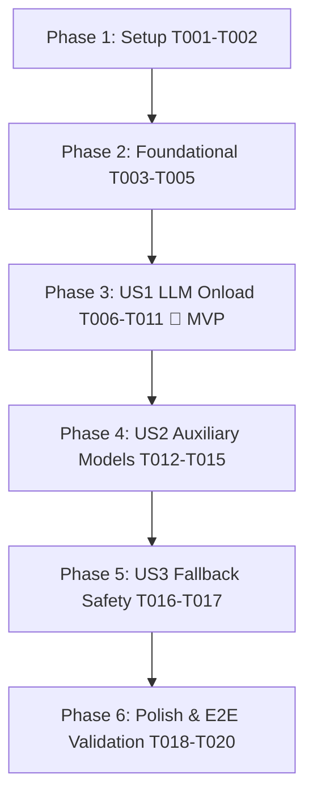

# Tasks: 모델 게이트웨이 LLM/임베딩/리랭커 온로드 및 GPU VRAM 가속 정상화 (Fix Model Gateway LLM Onload & GPU Acceleration)

**Branch**: `044-fix-model-gateway-onload` | **Date**: 2026-09-02 | **Spec**: [spec.md](./spec.md) | **Plan**: [plan.md](./plan.md)

---

## Phase 1: Setup (Shared Infrastructure)

**Purpose**: 프로젝트 초기화 및 테스트 환경 셋업

- [X] T001 검증 환경 및 모델 파일(`models/qwen3.5-2b`, `models/bge-m3`, `models/bge-reranker-v2-m3`) 가용성 확인
- [X] T002 [P] 회귀 방지용 테스트 뼈대 파일 `tests/test_model_gateway_onload.py` 생성

---

## Phase 2: Foundational (Zero Hardcoding & Runtime Profile SSOT)

**Purpose**: 헌법 v1.2.0 원칙 VII(포괄적 무하드코딩 및 인프라 SSOT) 준수 및 vLLM 셀프 루프백 차단

**⚠️ CRITICAL**: 이 단계가 완료되어야 런타임 프로브가 8081 포트를 외장 vLLM으로 오인하지 않고 정상 로컬 백엔드를 선택할 수 있습니다.

- [X] T003 `model_gateway/src/config.py`에서 `DEFAULT_FALLBACK_CHAIN` 수정: `ENABLE_EXTERNAL_VLLM=true` 명시 시에만 `"vllm"` 포함하고 기본값은 `["llama.cpp-cuda", "llama.cpp-cpu-openblas"]`로 설정
- [X] T004 [P] `model_gateway/src/config.py`의 `_profile_path()` 및 외장 vLLM URL 기본값을 게이트웨이 포트(8081)와 분리된 `http://127.0.0.1:8000/health`로 수정
- [X] T005 `model_gateway/src/core/process_manager.py`의 `_runtime_backend_from_profile()`에서 게이트웨이 자체 포트(8081) 조회를 금지하고 `ENABLE_EXTERNAL_VLLM` 명시 시에만 외장 엔드포인트 프로브 수행

**Checkpoint**: 런타임 백엔드 프로브가 게이트웨이 포트(8081)를 vLLM으로 오인하지 않고 `llama.cpp-cuda`를 1순위로 선택함.

---

## Phase 3: User Story 1 - 기본 초고속 LLM 모델 VRAM 온로드 및 정상 추론 서빙 (Priority: P1) 🎯 MVP

**Goal**: 게이트웨이 기동 시 기본 초고속 모델(`qwen3.5-2b`)이 포트 8089에서 실제 OS 프로세스로 스폰되고 GPU VRAM에 100% 온로드되어 503 에러 없이 챗봇 응답 제공.

**Independent Test**: 게이트웨이 기동 후 포트 8089 프로세스 리슨 확인 및 `POST /v1/chat/completions` 요청 시 200 OK 텍스트 스트리밍 수신.

### Implementation for User Story 1

- [X] T006 [US1] `model_gateway/src/core/process_manager.py`의 `verify_and_build_llama_server()`에서 `PYTHON_MODULE_FALLBACK` 생성 시 `llama_cpp.llama_supports_gpu_offload()`가 `True`이면 `is_cuda_enabled=True`로 동적 설정
- [X] T007 [US1] `model_gateway/src/core/process_manager.py`의 `build_server_command()`에서 `is_cuda_enabled=True` 시 `--n_gpu_layers 999` 주입 및 VRAM 100% 온로드 보장
- [X] T008 [US1] `model_gateway/src/core/process_manager.py`의 `spawn_process()`에서 `backend == "vllm"`의 셀프 루프백 가짜 READY 로직 제거 및 실제 서브프로세스 생성(`asyncio.create_subprocess_exec`), `self.process.pid` 획득, 포트 8089 헬스체크 검증 후 `READY` 전이 구현
- [X] T009 [US1] `model_gateway/src/core/process_manager.py`의 `is_ready()`에 프로세스 생존 검증(`self.process is not None and self.process.returncode is None`) 추가
- [X] T010 [US1] `model_gateway/src/core/llama_manager.py`의 `ensure_default_model_resident()`에서 프로세스 생존 상태 검증 및 미기동 시 즉시 `load_model_with_download` 호출 보장
- [X] T011 [P] [US1] `tests/test_model_gateway_onload.py`에 US1 기본 모델 로드 및 PID 바인딩, GPU VRAM 온로드 단위 테스트 구현

**Checkpoint**: User Story 1 완료 - 2B 모델이 포트 8089에서 실제 프로세스로 구동되어 추론 요청에 200 OK로 응답함.

---

## Phase 4: User Story 2 - 임베딩 및 리랭커 보조 서빙 프로세스 정상 기동 및 검색 서빙 (Priority: P2)

**Goal**: BGE-M3(임베딩 @ 8090) 및 BGE-Reranker-v2-M3(리랭커 @ 8091) 프로세스가 독립 기동되어 RAG 및 벡터 검색 요청 정상 처리.

**Independent Test**: `/v1/embeddings` 및 `/v1/rerank` 호출 시 각각 200 OK와 유효한 벡터/순위 점수 수신.

### Implementation for User Story 2

- [X] T012 [US2] `model_gateway/src/core/auxiliary_manager.py`의 `ensure_embedding_resident()`에서 포트 8090 BGE-M3 프로세스 정상 스폰 및 헬스체크 검증 로직 점검
- [X] T013 [US2] `model_gateway/src/core/auxiliary_manager.py`의 `ensure_rerank_resident()`에서 포트 8091 BGE-Reranker-v2-M3 프로세스 정상 스폰 및 헬스체크 검증 로직 점검
- [X] T014 [US2] `model_gateway/src/api/server.py`의 `lifespan` 내 `safe_startup_aux()` 기동 시차 및 에러 핸들링 점검
- [X] T015 [P] [US2] `tests/test_model_gateway_onload.py`에 US2 보조 모델 스폰 및 포트(8090/8091) 분리 검증 테스트 추가

**Checkpoint**: User Stories 1 & 2 완료 - LLM 및 임베딩/리랭커 3종 프로세스가 모두 독립 포트에서 정상 리슨 및 응답함.

---

## Phase 5: User Story 3 - 런타임 백엔드 프로브 및 Fallback의 결함 없는 안전 동작 (Priority: P3)

**Goal**: 외장 vLLM 프로브 토글(`ENABLE_EXTERNAL_VLLM`) 및 Fallback 체인의 안전성 보장.

**Independent Test**: `ENABLE_EXTERNAL_VLLM=true/false` 환경 변수에 따른 정확한 백엔드 선택 및 에러 핸들링 검증.

### Implementation for User Story 3

- [X] T016 [US3] `model_gateway/src/api/routes/inference_api.py`에서 백엔드 포워딩 실패 시 불필요한 중복 `ensure_default_model_resident` 태스크 남발 방지 및 정확한 503 에러 핸들링 점검
- [X] T017 [P] [US3] `tests/test_model_gateway_onload.py`에 US3 `ENABLE_EXTERNAL_VLLM` 토글 동작 및 Fallback 체인 동작 검증 테스트 추가

**Checkpoint**: User Stories 1, 2, 3 전수 완료 - 헌법 원칙 VII을 준수하며 모든 런타임 환경에서 결함 없이 작동함.

---

## Phase 6: Polish & Cross-Cutting Concerns

**Purpose**: 전수 통합 검증 및 실환경 E2E 확인

- [X] T018 [Polish] `tests/test_model_gateway_onload.py` 및 `tests/test_migration_convergence.py` 전체 회귀 테스트 실행 및 통과 확인
- [X] T019 [Polish] `docker exec vllm-serv-gateway`에서 포트 8081, 8089, 8090, 8091 소켓 리슨 확인
- [X] T020 [Polish] `quickstart.md`에 정의된 4종 시나리오(포트 확인, Readiness 200, Chat 200, Embed/Rerank 200) 전수 실측 실행 및 증적 확인

---

## Dependencies & Execution Order

### Parallel Opportunities

- **Phase 1**: `T002` (테스트 뼈대 생성) 병렬 가능.
- **Phase 2**: `T004` (URL 및 프로파일 수정) 병렬 가능.
- **Phase 3**: `T011` (US1 테스트 작성) 병렬 가능.
- **Phase 4**: `T015` (US2 테스트 작성) 병렬 가능.
- **Phase 5**: `T017` (US3 테스트 작성) 병렬 가능.

---

## Implementation Strategy

### MVP First (Phase 1 ~ Phase 3)
1. Phase 1 (Setup) 및 Phase 2 (Foundational SSOT) 완료.
2. Phase 3 (US1 LLM Onload) 구현 ➔ 포트 8089 실제 기동 및 503 에러 즉시 해결 (MVP 달성).
3. 독립 검증: `POST /v1/chat/completions` 200 OK 확인.

### Incremental Delivery (Phase 4 ~ Phase 6)
4. Phase 4 (US2) ➔ 임베딩(8090) 및 리랭커(8091) 활성화.
5. Phase 5 (US3) ➔ 런타임 프로브 안전성 및 에러 핸들링 강화.
6. Phase 6 (Polish) ➔ 회귀 테스트 통과 및 전수 E2E 실측 검증.
