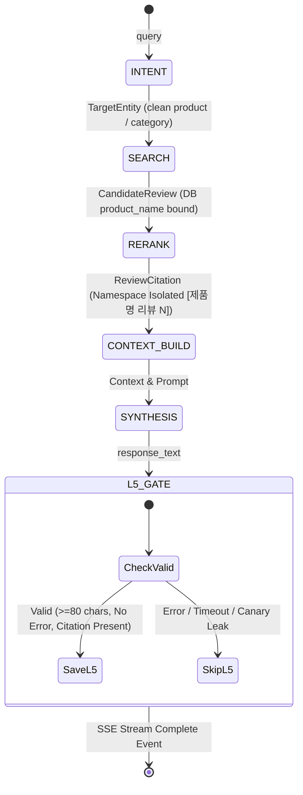

# Data Model & Schema Specification: 047-fix-chata-synthesis-and-entity-naming

## 1. Graph State & Core Entities

### TargetEntity (의도 라우팅 및 타겟 분석 단위)
```python
class TargetType(str, Enum):
    PRODUCT = "PRODUCT"
    SERIES = "SERIES"
    BRAND = "BRAND"
    CATEGORY = "CATEGORY"
    ATTRIBUTE = "ATTRIBUTE"

class TargetEntity(TypedDict):
    target_id: str                      # 고유 식별자 (예: 'target_1', 'discovery_pool')
    target_name: str                    # 라우팅/검색용 쿼리 식별자 (예: '스킨케어', '차앤박')
    brand_name: Optional[str]           # 감지된 브랜드명 (예: '차앤박', '브링그린')
    product_name: Optional[str]         # 확정된 단일 실존 제품명 (미확정 시 None)
    target_type: TargetType             # 분석 대상 유형
    attribute_query: Optional[str]      # 속성 수식어 (예: '수분감', '모공 커버')
    spec_header: Optional[str]          # 스펙 헤더
```

---

### CandidateReview & ReviewCitation (후보군 및 최종 선별 리뷰 엔티티)
```python
class CandidateReview(TypedDict):
    doc_id: str                         # 리뷰 문장 DB PK
    review_text: str                    # Reranker 입력용 정제 문장 (필요시 [제품명] 프리픽스 포함)
    target_id: str                      # 소속 타겟 식별자
    target_name: str                    # 타겟 질의명
    product_name: str                   # MySQL/Chroma에서 수집된 실제 실존 화장품명 (SSOT)
    clean_product_name: str             # 검색 링크용 정제 제품명 (기획/세트 수식어 제거)
    brand_name: str                     # 브랜드명
    category: str                       # 카테고리명
    attribute_name: str                 # 매칭된 피부/성분 속성명
    product_url: str                    # 올리브영 검색 URL
    first_stage_score: float            # 1차 벡터 유사도 점수
    rerank_score: float                 # BGE-Reranker v2 리랭킹 점수
    rating: float                       # 사용자 평점 (1.0 ~ 5.0)
    skin_type: Optional[str]            # 작성자 피부타입

class ReviewCitation(TypedDict):
    rank: int                           # 최종 인용 순번 (1, 2, 3...)
    tag: str                            # 인라인 인용 태그 (예: '[차앤박 뮤제너 앰플 리뷰 1]')
    product_name: str                   # 실존 화장품명
    clean_product_name: str             # 검색 링크용 정제 제품명
    brand_name: str                     # 브랜드명
    category: str                       # 카테고리
    attribute_name: str                 # 분석 속성
    review_score: float                 # 평점
    clean_text: str                     # 대괄호 잔여물이 완벽히 정제된 순수 리뷰 문장
    rerank_score: float                 # 리랭킹 점수
    product_url: str                    # 올리브영 공식몰 상품 상세 검색 URL
    oliveyoung_search_url: str          # 올리브영 공식몰 상품 상세 검색 URL
```

---

### L5CachePayload (L5 응답 캐시 페이로드)
```python
class L5CachePayload(TypedDict):
    response_text: str                  # 80자 이상이며 에러 키워드가 없는 온전한 마크다운 답변
    model_id: str                       # 생성 모델명 (예: 'qwen3.5-2b')
    prompt_version: str                 # 프롬프트 버전 (예: 'v1.0')
    tenant_id: str                      # 테넌트 식별자 ('chata', 'chatb')
    doc_ids_hash: str                   # 참조 리뷰 doc_id 집합의 MD5 해시
    created_at: float                   # 캐시 생성 타임스탬프
    estimated_tokens: int               # 생성 토큰 수
```

---

## 2. Validation & Gating Rules

### Rule 1: L5 Response Poison Prevention Gate
- **검증 함수**: `is_valid_synthesis_response(response_text: str) -> bool`
- **통과 조건 (모두 만족 필수)**:
  1. `response_text is not None` and `len(response_text.strip()) >= 80`
  2. 에러 블랙리스트 키워드 미포함:
     - `"[답변 생성 오류:"`
     - `"timed out"`
     - `"Error:"`
     - `"Exception:"`
     - `"traceback"`
     - `"유출 감지"`
  3. 최소 1개 이상의 인용 태그(`[... 리뷰 \d+]`) 또는 제로 서치 안내 문구 포함.
- **실패 시 동작**: Redis `SET`을 전면 건너뛰고(Bypass), 경고 로그 기록.

### Rule 2: Review Text Bracket Stripping Gate
- **정제 정규식**:
  ```python
  def clean_review_sentence(text: str) -> str:
      if not text:
          return ""
      cleaned = text.strip()
      # 1. 선행 대괄호 태그 제거 (예: '[차앤박 앰플] 효과 좋아요' -> '효과 좋아요')
      cleaned = re.sub(r"^\s*\[[^\]]*\]\s*", "", cleaned)
      # 2. 짝이 맞지 않는 선행 닫는 괄호 제거 (예: '기획 세트] 피부에...' -> '피부에...')
      cleaned = re.sub(r"^\s*\]\s*", "", cleaned)
      # 3. 선행/후행 따옴표 및 공백 정리
      cleaned = cleaned.strip("\"' \t\n\r")
      return cleaned if len(cleaned) >= 5 else text.strip()
  ```

### Rule 3: Olive Young Search URL Construction
- **규칙**:
  ```python
  def build_oliveyoung_search_url(product_name: str, brand_name: str = "") -> str:
      clean_name = clean_product_name_for_search(product_name, brand_name)
      encoded = urllib.parse.quote(clean_name)
      return f"https://www.oliveyoung.co.kr/store/search/getSearchMain.do?query={encoded}"
  ```
- **금지 사항**: 사용자 질문 문장(`query`)을 직접 `build_oliveyoung_search_url`의 인자로 전달하는 행위 엄격 금지.

---

## 3. State Lifecycle in LangGraph


