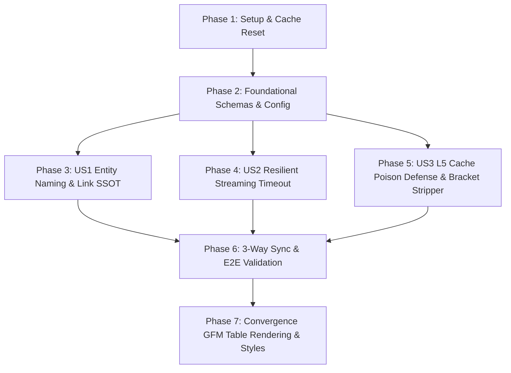

# Tasks: 047-fix-chata-synthesis-and-entity-naming

## Phase 1: Setup (Shared Infrastructure & Cache Reset)

**Purpose**: 3-Way 단일 마스터 코어 동기화 환경 준비 및 오염된 기존 L5 캐시 데이터 초기화

- [x] T001 Verify 3-way `bteam/sync_core.py` synchronization environment across `bteam/oliview_core`, `bteam/Oliview_chatbot_a/oliview_core`, and `bteam/Oliview_chatbot_b/oliview_core`
- [x] T002 [P] Evict all legacy poisoned Redis L5 response cache keys (`*l5:*`) in `aiservice-redis` to prevent stale error playback

---

## Phase 2: Foundational (Blocking Prerequisites)

**Purpose**: RAG 파이프라인 전 계층의 데이터 스키마 및 타임아웃 기본 설정 확립

- [x] T003 [P] Extend `TargetEntity`, `CandidateReview`, and `ReviewCitation` schemas in `bteam/oliview_core/graph_state.py` to enforce strict separation of `target_name` vs `product_name` vs `clean_product_name`
- [x] T004 [P] Update `CoreSettings` in `bteam/oliview_core/config.py` with `inactivity_timeout_s=180.0` and `timeout_llm_sec=180.0` under `APP_RUN_MODE=DEMO` and `development` per Constitution Principle VI & VII

---

## Phase 3: User Story 1 - 카테고리/추천 질의 시 실존 상품명 결속 및 정상 링크 제공 (Priority: P1) 🎯 MVP

**Goal**: 카테고리/추천 질의 시 질문 문장 전체가 상품명으로 둔갑하는 결함을 원천 차단하고 실제 DB 화장품명 결속 및 정상 올리브영 검색 링크 생성

**Independent Test**:
- *"스킨케어에서 수분감 좋은 인기 앰플 추천해줘"* 질의 시, 인용 태그(`[제품명 리뷰 N]`) 및 아코디언 타이틀, 올리브영 검색 URL(`query=...`)에 질문 문장이 나타나지 않고 실제 제품명(예: `차앤박 뮤제너 피토 수딩 앰플`)으로 매핑되는지 검증.

### Tests for User Story 1

- [x] T005 [P] [US1] Write unit tests for category discovery product name binding and URL generation in `bteam/Oliview_chatbot_a/tests/test_entity_naming_discovery.py`

### Implementation for User Story 1

- [x] T006 [US1] Update `bteam/oliview_core/nodes/router_node.py` to decouple query string from `target_name` and prevent raw query sentences from acting as product names
- [x] T007 [US1] Update `bteam/oliview_core/nodes/search_node.py` to capture actual MySQL/Chroma `product_name` and `clean_product_name` in `CandidateReview`
- [x] T008 [US1] Update `bteam/oliview_core/utils/document_top_p.py` to format citations and namespace tags using `clean_product_name`
- [x] T009 [US1] Update `bteam/oliview_core/graph_orchestrator.py` to construct `oliveyoung_search_url` and reference accordion using `clean_product_name` only

**Checkpoint**: User Story 1 is fully functional and independently testable with 100% accurate product naming and Olive Young links.

---

## Phase 4: User Story 2 - LLM 합성 스트리밍 안정화 및 타임아웃 완화 (Priority: P1)

**Goal**: vLLM 모델 게이트웨이 초기 추론 및 공유 GPU 대기열 지연 시 `[답변 생성 오류: timed out]` 없이 실시간 토큰 스트리밍 완주

**Independent Test**:
- 30~50초의 초기 백엔드 지연이 발생하는 환경에서도 연결 끊김 없이 첫 토큰부터 마크다운 답변 완료까지 정상 수신되는지 검증.

### Tests for User Story 2

- [x] T010 [P] [US2] Write unit tests for resilient streaming timeout and SSE stream parsing in `bteam/Oliview_chatbot_a/tests/test_client_resilient_timeout.py`

### Implementation for User Story 2

- [x] T011 [US2] Update `bteam/oliview_core/client.py` `generate_stream()` to apply sliding `inactivity_timeout_s` (180.0s) and handle SSE streaming queue events
- [x] T012 [US2] Update `bteam/oliview_core/graph_orchestrator.py` to emit 5-second interval heartbeat living step events to keep client connections active during LLM queueing

**Checkpoint**: User Story 2 is fully functional with robust streaming resilience across heavy model execution.

---

## Phase 5: User Story 3 - 에러 응답의 L5 캐시 오염 방지 및 잔여 대괄호 정제 (Priority: P2)

**Goal**: 에러 메시지(`[답변 생성 오류: ...`)의 L5 캐시 영구 저장을 원천 차단하고 리뷰 본문 내 선행 `]` 및 대괄호 잔여물을 완벽히 정제

**Independent Test**:
- 에러 발생 직후 동일 질문 재인입 시 오염 캐시 히트 없이 새로운 정상 파이프라인이 실행되는지 검증하고, 선행 `]`가 포함된 리뷰가 깨끗하게 정제되어 렌더링되는지 확인.

### Tests for User Story 3

- [x] T013 [P] [US3] Write unit tests for L5 poison cache prevention gate and bracket sanitization in `bteam/Oliview_chatbot_a/tests/test_l5_cache_poison_gate.py`

### Implementation for User Story 3

- [x] T014 [US3] Implement `is_valid_synthesis_response()` gate in `bteam/oliview_core/nodes/synthesis_node.py` to strictly reject caching of error tokens, tracebacks, or incomplete responses
- [x] T015 [US3] Update `bteam/oliview_core/sanitizer.py` and `bteam/oliview_core/graph_orchestrator.py` with regex-based `clean_review_sentence()` to strip leading `]` and dangling category brackets

**Checkpoint**: User Story 3 completes poison-free caching and pristine review text sanitization.

---

## Phase 6: Polish & 3-Way Core Synchronization

**Purpose**: 마스터 코어 동기화, 전수 회귀 테스트 검증 및 실시간 컨테이너 E2E 검증

- [x] T016 Execute `bteam/sync_core.py` to propagate `bteam/oliview_core` to `bteam/Oliview_chatbot_a/oliview_core` and `bteam/Oliview_chatbot_b/oliview_core` with 100% hash verification
- [x] T017 Run full regression test suite across `bteam/Oliview_chatbot_a/tests/` to assert 100% PASS
- [x] T018 Execute live E2E validation in Docker container for *"스킨케어에서 수분감 좋은 인기 앰플 추천해줘"* and *"여름철 기름기 잡고 모공 커버 잘되는 매트한 파운데이션"*

---

## Phase 7: Convergence

**Purpose**: 챗봇 UI 마크다운 요약표(GFM Table) 미렌더링/깨짐 결함 해소 및 올리브영 디자인 시스템 테이블 스타일링 적용

- [x] T019 [US1/UI] Implement robust GFM markdown table parser, horizontal rule converter, and list wrapper in `bteam/Oliview_chatbot_a/static/js/chat_ui.js` per FR-006 / Spec 038 (partial)
- [x] T020 [US1/UI] Add Olive Young design system responsive table styles (`.markdown-table`, `th`, `td`, `.table-responsive`, `hr.markdown-hr`) in `bteam/Oliview_chatbot_a/static/css/style.css` per Spec 038 (partial)
- [x] T021 [US1/UI] Verify live table rendering in browser for comparison query *"브링그린 티트리 세럼 진정 효과와 사용감 어때?"* per SC-001 (partial)

---

## Dependencies & Execution Order

